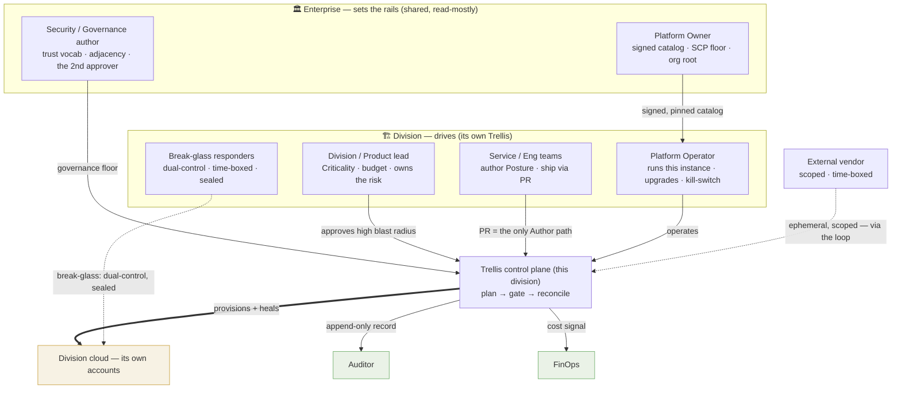
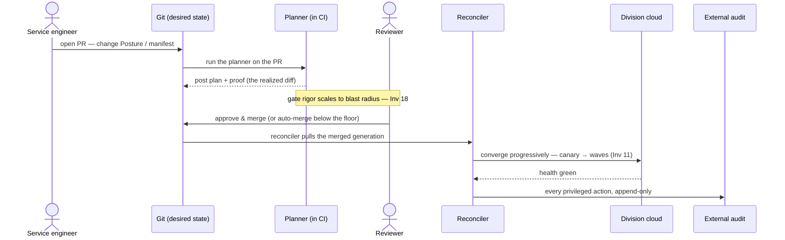
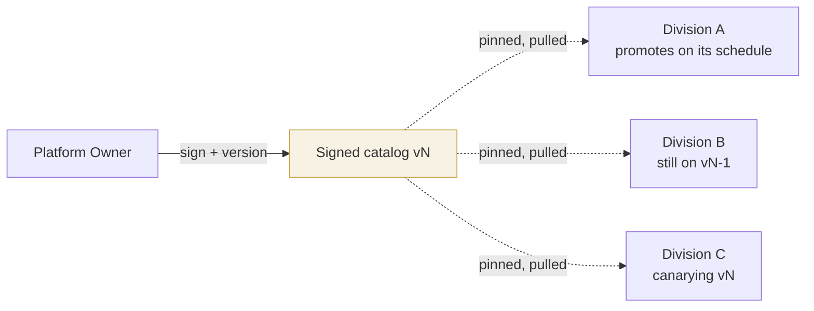
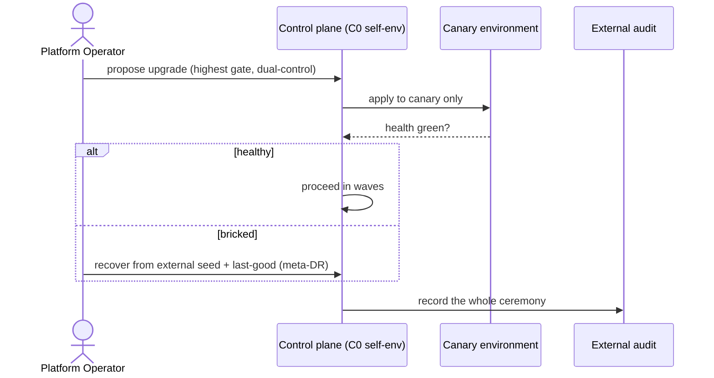
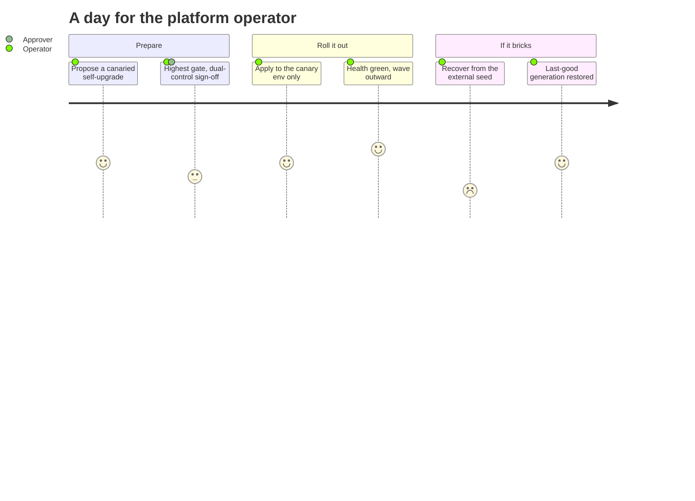
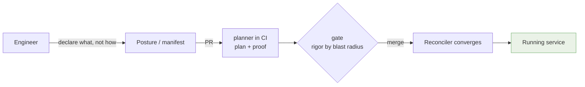
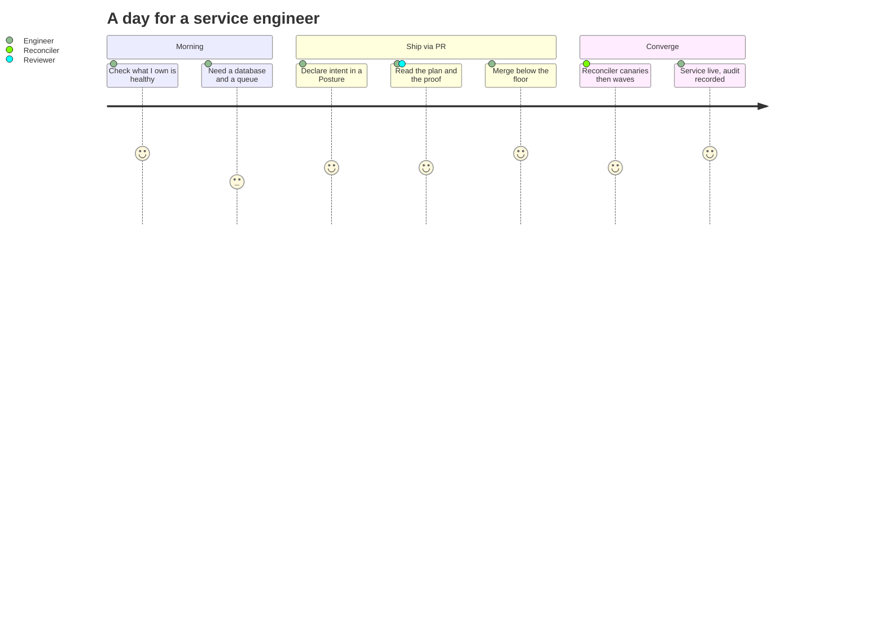
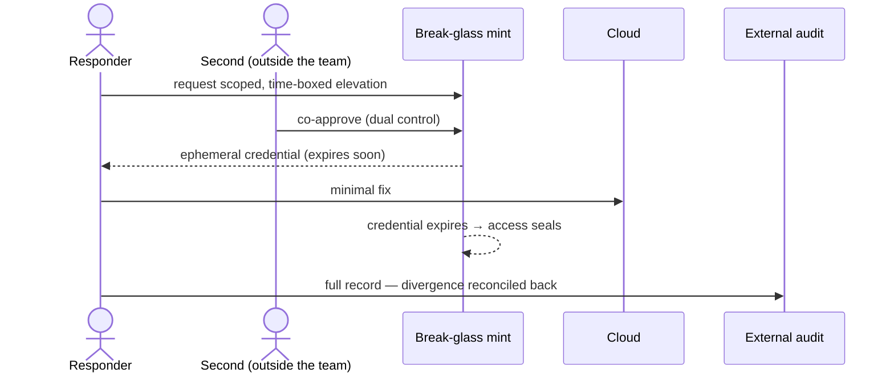
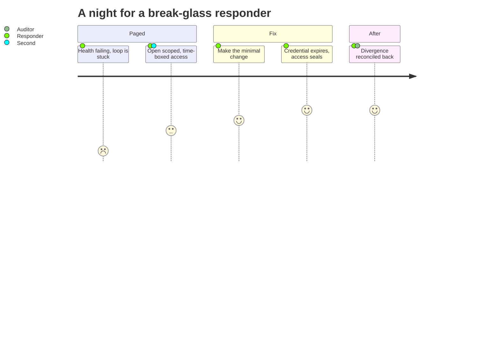

> **Applied decision & guidance** — extends and applies the [specification](/trellis/docs/spec) (the source of truth); not itself normative.

Trellis only works if **responsibility is clear**. The whole point of the model — enterprise sets the
rails, divisions drive — is a statement about *people*, not just software. This page names the personas,
what each owns, what each must **not** touch, and walks a day in each life. The one-line shape:

> **The enterprise curates and guardrails; the division operates and ships; everyone else reads.**

## The map of responsibility

Who touches what. Notice the asymmetry: only two arrows carry *write* power into a division's cloud — the
division's own reconciler, and a scoped break-glass — and both are contained to that division.

## A day in the life of *a change*

Before the people, the **journey they share**. Almost everything is a change to desired state, and a
change travels one path — proposed by an engineer, proven by the planner, gated at a rigor that scales
with blast radius, converged progressively, and recorded forever.

That single path is the backbone. Each persona below is defined by **where they stand on it** — who
authors, who approves, who operates, who only reads.

---

## Enterprise personas — set the rails

### Platform Owner

**Mandate:** make it safe for divisions to run their own cloud without operating raw AWS. Owns the
**signed catalog** (the approved privileged-access service, CI/CD, DNS, source control, cloud services),
the **SCP / governance floor**, and the org root.

- **Owns:** catalog contents + versions; the org-wide guardrail floor; account-factory / landing zone.
- **Does *not*:** operate any division's control plane, approve day-to-day changes, or hold standing
  write into a division's cloud. Publishing a catalog version **deploys nowhere** by itself.
- **Day in the life:** curates a new hardened CI/CD blueprint, signs and versions it, publishes to the
  catalog — then *stops*. Divisions adopt it on their own schedule. A bad publish takes nobody down.

### Security / Governance author

**Mandate:** own the *rules*, not the changes. Defines the trust vocabulary and adjacency (which Cells may
talk to which), the data-residency and compliance constraints (hard pre-filters, never objectives), and
acts as the **independent second approver** for high-blast-radius and catalog changes.

- **Owns:** governance floor content; trust/adjacency policy; catalog change-approval (with the owner).
- **Does *not*:** author service intent, or loosen the floor unilaterally — loosening it is itself a
  reflexive, dual-controlled, audited change (Inv 14).
- **Day in the life:** reviews a division's request to open a new cross-boundary edge; confirms the
  adjacency rule allows it; approves as the second set of eyes outside the requesting team.

---

## Division personas — operate & ship

### Division / Product lead

**Mandate:** own the **risk and the money** for the division. Sets Criticality (how much protection each
service earns) and the budget (a hard planner constraint), and is the accountable approver for the
biggest changes.

- **Owns:** the division's Criticality posture and budget; sign-off on high-blast-radius changes.
- **Does *not*:** hand-operate infrastructure or write manifests — they set intent and accept risk.
- **Day in the life:** a service is being promoted to Criticality-0; the lead approves the step,
  understanding it raises protection (HA, backup, change-rigor) and cost — a deliberate, costed decision.

### Platform Operator

**Mandate:** run *this division's* Trellis instance. The operator keeps the control loop healthy, drives
its **canaried self-upgrades**, and holds the **kill-switch** the system cannot disable
([Inv 13](/trellis/docs/spec)).

- **Owns:** the division's control-plane lifecycle (upgrade, recover), the reconciler's health, the
  kill-switch, meta-DR drills.
- **Does *not*:** approve service changes (that's the gate), or hold god-write — even the operator works
  through earned, scoped, ephemeral authority. Upgrading one division **cannot touch** another.
- **Day in the life:** rolls a control-plane upgrade — canary one waved environment, watch health,
  proceed; if it bricks, recover from the external seed + last-good generation (meta-DR).

The same day, read as a journey (how each step *feels* — 1 tense, 5 calm):

### Service / Engineering teams

**Mandate:** ship the things that deliver value. They **author** Posture and manifests, consume catalog
batteries, and ship via PR — the *only* path that changes desired state.

- **Owns:** their services' desired state (intent, not implementation); responding when their service
  Stalls (on-call for what they own).
- **Does *not*:** touch the cloud directly, hold standing credentials, or operate the control plane. No
  out-of-band changes — the reconciler reads those as drift and corrects them.
- **Day in the life:** needs a database + a queue; declares them in a Posture, opens a PR, reads the
  proof (provisioning + cost + the security delta), merges, watches the reconciler converge.

And as a journey — declare, ship, converge:

### Break-glass responders

**Mandate:** the sanctioned exception. When the loop genuinely can't self-heal, a responder takes
**dual-controlled, time-boxed, maximally-logged** elevated action — then the access seals again.

- **Owns:** emergency divergence under ceremony; restoring the system to a gated state afterward.
- **Does *not*:** use break-glass as a routine path (the exception must not become the road), or act
  alone — the second is from outside the requesting team.
- **Day in the life:** a stuck migration is failing health at 2 a.m.; a responder opens a scoped
  break-glass with a peer, makes the minimal fix, the credential expires, and the divergence is
  reconciled back into desired state.

The night, as a journey (it starts tense, ends sealed):

---

## Cross-cutting personas — read (and one that's scoped)

### Auditor

**Mandate:** prove what happened, independently. Reads the **external append-only audit** and compliance
Views; never writes. Because the record lives *outside* the control plane, the platform can't rewrite its
own history.

- **Owns:** evidence, attestation, compliance reporting over time.
- **Does *not*:** approve or change anything — read-only by design.
- **Day in the life:** pulls the quarter's privileged-action log and the compliance View, attests that
  every change traced to an approved plan.

### FinOps

**Mandate:** keep cost honest. Treats cost as a **first-class signal** — both the cloud's spend and the
control plane's own — sets budgets that become hard planner constraints, and watches for the economic
drift back toward a shared SPOF (Inv 19).

- **Owns:** budgets, allocation/showback along the Frame tree, cost-drift alerts.
- **Does *not*:** block delivery directly — budgets shape the plan; breaches alert or throttle by posture.
- **Day in the life:** spots a division's control-plane cost creeping; confirms it's still cheaper than
  re-centralizing; flags one service whose cost drift exceeds plan.

### External vendor / contractor

**Mandate:** get scoped, **time-boxed, least-privilege** access to exactly what they're engaged for —
nothing standing, nothing broad.

- **Owns:** only the narrow task they're scoped to.
- **Does *not*:** hold long-lived credentials or cross a division boundary. Access is minted scoped and
  expires — the same ephemeral, least-privilege credential discipline as everything else
  ([Inv 4](/trellis/docs/spec); §7 "External / contractor").
- **Day in the life:** a specialist is brought in to tune a database; gets an ephemeral, plan-scoped
  credential to that resource set, does the work, the credential expires, the audit shows every action.

---

## The whole point, in one table

| Persona | Authors? | Approves? | Operates? | Writes to cloud? |
|---|---|---|---|---|
| Platform Owner | catalog/floor | catalog changes | — | no |
| Security / Governance author | rules | 2nd approver | — | no |
| Division / Product lead | Criticality/budget | high-blast-radius | — | no |
| Platform Operator | — | — | **the control plane** | only via the loop |
| Service / Eng teams | **service intent** | — | — | no (via reconciler) |
| Break-glass responder | — | co-open (2-person) | emergency only | **scoped, time-boxed** |
| Auditor | — | — | — | no (read-only) |
| FinOps | budgets | — | — | no |
| External vendor | — | — | — | **scoped, time-boxed** |

The shape to remember: **many people author and approve; exactly one loop holds *standing* write (plus a
sealed break-glass, and the one-time sealed bootstrap) — and it's contained to its division.** That
containment is the whole product.
