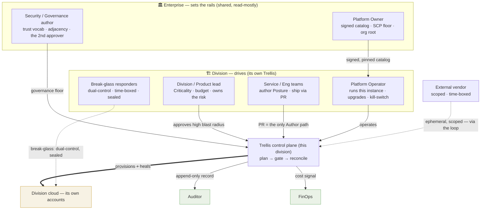
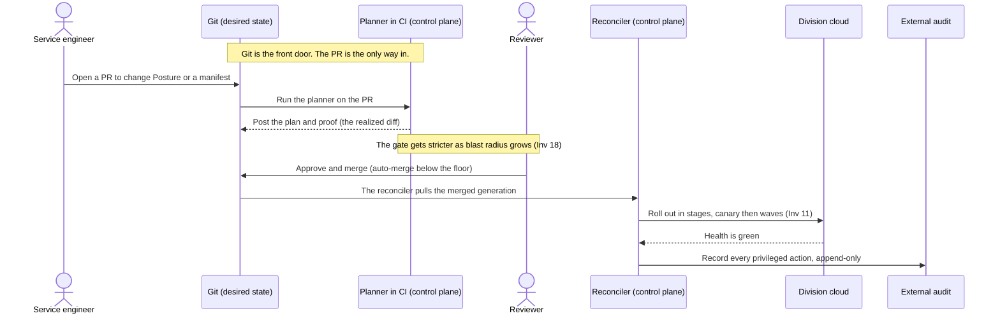
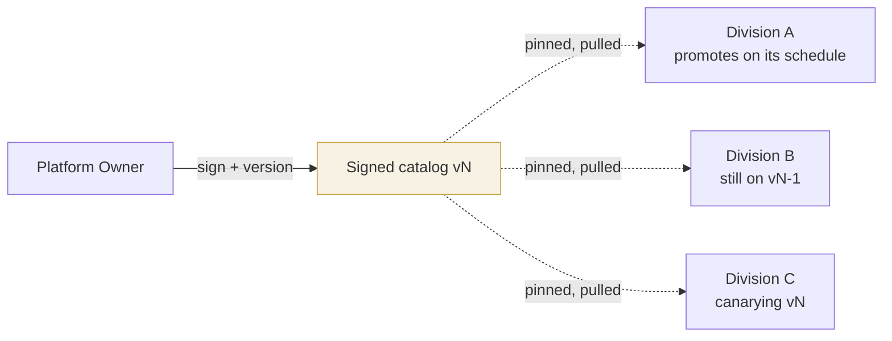
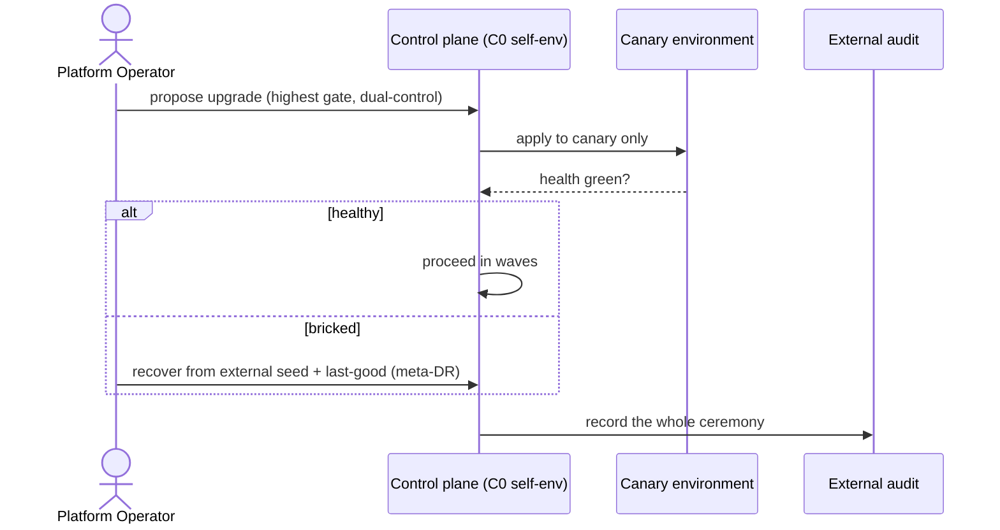
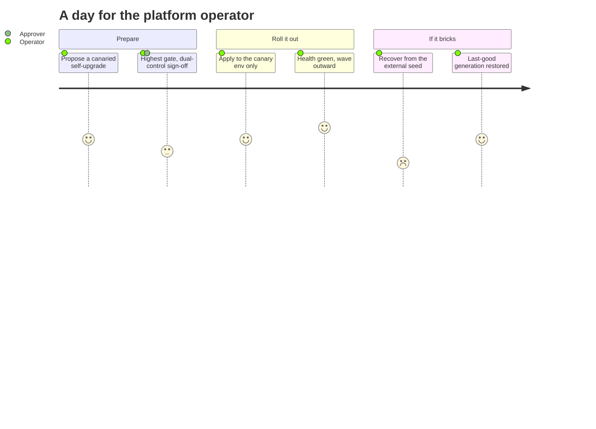
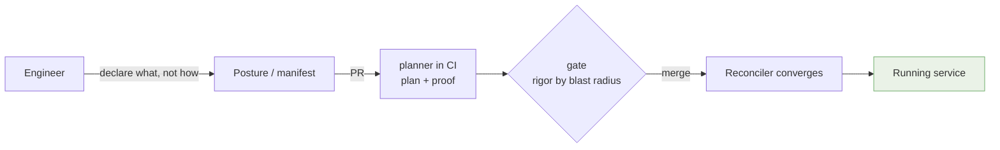
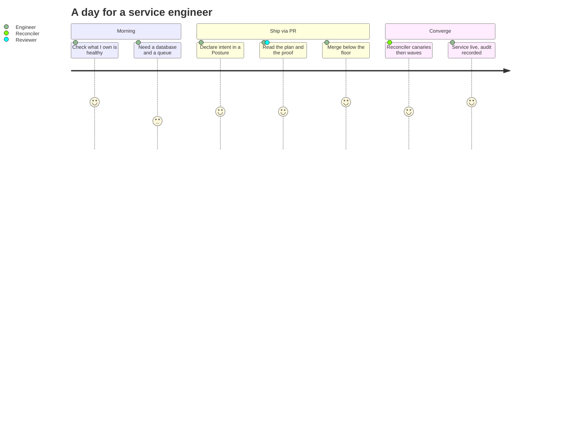
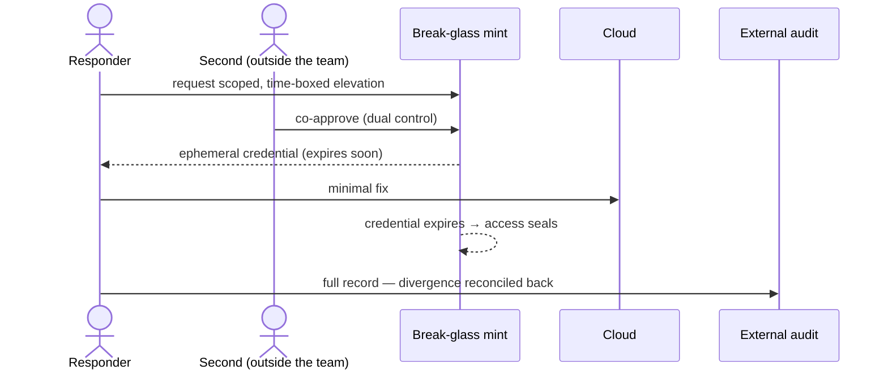
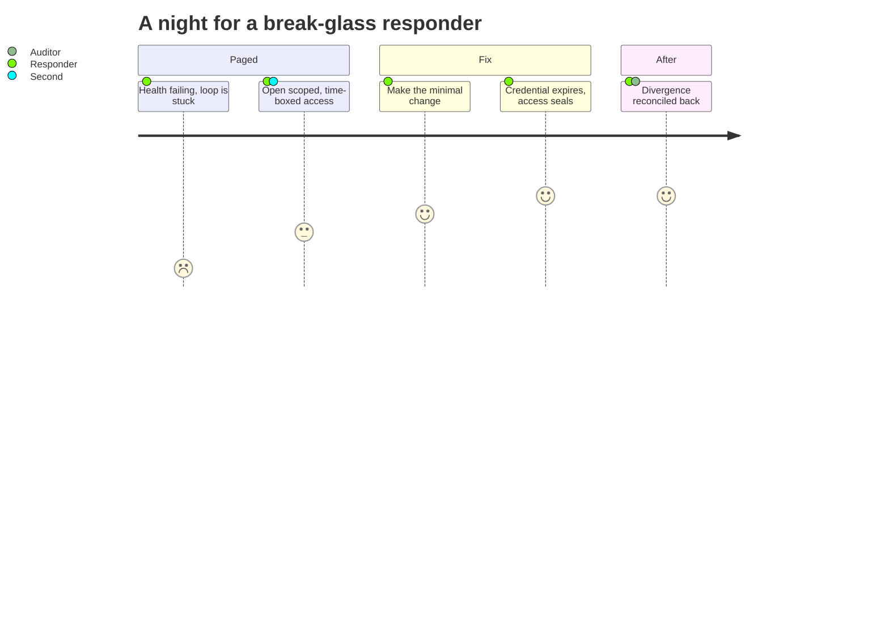

> **Applied decision & guidance** — extends and applies the [specification](/trellis/docs/spec) (the source of truth); not itself normative.

Trellis works only when responsibility is clear. The model is simple: the enterprise sets the rails and the divisions drive. That is a statement about people as much as software. This page names each persona, says what they own and what they must not touch, and walks through a normal day for each one.

The whole idea fits in one line:

> The enterprise curates the rails and sets the guardrails. The division operates and ships. Everyone else reads.

## The map of responsibility

Here is who touches what. Look at how few arrows carry write power into a division's cloud. Only two do: the division's own reconciler, and a scoped break-glass. Both stay inside that division.

## A day in the life of *a change*

Start with the journey before the people. Almost every change is a change to desired state, and every change travels the same path. An engineer proposes it in a pull request. The planner proves it. A gate approves it, and the gate gets stricter as the blast radius grows. The reconciler rolls it out in stages. The audit log records it for good.

One point clears up the confusion that trips most people first. **The engineer authors changes in Git, and Git is the front door of the control plane, not a way around it.** The planner and the reconciler in the diagram below *are* the control plane. A pull request does nothing on its own. The planner has to prove it, a gate has to clear it, and only then does the reconciler apply it. The engineer never touches the cloud directly. The reconciler is the one thing that holds standing write into the cloud.

So "using Git directly" and "going through the control plane" are the same act here. There is no separate console an engineer visits instead of Git. Git, the planner, the gate, and the reconciler are the control plane, and the pull request is the only door in.

That single path is the backbone. Each persona below has a place on it. Some author changes, some approve them, one operates the loop, and the rest only read.

---

## Enterprise personas — set the rails

### Platform Owner

**Mandate:** make it safe for divisions to run their own cloud without touching raw AWS. The platform owner owns the **signed catalog** (the approved set of privileged-access, CI/CD, DNS, source-control, and cloud services), the **SCP and governance floor**, and the org root.

- **Owns:** catalog contents and versions, the org-wide guardrail floor, and the account-factory and landing zone.
- **Does *not*:** operate any division's control plane, approve day-to-day changes, or hold standing write into a division's cloud. Publishing a catalog version deploys nothing on its own.
- **Day in the life:** the owner hardens a new CI/CD blueprint, signs and versions it, and publishes it to the catalog. Then the owner stops. Each division adopts it on its own schedule, so a bad publish takes nobody down.

### Security / Governance author

**Mandate:** own the rules, not the changes. The security author defines the trust vocabulary and adjacency (which Cells may talk to which) and the data-residency and compliance constraints (hard pre-filters, never objectives). The security author also acts as the independent **second approver** for high-blast-radius and catalog changes. This is the *checker* half of maker-checker: the person who proposes a change is never the person who clears it.

- **Owns:** the governance floor content, the trust and adjacency policy, and catalog change-approval (shared with the owner).
- **Does *not*:** write service intent, or loosen the floor alone. Loosening the floor is itself a change that needs two people and a full audit trail (Inv 14).
- **Day in the life:** a division asks to open a new cross-boundary edge. The security author checks that the adjacency rule allows it and approves as the second set of eyes from outside the requesting team.

---

## Division personas — operate & ship

### Division / Product lead

**Mandate:** own the division's risk and money. The lead sets Criticality (how much protection each service earns) and the budget (a hard constraint the planner must respect), and signs off on the biggest changes.

- **Owns:** the division's Criticality posture and budget, and sign-off on high-blast-radius changes.
- **Does *not*:** hand-operate infrastructure or write manifests. The lead sets intent and accepts risk.
- **Day in the life:** a service is being promoted to Criticality-0. The lead approves the step, knowing it raises protection (HA, backup, change-rigor) and cost. It is a deliberate, costed decision.

### Platform Operator

**Mandate:** run *this division's* Trellis instance. The operator keeps the control loop healthy, drives its canaried self-upgrades, and holds the **kill-switch** that the system cannot disable ([Inv 13](/trellis/docs/spec)).

- **Owns:** the control-plane lifecycle (upgrade and recover), the reconciler's health, the kill-switch, and meta-DR drills.
- **Does *not*:** approve service changes (the gate does that) or hold god-write. Even the operator works through earned, scoped, ephemeral authority, and upgrading one division cannot touch another.
- **Day in the life:** the operator rolls a control-plane upgrade. Canary one waved environment, watch its health, and proceed. If it bricks, recover from the external seed and the last-good generation (meta-DR).

The same day, read as a journey (how each step *feels* — 1 tense, 5 calm):

### Service / Engineering teams

**Mandate:** ship the things that deliver value. Service teams author Posture and manifests, use batteries from the catalog, and ship through pull requests. The pull request is the only path that changes desired state, and it runs through the control plane every time. This is the *maker* half of maker-checker: the team proposes, and someone else clears.

- **Owns:** their services' desired state (intent, not implementation), and the on-call response when their service Stalls.
- **Does *not*:** touch the cloud directly, hold standing credentials, or operate the control plane. If someone makes a change out of band, the reconciler reads it as drift and corrects it.
- **Day in the life:** a team needs a database and a queue. They declare them in a Posture, open a PR, read the proof (provisioning, cost, and the security delta), merge, and watch the reconciler converge.

And as a journey — declare, ship, converge:

### Break-glass responders

**Mandate:** the sanctioned exception. When the loop truly cannot self-heal, a responder takes elevated action under tight rules. Two people approve it, it expires on a timer, and it logs everything. Then the access seals again.

- **Owns:** emergency divergence under ceremony, and restoring the system to a gated state afterward.
- **Does *not*:** use break-glass as a routine path, or act alone. The exception must not become the road, and the second approver comes from outside the requesting team.
- **Day in the life:** a stuck migration is failing health at 2 a.m. A responder opens a scoped break-glass with a peer, makes the minimal fix, and lets the credential expire. The divergence is then reconciled back into desired state.

The night, as a journey (it starts tense, ends sealed):

---

## Cross-cutting personas — read (and one that's scoped)

### Auditor

**Mandate:** prove what happened, independently. The auditor reads the **external append-only audit** and the compliance Views, and never writes. Because the record lives outside the control plane, the platform cannot rewrite its own history.

- **Owns:** evidence, attestation, and compliance reporting over time.
- **Does *not*:** approve or change anything. The role is read-only by design.
- **Day in the life:** the auditor pulls the quarter's privileged-action log and the compliance View, then attests that every change traces back to an approved plan.

### FinOps

**Mandate:** keep cost honest. FinOps treats cost as a first-class signal, covering both the cloud's spend and the control plane's own. It sets budgets that become hard planner constraints and watches for the economic drift back toward a shared SPOF (Inv 19).

- **Owns:** budgets, allocation and showback along the Frame tree, and cost-drift alerts.
- **Does *not*:** block delivery directly. Budgets shape the plan, and breaches alert or throttle by posture.
- **Day in the life:** FinOps spots a division's control-plane cost creeping up, confirms it is still cheaper than re-centralizing, and flags one service whose cost drift exceeds plan.

### External vendor / contractor

**Mandate:** get scoped, time-boxed, least-privilege access to exactly what they are engaged for, with nothing standing and nothing broad.

- **Owns:** only the narrow task they are scoped to.
- **Does *not*:** hold long-lived credentials or cross a division boundary. Trellis mints their access scoped, and it expires, under the same least-privilege discipline as everything else ([Inv 4](/trellis/docs/spec); §7 "External / contractor").
- **Day in the life:** a specialist is brought in to tune a database. They get an ephemeral, plan-scoped credential to that resource set, do the work, and the credential expires. The audit shows every action.

---

## The whole point, in one table

| Persona | Authors? | Approves? | Operates? | Writes to cloud? |
|---|---|---|---|---|
| Platform Owner | catalog/floor | catalog changes | — | no |
| Security / Governance author | rules | 2nd approver | — | no |
| Division / Product lead | Criticality/budget | high-blast-radius | — | no |
| Platform Operator | — | — | **the control plane** | only via the loop |
| Service / Eng teams | **service intent** | — | — | no (via reconciler) |
| Break-glass responder | — | co-open (2-person) | emergency only | **scoped, time-boxed** |
| Auditor | — | — | — | no (read-only) |
| FinOps | budgets | — | — | no |
| External vendor | — | — | — | **scoped, time-boxed** |

Here is the shape to remember. Many people author changes and approve them. Exactly one loop holds standing write into the cloud, alongside a sealed break-glass and the one-time sealed bootstrap, and that loop stays inside its own division. That containment is what makes Trellis safe to hand to a division.
