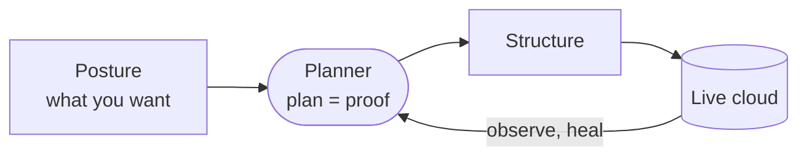
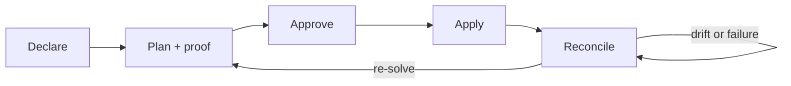
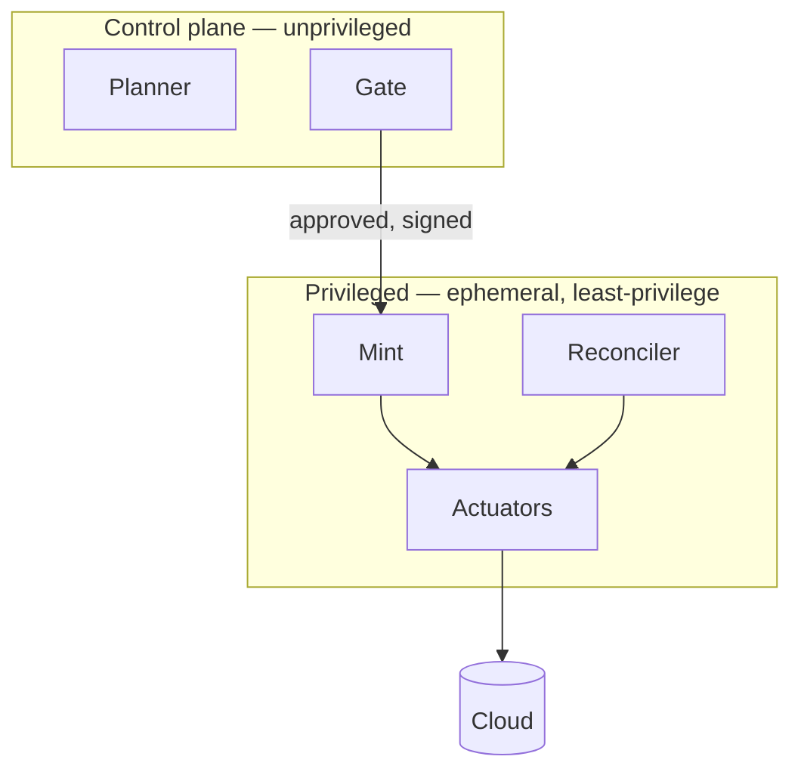

<!-- _class: title -->
<!-- _paginate: false -->
<!-- _header: '' -->
<!-- _footer: '' -->

# Declare what you want. Trellis builds and tends it.

`Trellis · cloud infrastructure that grows within a shape`

*A self-hosted platform: you declare a posture, a planner proves a plan, and a reconciler keeps it true — with no magic.*

---

<!-- _class: content -->

## A trellis, for the cloud.

You build a structure with a deliberate shape, train living things up it, set rules about what grows where — then tend it continuously, never letting growth escape the shape you set.

- **Shape** you govern — accounts, regions, networks, trust boundaries.
- **Life** that grows within it — your services, owned by your teams.
- **A gardener that never sleeps** — it reconciles, heals, and proves every move.

---

<!-- _class: diagram -->

`The shape of it`

## Posture in. Proven infrastructure out. Forever.

> You declare intent; the planner compiles it and shows its work; the reconciler holds reality equal to it, continuously.

---

<!-- _class: cards-grid -->

## Four dials — and one preset, Criticality.

- Intent
  - What the environment is *for* — a public payments API, a data lake, a sandbox.
- Resilience
  - How it must survive and change — active-active, RPO/RTO, deployment style.
- Budget
  - What it may cost — a ceiling to respect, or the thing to minimize.
- Governance
  - What is *allowed* — services, permissions, compliance, data residency.

---

<!-- _class: content -->

## No magic: the plan is a proof.

Trellis never "figures it out" behind a curtain. Every action it proposes traces to your objective or a named constraint — and a human approves the proof before anything changes.

- "Two regions, because RTO must be under fifteen minutes."
- "This instance mix, because it is the cheapest that meets it."
- Same inputs, same plan — deterministic, reviewable, signed.

---

<!-- _class: diagram -->

`Self-healing`

## Approve once. It holds the line.

> A node dies at 3 a.m. and is healed within the envelope you already approved — no page, no console, no surprise.

---

<!-- _class: cards-grid -->

## Safe by construction.

- Least privilege
  - Approval mints a credential scoped to that one change; it expires the moment apply is done.
- One brain, many hands
  - The planner holds no write rights; narrow actuators do the work, and the reconciler alone stands.
- Break-glass
  - Emergencies get a time-boxed, dual-controlled override — loud, logged, and repaid afterward.

---

<!-- _class: content -->

## A change is a path, not a target.

Moving a live system is never "redefine and pray." Trellis plans the *route* — and keeps your invariants true at every step, not just at the end.

- Expand-contract, blue-green, canary, rolling — the pattern is chosen by criticality.
- Every step reversible; data is migrated, never dropped.

---

<!-- _class: diagram -->

`The machinery`

## One brain. Many hands. Nothing trusted by default.

---

<!-- _class: cards-grid -->

## Most of it is proven. One part is the bet.

- The proven core
  - A reconcile loop, GitOps, and least-privilege execution — patterns already proven in practice, assembled with unusual rigor.
- The one bet
  - The planner that turns *what you want* into *how* — the genuine research risk, shipped first as vetted blueprints, never a black box.

---

<!-- _class: checklist -->

## What v1 is — and isn't.

- [x] One cloud, implemented richly (AWS first)
- [x] Blueprints plus constraint validation, with bounded tuning
- [x] Reconcile, self-heal, transitions, break-glass
- [-] Global topology optimization — authored and validated, not solved
- [ ] Multi-cloud and edge — deferred by design

---

<!-- _class: closing -->
<!-- _paginate: false -->
<!-- _header: '' -->
<!-- _footer: '' -->

## Build the shape. Let it grow.

`The full specification, red-team, and brand are in this bundle.`

<!-- markdownlint-disable MD033 -->

