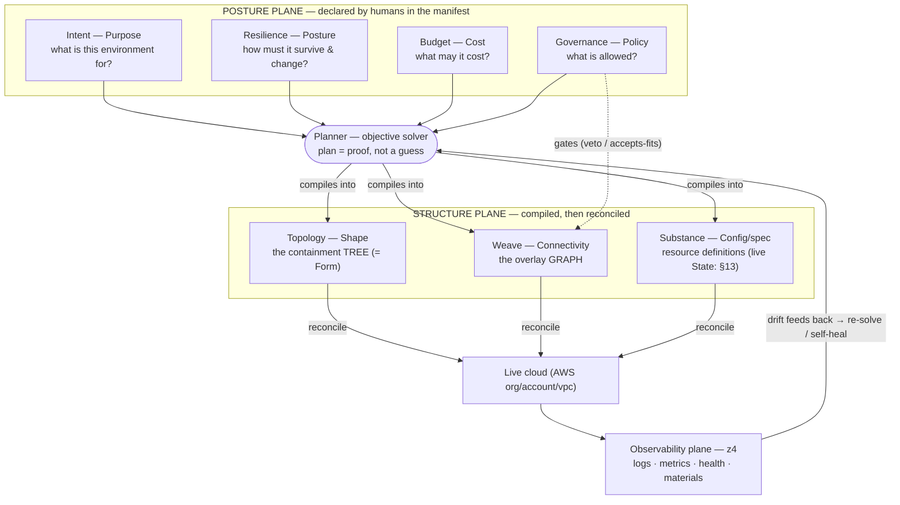

# Trellis — the one map (brainstorm)

> **Superseded for building by `trellis-spec.md`** — the self-contained, build-ready specification.
> This file is the discovery-ordered design *brainstorm* (provenance); `cloud-platform-redteam.md`
> holds the eight-reviewer critique.

**Working note, not canonical.** **Trellis** is a cloud infrastructure authoring,
provisioning, and management platform — a separate product from the slide engine, applying
Lattice's concept grammar (Function · Form · Substance · Finish, resolving into Frame · Cell ·
Tile) one domain over. The name extends Lattice: a lattice and a trellis are the same
structural idea — a woven support — and a trellis *trains living growth within a shape*, which
is exactly the role here (Governance shapes the structure, teams grow freely along it,
self-healing keeps it in form). It lives in `.scratch/` until it earns a home. The goal: point
Trellis at an AWS organization, declare *what you want*, and it plans, provisions, and
continuously heals the infrastructure — with **no magic**.

The thesis in one line: **Lattice is an open-loop renderer; this platform is a
closed-loop reconciler over the same compositional grammar.**

---

## 1. The whole system in three sentences

> An operator declares a **Posture** (intent, resilience, budget, governance).
> A deterministic **planner** solves an objective program to compile that posture
> into a concrete **Structure** (a topology tree + a weave graph + config +
> policy bindings), emitting a **plan that is a proof** a human approves before
> apply. A **reconciler** then keeps live cloud equal to that structure forever —
> self-healing is just this loop running continuously.

Everything below is which concept owns which decision, and how Lattice's grammar
maps onto it.

---

## 2. The lattice



Solid edges are the compile/reconcile spine; the dashed edge is the one cross-cutting
relationship that matters: **Governance gates Weave** (a proposed connectivity
edge must pass policy admission before it is realized).

---

## 3. The four Posture axes (what a human declares)

The four Posture axes are orthogonal, independently-swappable decisions, each owned
by a distinct audience — the same discipline Lattice applies to
Function/Form/Substance/Finish.

| Axis | Human word | The question | Owned by | Lattice origin |
|---|---|---|---|---|
| **Intent** | Purpose | what is this environment *for*? | requesting team | = Function |
| **Resilience** | Posture | how must it survive & change? (active-active/passive/standby, blue-green/canary, RPO/RTO, chaos tolerance) | SRE / ops | new |
| **Budget** | Cost | what may it cost? | owner / finance | new |
| **Governance** | Policy | what is *allowed*? (service whitelist, permissions, compliance regime, **data residency**) | security / compliance | new |

The operator declares **which posture input is the objective and which are bounds**
(see §5). Governance/compliance are *always* hard constraints — never traded away.
**Data residency** is one such hard constraint — a placement/data-flow rule ("EU PII stays in
`eu-*`") the planner enforces on Topology, Weave, *and* §18 backups (a cross-region backup must not
violate it).

---

## 4. The compiled Structure and its facets (what the planner compiles)

Structure is not an axis — it is the planner's **output**. It has three **facets**,
which are likewise outputs, not axes:

| Facet | Human word | Realized as | Lattice origin |
|---|---|---|---|
| **Topology** | Shape | the containment **tree**: org → account → region → AZ → VPC → resource | = Form (Frame/Cell/Resource) |
| **Weave** | Connectivity | the overlay **graph**: DNS, load balancing, peering, transit gateways, mesh, cross-region replication | new |
| **Substance** | Config/spec | resource definitions (the live **State** dimension is its own concept — see §13) | = Substance |

### Form's three nouns, in cloud terms

| Noun | Lattice | Cloud |
|---|---|---|
| **Frame** | slicer — carves a box | a partitioning boundary: Account, Region, VPC — contains and subdivides |
| **Cell** | typed slot, `accepts` kinds | a placement slot with a containment contract: a subnet/AZ. A *public* subnet `accepts` LBs/NAT; a *private* one `accepts` DBs |
| **Tile** (→ **Resource**) | filler — leaf bound to a source | a concrete resource (EC2, RDS, Lambda) bound to its image/config; `fits` only certain subnets |

**Topology is the tree; Weave is the graph drawn over it.** This is the resolution
to "cloud isn't a tree": connectivity edges (an LB fronting two regions, global DNS,
region-to-region replication) cross containment boundaries by design, so they are a
separate Structure facet, not part of Topology.

**Weave carries typed edges**, not just synchronous reachability: **sync** (request/response
— route + port) and **async** (pub/sub — producer → topic/stream, consumer-group → topic),
each gated by Governance ("may reach host:port" / "may publish to / subscribe as"). The
request/response model is the *sync subset*; event-driven and streaming workloads (§15) live
on **async** edges.

---

## 5. The planner — an explainable objective solver

**HARD RULE — the plan is a proof, not a guess.** Every provisioning action traces
to either the objective or a named constraint. Same manifest + same provider state →
same plan (deterministic). The planner emits the *derivation*: which constraints were
binding, how much slack each had, which alternatives were dominated and why. ("RTO 15m
is the binding constraint forcing warm standby"; "raise budget $500 and active-active
becomes feasible.")

```
minimize   cost(structure)                         # when Budget is the objective
subject to availability(structure) ≥ SLO           ┐
           rpo(structure) ≤ target                  ├ Resilience  (hard)
           rto(structure) ≤ target                  ┘
           services(structure) ⊆ whitelist          ┐ Governance  (hard — never relaxed)
           compliance(structure) ⊨ regime            ┘
           intent requirements satisfied               Intent
           resources(structure) ≤ provider quotas       Quota  (hard — else the plan passes review then fails at apply; planner requests increases + tracks headroom)
decision vars: region set, AZ spread, instance mix, replica count,
               replication links, deployment-strategy realization
```

The operator may flip the objective (`maximize-resilience subject to cost ≤ budget`).
Resilience and Budget are therefore not competing axes — they are posture inputs that
get **assigned a role** (objective | bound). Governance is always a hard constraint.

### Template *and* solver are one machine — and it is Lattice's "generated Frame"

- A **posture blueprint** (active-active → a vetted Structure) is a *pre-solved*
  answer to a standard objective — in Lattice terms, a **Frame** you *select*.
- The **solver** *derives a new Frame from goals* when no blueprint fits.

`design/forms.md` §7 already specifies this shape: Frames can be designer-authored or
**generated**, and the `accepts`/`fits` containment contract is the guardrail that
makes generation safe.

| Lattice (forms.md §7) | This platform |
|---|---|
| Select a Frame, or **generate** one | Pick a blueprint, or **solve** for topology |
| Guardrail: `accepts`/`fits` | Guardrail: **Governance** (whitelist + compliance) |
| Generation is reviewed (no blind regex) | **No magic** — the plan is a proof, human-approved |

So the constraint solver *is* the Frame-generation studio; Governance *is* the
guardrail; "plan-is-a-proof" *is* the review discipline.

---

## 6. The loop (what slides don't have)

```
solve → PLAN (+ proof) → human approves → apply → reconcile → (drift / manifest change) → re-solve
```

- The **human-approves-the-plan** step is the platform's one gate — the analogue of
  Lattice's "ask to merge" (prior approval never carries forward).
- **Self-healing** is the reconciler enforcing HARD RULE #1 ("all render paths agree")
  *continuously* instead of once in CI. Every remediation is explained: "replacing
  i-abc — failed health; Resilience requires availability ≥ 99.95%."

---

## 7. Weave vs Governance — kept distinct, with a directed gate

Weave (a Structure facet) and Governance (a Posture axis) are kept **distinct**,
because they pass the orthogonality test on every count — different owner
(network/platform vs security/compliance), different change cadence (re-route traffic
vs tighten policy), different enforcement (routes/DNS/LB vs IAM/SCP/admission),
different solver role (decision variable vs hard constraint). Conflating them would be
the SRP violation `forms.md` §3 warns against and would collapse the
**defense-in-depth** ("belts and suspenders") the platform exists to provide.

The seam — a security group is *both* a reachability and an authorization statement —
is a **shared-artifact** problem, not a reason to conflate them (exactly as a Lattice
Cell takes its *box* from Form and its *color* from Finish):

- **Weave** authors reachability intent ("ALB → app tier:443"; "us-east ↔ eu-west replication").
- **Governance** authors authorization intent ("app role may read payments DB"; "PCI ⇒ encryption in transit").
- The planner **compiles both** into the concrete SG / IAM / route set.
- **Governance gates Weave**: a proposed Weave edge must pass `accepts`/`fits`
  admission, or the plan fails *with a proof* ("denied — service not in whitelist").

Weave = *capability* (what CAN connect); Governance = *authority* (what MAY connect).
Capability without authority is the whole point of defense-in-depth — so they stay
distinct, with one labeled edge: `Governance ──gates──▶ Weave`.

---

## 8. Delegation = the recursion + the containment contract

The three personas are the **same grammar at different Frame scales** — a Frame is the
same type whether root or nested.

| Persona | Points at | Operates on |
|---|---|---|
| **Admin** | an AWS **Organization** | the **root Frame** — carves OUs / accounts |
| **Operator / DevOps** | an **account / region** | a **mid Frame** |
| **Team** | a **VPC** | a **nested Frame** (one Cell of the parent, recursed into) |

The guardrail that makes delegation safe is the `accepts`/`fits` contract: a division's
Frame declares what its Cells `accept` (which services, which budget ceiling, which
compliance regime); a team's resource must `fit` it or it is rejected. `clip, don't
bleed` becomes literal **quota / blast-radius enforcement** at the boundary; the
preview-only **overflow ring** becomes a policy-violation flag in the console, never
burned into a deployed resource.

---

## 9. Not axes — reuse existing Lattice concepts

| Requirement | Mapping |
|---|---|
| Logs everything; captures health & "materials" | **Observability = the z4 annotation plane**, formalized; it observes everything without being an axis, and is the loop's feedback path |
| Self-healing | the **reconciler** running HARD RULE #1 continuously |
| Stress / chaos testing | a **test capability** (an interpreter of the manifest, not a render path): inject failure, assert the reconciler heals |
| Cert mgr, secrets, DNS, CICD, load balancing ("batteries") | **Components filed under Buckets** — a rich library with sane defaults |
| Backup / archive (data protection) | a **Data Protection Component** (battery) — posture-derived backup cadence + retention; the stateful-transition mechanism (§18) |
| Cost / security / health views | the **Views layer (§25)** — a read-only *projection / aggregation* along the Frame tree (not a re-skin). Finish has no strong Trellis analogue |

The buckets stay roughly twelve: Compute · Networking · Storage · Data · Identity ·
Secrets · Certs · DNS · Delivery (CICD) · Traffic (LB) · Observability · Governance.

The cert/secret/DNS managers are **Components** in the §9 capability/battery sense —
distinct from a workload **Service** (§15). After the rename, "Component" means a
battery; "Service" means a workload unit.

---

## 10. The manifest (operator-facing)

```yaml
environment: payments-prod          # Intent
dock: aws-org/ou/payments           # WHERE it attaches — the Frame scale (§8)

optimize: minimize-cost             # which posture input is the objective
posture:
  resilience: active-active         # Resilience  ─┐ planner compiles to
  regions: [us-east-1, eu-west-1]   #              │  Topology + Weave
  rpo: 5m ; rto: 15m                #              ┘
  budget: 8000/mo                   # Budget       → bound (since cost is the objective)
  compliance: [pci-dss, soc2]       # Governance   → hard constraint

governance:                         # Governance overlay (permission graph)
  services: [ec2, rds, alb, acm]    #   whitelist
  permissions: least-privilege

capabilities:                       # Components from Buckets ("batteries")
  certs: acm ; secrets: secrets-manager
  dns: route53 ; cicd: codepipeline ; traffic: alb
```

---

## 11. Lattice → platform, at a glance

| Lattice | Platform |
|---|---|
| Function / Form / Substance / Finish | Intent / Topology / Substance / Views (Finish has no strong analogue) |
| Frame / Cell / Tile | boundary / placement slot / Resource |
| Component selects a Frame, binds Substance | a module/blueprint selects a topology, binds resources |
| Bucket | capability family |
| CSS — palette-blind, `var(--token)` | the map-rendering layer — token-driven Views |
| Transformers — one AST, many render paths | the reconciler — one desired state, many interpreters (live / diagram / cost / compliance / chaos) |
| resolution-blind Cell (`size:` at render) | region/account-blind module (target at deploy) |
| HARD RULE #1 — render paths must agree | drift detection + self-healing |
| `clip, don't bleed`; overflow ring | blast-radius/quota containment; policy-violation flag |
| "ask to merge" — one human gate | "approve the plan" — one human gate |

---

## 12. Authorization & execution

The action model and the execution engine are **two faces of one model**: the
`authorized-by` three-way intersection is the **static admission** face (who *may*
act, provable without running anything); the minted-ephemeral-credential ladder is the
**runtime** face (what an actuator actually holds when it acts). Break-glass is the
strictest contract value of the same model. Actions are the verbs over the noun
lattice. The map stays "no magic" by making every action answer *who / why / when* by
construction.

### The governing law

Every action is exactly one of four **classes**, and the class *is* the authority + gate:

| Class | Mutates | Who | Gate | Why / When |
|---|---|---|---|---|
| **Author** | *desired state* (the manifest) | humans only | **always** — plan + proof + approval | intent/policy/budget change; on-demand |
| **Converge** | *reality* toward desired state | the platform / reconciler | pre-authorized — human approved the **envelope**, not each act | drift, health, schedule, load; continuous / event |
| **Observe** | nothing | anyone in scope | none (read-only) | telemetry; continuous / on-demand |
| **Break-glass** | reality, *outside* the gate | elevated human | emergency only — time-boxed, max-logged | outage / incident; rare |

> **The one law: desired state changes only through *Author*; everything else
> *Converges* toward it.** This is the action-layer analogue of "the plan is a proof."
> Self-healing acts autonomously *because* a human already approved the envelope it
> acts within — it never invents desired state.

### The actors (who), by Frame scale

| Actor | Scale | May Author | Converge role |
|---|---|---|---|
| **Admin** | org / root Frame | org guardrails, delegation, governance baseline | — |
| **Operator / Platform eng** | account / region | environment manifests, blueprints, capabilities | — |
| **Team / Developer** | VPC / nested Frame | app config *within the delegated envelope* | — |
| **Security** | cross-cutting | tightens Governance constraints (author) | Observe everywhere |
| **Auditor** | cross-cutting | — | reads the *independent, externally-anchored* record (§27); split from Security |
| **FinOps / owner** | per Frame | budget + tags | reads cost Views (§25); acts on budget-breach |
| **Incident responder** | per blast-radius | — | drives the incident surface (§26); may invoke break-glass |
| **External / contractor** | scoped + TTL'd | — | guest identity, single Frame, max-audited, expiring (§29) |
| **Exec** | portfolio | — | reads portfolio Views (§25) |
| **Reconciler** (machine) | wherever applied | never | the autonomous Converge actor |
| **Approver** (human) | per scope | — | owns the gate (approve / reject plans) |

The `accepts`/`fits` delegation contract (§8) bounds *both* what a team may Author and
what the reconciler may Converge.

### The catalog (when × what × why), by lifecycle phase

| Phase | Representative actions | Who | Class · trigger |
|---|---|---|---|
| **Onboard** | connect to AWS org, set guardrails, define blueprints, delegate scopes | Admin / Operator | Author · once / bootstrap |
| **Author** | write/edit manifest, tighten policy, set budget / objective | Operator / Team / Security | Author · on-demand |
| **Plan** | solve, simulate / what-if, review plan + proof | Planner (machine) + human | Observe / decision · on change |
| **Approve** | approve / reject the plan | Approver | the gate · before apply |
| **Apply** | realize plan, deploy app version (blue-green / canary), roll back | Platform / CICD | Converge · post-approval |
| **Operate** | reconcile drift, self-heal, scale-in-bounds, failover, rotate certs/secrets, backup/replicate, alert | Reconciler | Converge · continuous / event / scheduled |
| **Evolve** | re-author → re-plan; promote a solved topology into a named blueprint | Operator | Author · on-demand |
| **Test** | chaos / game-day, stress test, compliance scan | SRE / Auditor | test-capability / Observe · scheduled |
| **Decommission** | tear down environment, revoke delegation, disconnect org | Operator / Admin | Author · gated, destructive |

### The duality with observability

Actions and the z4 observability plane are **duals**: actions are the writes, the plane
is the log of them. "Logs everything worth logging" falls out for free — every action
emits one audit record: `actor · verb · target · trigger · plan-proof · outcome`. That
record *is* the who/why/when, captured at the moment of action.

### Action is first-class — authorized by contract

An Action is a **catalog entry with a manifest**, like a Component — not ad-hoc code.
Each declares its effect, class, required privilege, and the key field: its
**`authorized-by` contract**, the `accepts`/`fits` of the verb layer.

```yaml
action: failover
class: converge
effect: promote standby region to active
requires:                     # the privilege profile (the privilege ladder, below)
  privilege: standing-write
  capability: [traffic, dns]
  scope: region
authorized-by:                # the contract — who / when may invoke
  roles: [reconciler, operator]
  conditions: [region.health == degraded]   # the why/when, as a guard
  gate: auto                  # auto | human-approval | dual-control
emits: audit-record
```

Authorization is a declarative **three-way intersection, statically checkable** — the
"no magic" property applied to *who-may-act* (provable without running anything):

```
allowed  =  action.authorized-by   ∩   scope.accepts-actions   ∩   actor.role
```

- the **action** declares which roles / conditions / gate it permits;
- the **scope / Frame** (delegation envelope) declares which action-kinds it `accepts`
  (a team VPC accepts `deploy, scale-in-bounds, observe`, not `create-peering, failover`);
- the **actor's role** declares which it `fits`.

The gate rigor is a *field on the action*, not scattered logic — so Break-glass is simply
an action whose contract says `gate: dual-control`, with a `ttl` and elevated privilege.
Reuse the manifest/catalog infrastructure (HARD RULE #15) — don't clone it.

### The execution engine — one control plane, many actuators

That static admission face has a runtime face: the engine that actually holds
credentials. *All actions are privileged, but not all privileges are the same* — which
forbids a single all-powerful engine (it would hold the union of every privilege; one
compromise = total org takeover) and forbids fully independent engines (they would
drift, violating HARD RULE #1). The resolution:

- **One control plane — unprivileged.** Planner, desired-state model, gate,
  audit. It reads, reasons, and proves; it holds **no write credentials**. Authoring
  mutates the manifest (data), never the cloud directly. (Intuition pump: the control
  plane is the part that *thinks*; the actuators are the part that *acts*.)
- **Many actuators — each least-privilege**, partitioned along three seams,
  holding the minimal credential for their cell of the grid:
  1. **Action class** — Observe/Plan need *read*; Apply/Converge need *write*;
     Break-glass needs *elevated*.
  2. **Frame scale** — a team actuator holds creds for one VPC; the org actuator's
     account-creating creds are rare and heavily gated.
  3. **Capability / bucket** — the DNS actuator gets Route53 only; secrets gets Secrets
     Manager only. A poisoned DNS actuator can't touch IAM.

### The privilege lattice

```
  break-glass / org-admin       — vaulted, dual-control, time-boxed
  standing write                — reconciler ONLY, scoped to managed set + posture-permitted changes
  ephemeral plan-scoped write   — minted by approval, expires after apply
  read / plan / observe         — broad, low-risk
  author                        — NO cloud creds (control-plane data only)
```

**The approved plan *is* the capability.** Approval mints an ephemeral credential scoped
to *exactly the diff in that plan* — the actuator does what the proof says and nothing
else, then the cred expires. Standing god-mode write exists nowhere except the
reconciler, bounded to its managed resources and the change kinds the posture permits
(replace an unhealthy instance: yes; create new VPC peering: no — that needs
Author + Approve). Plan-proof, gate, and privilege grant are the same object.

### Privilege narrows down the Frame tree

The actuator fleet delegates as the Frames do: an org-actuator mints account-actuators,
which mint vpc-actuators, and **a child grant can never exceed its parent's** — the
`accepts`/`fits` contract applied to *credentials*, and `clip, don't bleed` as literal
blast-radius isolation at the credential boundary.

### Break-glass — the sanctioned divergence

The escape hatch from the gate, for the crises where the gate *can't* run: the control
plane is down, an already-approved desired-state is *itself* the outage, the bleed is
faster than Author→Plan→Approve, or a gate dependency is unavailable. It is a first-class
action (above) whose contract makes it the **most**-controlled, not the least:

- **pre-authorized, never ad-hoc** — invoke a *defined* break-glass action
  (`gate: dual-control`, a `ttl`, elevated privilege), not improvised god-mode;
- **dual-control** — two humans open the glass;
- **JIT, time-boxed credential** — minted by the ceremony for the TTL, held by no one
  standing; the glass re-seals on expiry;
- **scoped to the Frame** — break-glass is never one global god-switch; it comes
  in distinct **scopes**, each opening a strictly bounded blast radius (table below);
- **maximally logged + loud** — non-repudiable audit; opening it pages everyone.

**The scopes** — each scope follows the same Frame recursion as standing privilege
(the privilege ladder, above): a scope can never exceed its grant, so break-glass
narrows *down* the tree exactly as ordinary privilege does. Dual-control at every scope.

| Scope | Opened by (two-person) | Blast radius | TTL |
|---|---|---|---|
| **VPC / team** | team lead + second | one VPC's resources | shortest (≤ 30m) |
| **Account / region** | operator + second | one account or region | bounded (≤ 1h) |
| **Org** | admin + second | cross-account / org-wide — *only when the org itself is the incident* | shortest-lived, hardest gate |

**It does not change desired state — it changes reality, temporarily, and owes a debt.**
On TTL expiry the reconciler does **not** auto-revert (that would re-open the very bleed
the glass was broken to stop). It **freezes reconciliation on the touched resources** and
raises a mandatory **ratify-or-revert** task: the operator closes the divergence through
the normal **Author** gate — ratify (the emergency change becomes the new desired state)
or explicitly revert.

> Break-glass buys *time*, not *permission*: a time-boxed, dual-controlled, fully-logged
> loan against the model, with forced repayment through Author. The governing law still
> holds — "desired state changes only through Author"; only "reality converges to desired
> state" is suspended, and only until the debt is paid.

---

## 13. The State model

**State** is the live condition of a resource — lifted out of Substance into its own
concept (Substance is config/spec; State is the live dimension, observed via the z4
plane). `desired` and `observed` are **not states** — they are two **projections** of one resource
(spec / status; setpoint / measured value). The lifecycle state is **derived**:
`state = f(desired, observed, health)` — a pure, recomputable function, never stored as
ground truth (one scoped exception: a *retained observed-state history* is kept for compliance
evidence — §27). That is "no magic" applied to state: every state is explainable by showing
its inputs ("why Degraded? — *these* inputs"). It is Lattice's manifest→rendered
relationship: observed is the "rendered" reality, desired is the source of truth, and the
reconciler is the continuous drift gate between them.

- **Desired** (spec) — authored; **version-stamped** by the plan generation that produced it.
- **Observed** (status) — measured from telemetry; **timestamped** with freshness / confidence.

### State is a product of three orthogonal sub-dimensions

| Sub-dimension | Values |
|---|---|
| **Sync** (observed vs desired) | InSync · Progressing · Drifted · Unknown |
| **Health** (liveness of observed) | Healthy · Degraded · Unknown |
| **Control** (reconciler stance) | Reconciling · Settled · Stalled · Frozen |

The named states are the salient cells of that product:

| Named state | Combination | Meaning |
|---|---|---|
| **Converged** | InSync · Healthy · Settled | matches spec and alive — the goal |
| **Converging** | Progressing · — · Reconciling | *authored* gap-closing (a deploy) |
| **Drifted** | Drifted · — · Reconciling | *unauthored* divergence — reconciler corrects |
| **Degraded** | InSync · Degraded · Reconciling | correct but unhealthy → self-heal |
| **Stalled** | behind · — · Stalled | can't converge (error / timeout / blocked / Governance veto) — needs a human |
| **Frozen** | — · — · Frozen | reconciliation suspended (break-glass §12) — debt outstanding |
| **Unknown** | Unknown · Unknown · — | observation stale / missing — *cannot assert* |

### Two lifecycle modes — steady-state and run-to-completion

The product above describes **steady-state** (a Service: converge-and-hold). A **Job**
(batch / ETL / ML; cron = recurring) has a different shape: its State is a **terminal
progression** — Pending → Running → **Succeeded / Failed** — not a steady Converged. The
reconciler converges to *terminal success by deadline*, then **retires** the Job; a completed
Job vanishing is **success, not Drift**. So State has two modes: steady-state (Service) and
run-to-completion (Job). **Stateful clusters** (Kafka / DB / search) are steady-state with a
**quorum/partition-aware roll-up** (1-of-3 down = Degraded-serving; 2-of-3 = unavailable) — an
instance of the Resilience-parameterized roll-up below. (Workload classes: §15.)

Two non-obvious rules:

- **Progressing vs Drifted is decided by provenance, not the size of the gap.**
  `observed ≠ desired` is ambiguous — a healthy deploy or an out-of-band change — so desired
  state is **versioned (generations)**: "converging toward generation N" is good; "diverged
  from N with nothing pending" is drift.
- **Unknown is fail-safe and first-class.** Stale telemetry → Unknown, never
  assumed-Converged. The reconciler **holds and alerts on Unknown — it never acts on stale
  data**; a dashboard never shows green while blind.

### Roll-up follows the Frame tree; Resilience parameterizes it

A Resource has a state; a Cell/Frame state is a **roll-up of its children**, aggregating up the
Form recursion. The roll-up *severity function is parameterized by the Resilience axis*:
active-active reads "one region down" as Degraded-but-serving; active-passive reads the same
fact as a failover trigger. The posture defines what "healthy" *means*, not just the topology.

### Drift policy

Auto-remediation of Drift is a **per-scope policy — `enforce | warn | ignore`** — defaulting
to `enforce`, set by Governance / posture. Self-healing stays the default; an operator can
mark a resource observe-only (e.g. hand-managed during a migration) without the reconciler
stomping it.

### What it powers

- **Reconciler** acts on the *derived* state: Drifted/Degraded → Reconciling; Stalled → page;
  Unknown → hold; Frozen → do not touch.
- **Break-glass** (§12) *is* the Frozen state; ratify-or-revert is "take this resource out of Frozen,
  back through Author."
- **Observability (z4)** *is* the observed projection — the measurement half of this model,
  not a separate thing.

---

## 14. Solver depth — shallow across Frames, deep within Cells

"Solver depth" is not one knob; the question is *where* depth lives, and the Form recursion
answers it. A plan has two scales: the **macro topology shape** (which Frames; how
regions/AZs/VPCs are carved) is discrete, small, and **authored**; the **micro fill of each
Cell** (instance types/sizes, replica counts, placement mix) is continuous and **tunable**.

> **Shallow across Frames, deep within Cells.** Macro structure comes from template/rule
> *selection*; optimization is confined to bounded leaf sub-problems. You never optimize the
> Frame catalog — the graveyard is *global* topology optimization — you select a Frame and
> optimize what fills its Cells, exactly as Lattice never optimizes its Frame catalog.

### The rung ladder

| Rung | Planner does | "Solve" = | Limit |
|---|---|---|---|
| **0 — fixed template** | posture → one named blueprint | lookup | no flex |
| **1 — parameterized template** | blueprint + posture-bound knobs | instantiate + validate | shape fixed |
| **2 — rule-based composition** | rules select & compose blueprints | decision procedure | no optimization |
| **3 — constraint satisfaction** | search for *any* legal structure | feasibility | no preference among legal |
| **4 — constrained optimization** | among legal, minimize cost / max resilience | the objective program | combinatorial — the graveyard *if global* |

### Invariants that hold at every rung (only the internals deepen)

Like Lattice's light→executed coupling rungs, vocabulary and contract are rung-invariant —
graduation never changes the model:

1. **Determinism** — a plan is a pure function of *(manifest generation + a pinned provider-state snapshot + a pinned pricing version)*; same pinned inputs → same plan. Live provider state is eventually-consistent, so determinism is scoped to the snapshot, **not** "the cloud right now"; add hysteresis so a sub-threshold cost wobble doesn't churn the plan. At rung 4 this forbids a stochastic solver. Non-negotiable. (See §22.)
2. **The plan is a proof** — always carries the derivation; its *form* deepens (rung 0 "you picked X" → rung 4 "min $N, binding = {RTO}, +$500 unlocks active-active").
3. **Governance is a hard pre-filter** — bounds the feasible region; never an objective term.
4. **Human approves before apply** — rung-independent.
5. **Same vocabulary in/out** — posture in, Structure out; the author can't tell the rung except that the proof is richer.

### Two time-scales — "templates are cached solutions," realized

- **Catalog-time (offline, human-reviewed):** higher-rung solving may *generate a novel
  topology Frame* from goals (forms.md §7's AI-assisted Frame generation) — its output is
  reviewed and **frozen into the blueprint catalog**.
- **Request-time (online, deterministic, fast):** consumes the catalog — rungs 0–2
  select/compose/parameterize, plus bounded leaf tuning. No global search on the hot path.

A solved novel topology, once vetted, *becomes* a cached blueprint. The dream
(derive-from-goals) lives at catalog-authoring time, gated; the request path stays
deterministic.

### The competence-boundary escape hatch

When no template/rule/feasible solution fits, the planner **fails loudly with the binding
constraint** ("no blueprint satisfies RTO < 2m at $8k/mo — RTO is binding; here's the
cheapest feasible RTO, or the budget that unlocks it") — it **never silently invents**. That
loud failure *is* "no magic" at the edge of competence.

### v1 ceiling (settled)

- **Hybrid from day one:** macro = template/rule (rungs 0–2); micro = bounded leaf tuning;
  catalog grown offline; loud escape hatch.
- **v1 caps at rung 2** — select + compose + parameterize, with **heuristic / lookup-table
  leaf sizing**, no real optimizer. Determinism and the proof are mandatory from v1.
- **True bounded leaf optimization** (rung-4-local, deterministic) is v2.
- **Frame generation** is a human-authored catalog in v1; solver/AI-assisted generation is a
  later offline, reviewed capability.

---

## 15. The workload — archetypes, Services & Criticality

Two concepts wanted the word "tier." Resolved by the vocabulary law (one exact word per
concept, like Lattice legislating "look" into Layout vs Style): **Criticality means
"how much does it matter" only**; the web/app/data layers are **Services** — they need
no new word, they already *are* the join concept (§5, §11). A **Service** is the
bounded-context workload unit that owns its own data.

### Services — the workload's composition

A web/app/data layer *is* a Service one scale down: it **is-a Function** (its role),
**occupies a Cell** (public / private / isolated subnet), **binds Substance** (its
resources), and **carries its own posture**. A workload is a composition of Services,
in the recursion between the environment Frame and the leaf Resource:

```
environment (Frame) → Services (Cells / sub-Frames, Intent-typed) → resources (Resources)
```

- **Placement** via `accepts`/`fits`: a public Cell accepts the web Service; an isolated Cell accepts the data Service.
- **Sizing** is the per-Service leaf optimization (§14, "deep within Cells"): web sizes on request-rate, data on capacity + IOPS + RPO.
- **Weave** wires Service→Service (web→app→data); **Governance** differs per Service (the web Service is the attack surface).
- **Don't hardcode web/app/data** — Service is the general Intent-typed unit; 3-service is the common *blueprint*, not a kernel concept (event-driven, pipelines, ML differ). Catalog, not kernel.

**Posture cascades per Service** — declared at the environment level as a default,
**overridden per Service** (the cascade Lattice already lives by). The solver resolves
effective posture per Service (override > inherit), runs per-Service placement +
sizing + wiring, and the proof reports it per Service.

### Workload archetypes — not everything is a 3-tier service

The reconciler thesis ("keep reality equal to desired state *forever*") is right for
long-running services and wrong for finite work. Generalize it: **the reconciler converges to
the declared *lifecycle intent*.** **Workload** is the umbrella; its **lifecycle class** is:

- **Service** — long-running, steady-state, *reconcile-and-hold* (desired = "N healthy replicas
  exist"). The common case above; a **monolith** is simply one coarse-grained Service
  (decomposition is a team choice, never forced).
- **Job** — finite, *run-to-completion* (batch / ETL / ML training; cron = recurring). Desired =
  "terminal success by deadline"; completion is **success, not Drift**; the reconciler
  runs-to-terminal then **retires** it (never re-creates a finished Job). Its State is a terminal
  progression (§13).

Two node-types that are *not* reconciled workloads complete the picture:

- **External / Integration** — a third-party SaaS (Stripe, Datadog, Auth0) Trellis *consumes, not
  provisions*. A node in the dependency/Weave graph that Trellis **governs the integration to but
  never reconciles**: it consumes secrets (API keys), needs an egress Weave edge + Governance
  allow, and **participates in Criticality propagation** (its outage affects you) — but its State
  is **observed-only** (Trellis can't heal Stripe).
- **Async wiring** — event-driven and streaming systems are wired with Weave's **async** edges
  (pub/sub — §4), not synchronous routes.

**Out of scope (honest cut): edge computing.** Thousands of intermittently-connected sites invert
the org → account → region → AZ → VPC containment tree and need a *disconnected / eventually-
consistent* reconciler — a different core model, not a force-fit here.

### Criticality — the magnitude facet of Intent

**Criticality is the "how much does it matter" magnitude of Intent** (C0 = mission-critical →
C3 = best-effort), realized as a **posture preset**: one dial expanding into a
coordinated bundle across Resilience / Budget / Governance / Observability. It is *not* an
orthogonal axis — its purpose is to move the others together (a "theme" for posture).
Criticality is a **catalog of named presets**, not a fixed enum, so an org defines its own
(`regulated-prod`, `internal-tool`) without changing vocabulary. Criticality sets §5's
objective/constraint roles by default: high Criticality → resilience hard + aggressive, cost is
slack; low Criticality → cost is the objective, resilience best-effort.

**What the solver does with Criticality:**

1. assigns objective vs hard-constraint roles;
2. sets target aggressiveness (availability / RPO / RTO numbers);
3. selects the blueprint (macro) and sizing headroom (micro);
4. sets blast-radius **isolation** (high-Criticality separated from low-Criticality — `clip, don't bleed`);
5. sets gate rigor + break-glass scope (§12);
6. orders **budget priority** under contention;
7. sets **observability depth** (z4 intensity, SLO-burn tracking).

**Criticality flows over two graphs, in two directions:**

- **Declared Criticality cascades *down* the containment tree** (environment default → per-Service override) — the same cascade as posture.
- **Required protection propagates *up* the dependency graph** (Weave edges): **your dependencies must be at least as critical as you are** — `effective = max(declared, max over dependents)`. The planner **validates** this statically (checks consistency, fails loud with a proof: "C0 web → C2 cache: violation; raise cache ≥ C0 or mark it off the critical path") — it does **not** *optimize* it; propagation is a graph fixpoint, and solving it reintroduces global optimization (see §22). Propagation raises a shared dependency's **protection level** (HA / backup / change-rigor), **not** its isolation domain (§22). Needs the dependency graph as a planner input.

---

## 16. Placement — ownership, trust attributes, and the colocate↔isolate posture

### Ownership is the primary grouping (vertical, not horizontal)

A workload decomposes **by ownership / bounded context (vertical)** — a Service
**owns its own data**, colocated — not by horizontal function (a shared "data
tier"). Genuinely shared things (a data lake, identity, logging) are just Services owned by
a *platform team*, depended on via Weave, with **criticality propagation** (§15) forcing
them ≥ their most-critical consumer's Criticality. Function and trust are overlays *within* the
ownership grouping; ownership is what they overlay onto.

### Trust — a Governance-derived attribute on a Cell, not a location

Trust is a **Governance-derived attribute stamped on a Cell**, not a parallel
classification: it sets the Cell's trust-derived `accepts` and the Cell's inter-Cell
adjacency (this is `Governance gates Weave`, §7). The correction the colocation argument
forces: trust is a **tag realized as a local microsegment**, *not* a shared central band.
A database stays database-*trust* (isolated, no internet inbound, strict adjacency) while
living **with its app**, inside the owning Service's boundary. "Database zone" as a shared
horizontal tier is retired, and trust is no longer a first-class noun.

- **Resources are classified along three independent dimensions:** **function** (a
  Service — Intent), **trust** (a Governance attribute on a Cell), and **Criticality** (a
  posture preset — Intent magnitude). They usually line up in a textbook app, which is
  exactly why they get conflated — they vary independently (two Services at one trust
  level; one Service spanning trust levels; a C0 resource at any trust level).
- **A Cell carries a trust attribute**, which sets the Cell's trust-derived `accepts`.
  Trust attributes **recurse** (concentric trust → microsegmentation; finest grain = per-Service).
- **Inter-Cell adjacency is the concrete `Governance gates Weave` policy (§7)** — default-deny,
  explicit allowed crossings (customer-facing → app → data, never customer-facing → data). The
  planner compiles the SG / NACL / route set from the adjacency and **fails forbidden flows with
  a proof**.
- **The designer/author split holds:** Governance *owns* the trust vocabulary + adjacency rules
  org-wide; each ownership boundary *realizes* them locally.

### The colocate↔isolate placement posture

Placement is an explicit, provable **choice**, not a fixed rule — three forces, two of which
oppose colocation for *different* reasons:

| Force | Pulls toward | Driven by |
|---|---|---|
| efficiency (data gravity, latency, egress cost) | **colocate** | Budget + Weave |
| redundancy (survive a failure) | **spread copies** | Resilience |
| containment (a failure / breach doesn't propagate) | **separate boundaries** | Governance / blast-radius |

Redundancy and containment both fight colocation but are distinct — you can have one without
the other. The knob is a **granularity decision on isolation boundaries** — the `isolation`
value runs from coarse colocation to fine isolation per service (cell-based architecture), a
*spectrum*. ("Cell" here = the placement slot from the grammar; note it collides with the
"cell-based architecture" term of art, which is the fine-isolation end of this same knob.)

It lands as a **placement posture** — a per-Service knob (`isolation: colocate …
isolate-per-service`), **defaulted by Criticality** (C0 → fine isolation; C3 → colocate
for cost), **overridable**, and **validated by the planner** — *authored, not globally optimized*:
cross-Service placement is declared (or Criticality-defaulted), never solved, or the colocation tradeoff
becomes facility-location-hard (§22). The proof reports the tradeoff
("colocated — C2; cross-region replication exceeds budget"). No new axis — it
bundles the existing Budget / Resilience / Governance forces into one declarable choice.

---

## 17. Provider strategy — abstract with a contract

Full multi-cloud (simultaneous, provider-erasing abstraction) is the holy grail that is
expensive and rarely materializes — it leaks anyway via the lowest-common-denominator trap. The
strategy instead is **abstract with a contract**, the same shape Lattice uses for colour
(palette-blind layouts; one theme shipped; the contract admits others).

> The vocabulary, Topology, and Structure stay **provider-neutral**, expressed against a
> **capability contract**. Exactly **one provider is executed at a time** (the primary,
> implemented richly); other providers are **mapped** against the contract but **built only when
> the time comes**. This is provider-risk mitigation, *not* active multi-cloud.

Reuses three model principles:

- **Theme / Finish** — the provider adapter is the substrate's "theme"; the provider is a
  *deploy-time binding*, as resolution is for a resolution-blind Cell.
- **Coupling rungs** — a non-primary provider sits at the "light" rung: its capability mapping is
  *validated* (the crosswalk exists), not *executed* (no live adapter) until needed.
- **HARD RULE #1** — a second provider, once built, is another render path of the same
  desired-state AST; the parity gate makes it agree. Until then only the primary path is live.

### The contract is capability-intent, not resource-type

This dodges the lowest-common-denominator trap:

- ❌ "an `aws_db_instance`" (leaky, AWS-shaped)
- ✅ "a managed relational store, cross-region replication, RPO ≤ 5m" — AWS binds RDS, GCP would
  bind Cloud SQL, Azure binds Azure SQL.

The primary is implemented **richly** (full capabilities), not the intersection. **Escape
hatches** are allowed: a Service may use a provider-specific feature with no mapping elsewhere
— which makes **portability a measurable property** (pure-contract vs. provider-locked per
Service). The platform **reports your lock-in exposure** — "no magic" applied to provider risk.

### Abstract the level-names; implement the AWS column

The Frame/Cell/Tile grammar is already provider-neutral; only the *named levels* are AWS today.
The contract abstracts them:

| Neutral concept (contract) | AWS | GCP | Azure |
|---|---|---|---|
| tenancy root | Organization | Organization | Mgmt Group |
| isolation / billing boundary | Account | Project | Subscription |
| geographic failure domain | Region | Region | Region |
| local failure domain | AZ | Zone | AZ |
| network boundary | VPC | VPC | VNet |

Implement the AWS column; the rest is the documented crosswalk, built on demand. Adding a
provider is **additive** (a new adapter against the existing contract, parity-gated), never a
rewrite — portability costs *contract discipline now*, not N implementations.

---

## 18. Transition planning — a plan is a path, not just a target

Everything to here produces a **target** (the desired Structure). But a *live* system can't
always jump to a valid target: two perfectly valid states may have **no safe instantaneous
transition** (you can't redefine a live database's network boundary — you stand up the new,
replicate, cut over, retire the old).

> A target only has to be **valid at the end**. A path has to keep the system's invariants —
> availability, data integrity, the Criticality's SLOs — **true at every intermediate step.** A
> transition can be unsafe even when both endpoints are flawless.

So "the plan" splits into two artifacts from one derivation:

1. **Solve the target** (§5/§14 — the objective solver): *what should exist.*
2. **Solve the path** (new — the **transition planner**): diff `observed → target` and sequence a
   safe migration. *How to get there from where we actually are.* (Terraform orders a diff by
   dependency; this is stronger — it must preserve invariants *during* the change, not just reach
   the end state.)

### Build the path from canonical patterns — not a path-solver

A general "search all orderings" solver is the §14 graveyard again. Apply the same discipline —
rungs 0–2 over a catalog, never global search — but the catalog is **migration patterns**:

| Pattern | Use | Cost / safety |
|---|---|---|
| **Expand-contract** (parallel change) | replace anything others depend on | safe, general |
| **Blue-green** | swap a whole environment | safe, expensive |
| **Canary / progressive** | validate before full ramp | safe, slow |
| **Rolling** | replace N-at-a-time | medium |
| **In-place (stop-the-world)** | low-Criticality, tolerable downtime | cheap, unsafe-by-design |

The planner classifies each change, **selects a Criticality-appropriate pattern per change**,
dependency-orders them, and emits the path with a proof. **Criticality sets the strategy** (C0 →
zero-downtime expand-contract/blue-green; C3 → in-place) — the same Criticality-as-preset
consistency as resilience and isolation.

### The path is a sequence of gated, reversible Actions

- **Each step is a first-class Action (§12)** — its own authorized-by contract, proof, audit record.
- **Rollback is first-class:** every step carries its inverse (or a checkpoint); the plan ships its undo.
- **The proof extends to transition safety** — not just "the target is optimal" but "this ordering
  preserves invariant X at every phase; here's each step's rollback point; here's the one place a
  maintenance window is required, and why." "No magic" applied to migration.
- **The path is recomputed from `observed`, not stored as a script** — idempotent, resumable,
  self-healing by construction. To avoid strategy-thrash mid-flight, the chosen pattern is
  **pinned** in an explicit, versioned **transition intent** — a short-lived second desired-state
  layer that retires when the transition completes.
- **Approval is Criticality-defaulted:** whole-path for routine/low-Criticality; **phase gates for C0 and any
  stateful migration** (approve, validate the phase landed, proceed).

### What it reaches back and changes

- **Loop (§6):** `solve target → plan transition → approve the path → apply step-by-step → reconcile`.
- **State model (§13):** becomes the **gate between steps** — observe + confirm invariants/health
  before proceeding; a failed step → rollback → Stalled/Frozen + human. "Converging" is now per-step.
- **The gate:** the human approves a *sequence* (or phases), not a single target.
- **Break-glass (§12):** gains "halt/abort an in-flight transition and stabilize."
- **The solver** is now two-stage (target, then path).

### Stateful data — the hard core (the Data Protection battery does the work)

Stateless resources transition trivially (rebuild). **Stateful ones (DBs, queues, caches) are the
deep end** — the **RPO/integrity invariant binds the path itself**. The mechanism is the
**Data Protection battery defined in §9** (backup realizes RPO; archive realizes
retention/compliance; cadence and retention are posture-derived per Criticality). Two payoffs
for transitions:

- **PITR is the data-plane rollback** — the restore point before a risky step *is* its undo. Backup-
  restore is to *data* what inverse-actions are to *structure*; the model gets symmetric recovery.
- **Two stateful-migration patterns, Criticality-picked** — "stateful migration = restore" is *Criticality-conditional*:

  | Stateful pattern | When | Cost / loss |
  |---|---|---|
  | **Backup → restore → cutover** | C2–3, downtime-tolerant, cold | cheap; window + RPO-window data loss |
  | **Replicate → verify → atomic cutover** | C0–1, live, zero-loss | safe; expensive, complex |

  Restore is point-in-time-*past* (loses the delta since the restore point) and doesn't choreograph
  cutover or transform schema/engine — so live high-Criticality migration needs replicate-cutover, with
  backup as the *net*, not the mechanism.

**Backup ≠ HA** — different threat models: replication protects against *infrastructure failure*
(but faithfully replicates a corruption / `DROP TABLE`); backup/PITR protects against *corruption /
deletion / logical error*. C0 provisions **both**; "we have backups, so we're resilient" is the
trap.

---

## 19. Bootstrap & root of trust

The whole model — control plane + actuators, least-privilege, approval mints ephemeral creds — *assumes
credentials already exist*. The platform can't provision its own initial authority (circular),
nor the infrastructure it runs on if that's what it provisions.

> The root of trust is **necessarily external** to the system it bootstraps. There is exactly one
> moment that lives outside the gated machine — the bootstrap ceremony — and the whole chain of
> derived, scoped, ephemeral authority hangs from it. Bootstrap is the same shape as break-glass
> (§12): deliberate, dual-controlled, maximally-logged, time-boxed, using the most elevated
> credential, then **sealed**.

### The principles

1. **External, minimal, sealed root.** The seed is the provider's own root (the management-account
   root user) + a human IdP. It does the minimum — establish the org, create the
   delegated-administrator identity foundation — then **seals itself** (root MFA in a safe, no
   access keys, never used again; re-opening is a break-glass-scope event). The §12
   privilege-narrows-down-the-tree recursion applied to the apex.
2. **Bootstrap is the loop's first iteration — privilege is *earned* visibly:**
   `read-only discovery → plan (proof of what it would set up) → human approves → scoped write`.
   The platform shows the map and the bootstrap plan *before* it is granted anything that writes.
3. **Identity, not standing secrets.** The control plane authenticates via workload identity (instance
   roles / OIDC federation); the actuators mint ephemeral creds via the provider's STS, scoped to the
   approved plan. No long-lived keys at the core — "who grants the actuators their mint-capability"
   resolves to the trust policies the bootstrap established, anchored in the sealed root +
   permission boundaries that cap even the top org-actuator (it can't escalate itself or remove its
   own guardrails).
4. **Protect the root like break-glass, log it externally.** Dual-control to use it; the bootstrap
   audit is **immutable and external** — the platform can't be trusted to honestly log its own
   genesis, so that record lives in an append-only store outside it.
5. **The platform manages itself as a Criticality-0 environment** — its own control plane is just another
   environment it manages, **C0** by definition, described by a manifest in external SCM. That
   yields **meta-DR**: if the control plane is destroyed it is *re-bootstrappable* from the external
   seed + the manifest repo. Only the very first stand-up is manual.

### Deployment: self-hosted first

The control plane runs in a **customer-owned management account**, and the **trust root never leaves the
customer** — chosen for sovereignty, since a tool with org-wide god-tier potential should not
externalize its root. The customer always retains the root and can revoke the platform's foothold
unilaterally. A vendor-hosted SaaS control-pane (customer grants a scoped, revocable cross-account
role) is a possible *later* option, not the v1 posture.

---

## 20. Manifest lifecycle & promotion

### Structure follows ownership — Governance dictates the contract, teams contour

The governing principle, the designer/author split (§7/§8) applied to source:

> **Governance dictates the *contract* (what's allowed); teams *contour* — they self-determine how
> they slice their apps into Services — within it.** Governance constrains; it does not dictate
> layout.

This settles repo structure on principle: **federated by ownership, not a monorepo.** A monorepo
collapses one access boundary over all desired state, contradicting the per-Frame least-privilege
and blast-radius isolation held everywhere else (§12, §16), and couples change-cadence + CI across
teams. The structure is **layered by Frame scale**:

- **Platform / governance layer** — centrally owned (admin/security): the Governance contract, the
  Criticality/trust catalogs, blueprints, org guardrails. Its own governed unit.
- **Team units** — federated, team-owned: each owns its Services, slices its apps as it likes,
  runs its own cadence — bounded only by the contract.

**Governance is enforced at the admission gate, not by repo topology** — the contract check at plan
time (`accepts`/`fits`, the §12 three-way `authorized-by` intersection, Criticality propagation, inter-Cell
adjacency), applied uniformly to whatever any team submits, *wherever it lives*, with a proof
("denied — Service declares a public path to a database-trust Cell"). Policy is centralized (the
contract); mechanism and structure are distributed (the teams). That decoupling is what *lets* the
repos federate — you never centralize source to enforce policy.

### Git is the source of truth; the gate is the merge

| Our concept | GitOps realization |
|---|---|
| Desired state (the manifest) | the Git repo |
| **Generation** (§13, drift-vs-progress provenance) | a commit SHA |
| **Author** action (§12) — the only way to change desired state | a commit / PR |
| **The plan is a proof** (§5) | the planner runs in CI on the PR, posts the plan+proof as the check |
| **The one human gate** (approve) | PR review + **merge** |
| Reconciler converges to desired | reconciler **pulls** the merged manifest |

*Propose (PR) → planner posts plan+proof → human reviews → merge = approve → reconciler applies.* The
merge **is** the gate — the same workflow Lattice itself is developed under. Two caveats: the
reconciler **pulls** (not CI-push), and **secrets never live in Git** — the manifest *references* a
secret (in the Secrets Manager battery, Governance-controlled); the value is never committed.

### Promotion: advance an immutable, validated version — don't re-merge

> **Promotion = advancing an immutable, validated version reference through an ordered pipeline of
> environments.** The base desired state is **environment-blind**; each environment instantiates it
> with its own **posture overrides** (the §15 cascade — dev = C3, prod = C0). You promote a
> known-good artifact (vN), so **what you validated in staging is bit-for-bit what reaches prod.**

Reuses the posture cascade, env-blind artifacts (env is a deploy-time binding, like region-blind
modules §17 / resolution-blind Cells), and one key split: **the artifact is promoted, but the *path*
is re-planned per environment** — prod gets a fresh transition plan+proof against *prod's* observed
state (§18), because prod ≠ staging. Promotion state is **visible** (dev@v5, staging@v4, prod@v3),
and an environment hand-modified off its version shows as **Drifted** (§13).

### It inherits delegation and closes the loops

Commit authority follows the §8 Frame scales (CODEOWNERS-style); the `accepts`/`fits` envelope bounds
what a team's commit may declare. **Break-glass ratify (§12) = a commit** (the emergency change repaid
into Git); **rollback of intent = `git revert`**, and the reconciler plans the reverse transition
(with §18 stateful caveats for schema-affecting reverts).

---

## 21. The trusted computing base (red-team)

The model's safety **concentrates onto five parts it implicitly trusts**: the **planner**, the
**proof**, the **gate**, the **catalog**, and the **reconciler**. Every "it's a proof / statically
checkable / no magic" claim trusts a checker that sits *inside the blast radius of what it checks* — so
the design is **assertively secure, not inherently secure** until the same maker-checker / parity-gate /
external-audit discipline applied downstream is turned on the core.

- **The planner authors the bounds of every credential** (§12: "approval mints a credential scoped to
  exactly the diff"), yet is "unprivileged." A compromised planner emits a plan whose human-readable proof
  reads benign while the minted scope is attacker-chosen. **Fix:** a separate minimal mint authority
  **re-derives** the scope from the signed manifest generation (never consumes a scope the planner
  asserts); **sign the plan** and bind approval to the signature (the human approves the exact bytes, not a
  summary); **dual-planner parity** (two implementations agree on the diff before mint).
- **The gate trusts CI; merge = apply-authorization** (§20). §20's claim that repo controls are redundant
  is wrong — defense-in-depth (§7's own thesis) demands **both**: signed commits, branch protection,
  required external reviewers, an **attested builder** for the plan check, the reconciler verifying a
  **signature on the generation** (not "it's on main"); surface the **realized resource diff**
  (IAM/SG/route delta), not just the manifest diff; **scale gate rigor to computed blast radius**.
- **The reconciler holds the only standing god-write** (§12) and is **steerable by attacker-induced drift**
  (§13). **Fix:** partition it into a fleet by Frame scale + capability (its own §12 discipline); bound
  change-kinds at the **credential** layer (not a planner rule); **sign generation stamps**; rate-limit +
  anomaly-alert on remediation volume; human confirm before **destructive** convergence; an out-of-band
  **kill-switch** it cannot disable.
- **The central catalog is a supply-chain bomb** — blueprints/presets/patterns trusted by every plan.
  **Fix:** sign + version entries; consumers pin versions; a catalog change is a highest-rigor
  (admin+security dual-control) gated Author action that re-plans dependents.
- **Audit is self-reported (§12); the Criticality-0 self-environment is circular trust (§19)** — a compromised control plane
  verifies changes to itself, and meta-DR can *replay* a poisoned manifest. **Fix:** extend §19's external
  append-only audit from genesis to **all** privileged actions, written by the mint/gate; self-environment changes
  need a **higher** gate (sealed root, never the ordinary merge); meta-DR restores to a **signed,
  externally-attested known-good generation**; an integrity watcher lives **outside** the self-environment.
- **Break-glass abuse:** unpaid ratify-debt → permanent un-healed hole; serial re-open evades the TTL;
  "team lead + second" defeats dual-control within one team. **Fix:** escalating deadline on Frozen debt;
  per-actor break-glass budget; the **second approver outside the requesting Frame** above the VPC scope;
  heightened monitoring while glass is open.
- **Workload supply-chain** (distinct from the control-plane TCB above): the artifacts a *workload* runs
  — AMI / container image / package — are trusted implicitly. **Fix:** require signed images + provenance
  (SBOM, CVE gate) admitted by Governance — the catalog-signing discipline above, extended to what the
  Resources themselves execute.
- **Static authorization governs *infrastructure authority*, not *workload behavior*** (§12): approved app
  code can still abuse a *legitimately granted* edge. State that runtime controls (egress filtering,
  workload-identity scoping, anomaly detection) are required and out-of-model; `actor.role` must bind to an
  authenticated, MFA'd identity, and role assignment is itself a gated Author action.

---

## 22. Corrections & resolved tensions (red-team Pass 1)

Where the body above and these corrections disagree, **these win** (source sections rewritten in Pass 2).

**Demotions (buildability).** Criticality propagation (§15) and the colocate↔isolate placement choice (§16)
are **authored-and-validated, not solver-optimized** — the human declares Criticality and isolation; the planner
*checks consistency and fails loud*. Making the solver *solve* them reintroduces the global, NP-hard
topology optimization §14 exists to avoid (propagation is a graph fixpoint; placement is facility-location).
Optimization stays confined to **independent per-Service leaves**.

**The four in-motion contradictions, resolved:**

1. **Determinism vs. recompute-from-observed** (§14 vs §18): a plan is deterministic *given pinned inputs*
   (manifest generation + provider-state snapshot + pricing version). The transition **path is recomputed**
   from observed, but the **strategy/pattern is pinned** (the transition intent), and a re-planned path that
   **materially diverges** from the approved one **requires re-approval**. The gate pins to the approved
   *pattern + bounds*, not a frozen step list.
2. **Criticality-preset vs. objective-role authority** (§15 vs §5): precedence is **explicit operator `optimize:`
   declaration > Criticality preset > system default.** Criticality *defaults* the roles; an explicit declaration overrides.
3. **Criticality-up vs. isolation-down** (§15 vs §16): two meanings were smuggled into "Tier." Up-propagation
   raises a shared dependency's **protection level** (HA / backup / change-rigor); it does **not** pull it into
   a consumer's **isolation domain**. A shared C0 dependency stays *shared*, isolated **as its own unit**,
   with C0 protection — not duplicated per consumer.
4. **Governance-at-gate vs. per-Frame delegation** (§20 vs §8): the contract is **composed**. Org sets
   non-negotiable **floors** (central); delegated parents may **tighten, never loosen** within their subtree
   (per-Frame); the gate enforces the **composition** (monotonic tightening). Both are true.

**Liveness.** Fail-safe-Unknown (§13) is a safety/**liveness** tradeoff, not pure safety: replace binary
fresh/Unknown with **confidence-decay + a per-Criticality staleness budget + a liveness backstop** (escalate to a
human after T; don't freeze the fleet silently when the *observability plane itself* is the degraded thing).

**Concept cuts (parsimony — applied in the Pass 2a rewrite):** "7 axes" → **4 posture axes + compiled
Structure** (Topology/Weave/Substance are *outputs*, not axes) — applied; **Zone** → a Governance-derived **trust
attribute** on a Cell — applied; **Bulkhead** → a **value** of the `isolation` knob — applied; **merged §12 + §13** into one
authorization model (static check + minted credential = two faces) — applied; stated the **catalog-not-search**
discipline once; moved **Data Protection** to §9 — applied; demoted **"Environment Zero"** / **"chaos = render path"**
to phrases — applied. The live-state machine was also lifted out of Substance into its own **State** concept (§13).

**Claim downgrades:** "plan is a proof" is genuine at *solve-time*, a slogan for everything dynamic; §17
*defers and measures* the lowest-common-denominator trap rather than "dodging" it.

---

## 23. Status

Pass 1 of the red-team revision (full findings in `cloud-platform-redteam.md`) has landed the structural
fixes in §§21–22: the trusted-computing-base hardening, the §15/§16 demotion, the determinism scoping, and
the four resolved contradictions. **Pass 2a (renames + parsimony merges) is DONE** — the **naming sweep**
(Fabric→Weave + demote to a Structure facet, criticality-Tier→Criticality,
workload-Component→Service, Substance→split out live State, Tile→Resource, brain/hands→control-plane/
actuators, lens→View, "7 axes"→4 posture axes + compiled Structure) and the **parsimony merges**
(§12/§13 → one Authorization & execution section, Zone, Bulkhead, Data Protection) have been applied to the
body. **Pass 2b (missing-scope) is COMPLETE.** Each addition passed a survives-deletion test; the test
*itself* decided section-vs-fold — anything an existing concept could absorb was folded, not given a
section.

**Earned a section** (introduces a distinct mechanism): **§15** workload archetypes (Service/Job
lifecycle + External node); **§24** reconciler safety (change-freeze + circuit-breakers); **§25**
FinOps & Views (the read/aggregation surface + the cost loop); **§26** incident management (the
self-heal↔break-glass middle); **§27** compliance evidence (+ the §13 state-history amendment); **§28**
self-upgrade (transition applied to Environment Zero); **§29** org-change (transition applied to
structure; multi-root M&A).

**Folded, not sectioned** (failed the "needs its own concept" test — absorbed by an existing one):
**quotas** → a hard planner constraint (§5); **data residency** → a Governance hard constraint (§3, §18);
**tagging** → allocation metadata inside FinOps (§25); **workload supply-chain** → a TCB bullet (§21);
**personas** (FinOps / auditor-split / incident / external / exec) → rows in the actor table (§12);
**Views** absorbed the old "lens = Finish" hand-wave rather than adding a parallel concept.

**Net:** Pass 2b added 6 sections and 5 folds, and *removed* one hand-wave — the operational gaps the
red-team flagged (FinOps, quota, incident, self-upgrade, compliance, change-freeze, residency,
supply-chain, tagging, personas, Views, reconciler self-protection, org-change/M&A) are all addressed,
with parsimony enforced per item.

The spine — Posture → planner → Structure → reconcile loop — survived the red-team. The map is **not yet
"complete"**: it is internally consistent on its chosen axes *with the §22 corrections*, and the deferred
items are tracked in the companion red-team file. Eight independent reviewers; the doubled reviews converged,
which is why these findings are treated as load-bearing, not taste.

---

# Part II — operational completeness (Pass 2b)

Sections §24+ close the missing-scope the red-team surfaced. Each ends with a **Survives-deletion**
test (does it have a distinct role, or does an existing concept absorb it?). Items that *failed* the
test are folded into existing sections instead of added here, and noted in §23.

## 24. Reconciler safety — temporal governance + self-protection

The control plane has standing write and acts continuously (§6, §12), so *when* and *how hard* it may
act must be governed, or autonomy is an outage amplifier.

- **Temporal governance (change windows).** A **change-freeze** is a Governance/posture constraint on
  *Converge*: a window (holiday/earnings freeze; a per-Service maintenance window) in which the
  reconciler may **not** apply non-emergency changes. Drift during a freeze is *recorded and held*, not
  auto-remediated. Break-glass (§12) explicitly overrides a freeze and says so in its proof. Freeze
  scope follows the Frame tree.
- **Self-protection (circuit breakers).** The reconciler bounds its own action: **rate-limit**
  remediations per scope; **flap detection** (healed N times in T → stop, escalate, don't retry into a
  crash-loop); **blast-radius breaker** (a remediation touching > X% of a scope halts and pages). A
  remediation that keeps failing trips to **Stalled** (§13), never infinite retry. Criticality-scaled
  (C0 = tighter breakers).

**Survives-deletion:** yes. Without it the most dangerous component (standing-write reconciler) is
ungoverned in time and unbounded in aggression. Not absorbable — §12 governs *who/what* may act, §13
describes *state*; neither governs *when* or *how much*.

## 25. FinOps & Views — the cost loop and the read/aggregation surface

Two coupled additions; FinOps forces the Views surface.

**Views — the read/aggregation layer (retires the "lens = Finish" hand-wave).** A **View** is a
read-only projection/aggregation of State + Substance + cost + audit **along the Frame tree** (the
natural rollup hierarchy), filtered for an audience: cost, security-posture, health/SLO, compliance,
incident, exec portfolio. Derived, never authoritative. (Finish has no strong analogue; the projection
layer is just "Views.")

**FinOps — cost as a first-class loop signal.** Today Budget (§3) is only a *planner input* — the loop
is open on its most-watched dimension. Close it:

- **Allocation rides the Frame/Service tree** (each Resource's spend attributes to its owning Service →
  Frame → org); a minimal **tag** model carries cross-cutting dims (cost-center, environment) and tags
  **External** spend. Mandatory-tag enforcement is a Governance rule (tagging governance folds in here).
- **Cost is an observed signal** (a cost View) → **cost drift** (actual billed vs planned) is detected
  like any drift (§13); a **budget-breach** triggers alert/throttle, or — by posture — blocks further
  provisioning.
- **Forecast / commitment** (reservations, savings plans, headroom) is a planner input at catalog-time.

**Survives-deletion:** both yes. Without **Views**, every reporting persona has no read-surface (it is
reused by §26/§27 and the exec persona). Without **FinOps**, the loop never reconciles cost and spend
can't be charged back. Neither is absorbable by the Budget *axis* (an input) or the State model
(resource health, not money).

## 26. Incident management — the middle between self-heal and break-glass

Self-heal is autonomous; break-glass is emergency-human. The **vast middle** — a **Stalled** resource
(§13) that "needs a human" — has no home: *which* human, paged *how*, with *what* runbook?

- **Alert routing.** A signal (Stalled, SLO-burn, budget-breach, freeze-violation) routes by **Frame
  tree + Criticality** to an **on-call** owner (the owning Service's team; escalates up the tree).
  Declared posture, not ad-hoc.
- **Incident surface = an incident View** (§25): the blast-radius rollup of Stalled/Degraded/Frozen
  joined to the time-correlated **action audit log** (§12) — actions and observability are duals, joined
  here.
- **Runbooks** are catalog entries bound to a failure class; break-glass (§12) is invocable *from* the
  incident surface, scoped to the blast radius.

**Survives-deletion:** yes. The model had autonomous remediation and emergency override but nothing for
the common "a human must look" path — Stalled was a dead-end. Not absorbable by break-glass (emergency)
or self-heal (autonomous).

## 27. Compliance evidence over time — and a State-history amendment

Governance enforces compliance at *plan time* (§5) and §12 logs *actions*. An auditor needs evidence of
**state over time** ("prove this DB was encrypted-in-transit and access-restricted *continuously*") —
which the action log can't show during the long stretches when nothing changes.

- **Amendment to §13:** State is derived and recomputable, but for evidence the platform must **store a
  retained observed-state history** (time-series of the `observed` projection + derived compliance
  status), kept per Governance regime. "Never stored as ground truth" stands for *desired* state and for
  *deriving current* state; evidence needs a *retained observed history* — a deliberate, scoped
  exception, written to the external append-only store (§21), not the mutable plane.
- **Evidence = a compliance View** (§25): controls → resources → continuous status over the period,
  exported as an attestation package (SOC2/PCI).
- Splits **Auditor** (reads an independent, externally-anchored record — §21) from **Security** (authors
  constraints).

**Survives-deletion:** yes. "Enforce PCI" otherwise produces no audit binder; the action log proves
*changes*, not *steady-state compliance*. Not absorbable — it forces the state-history decision §13
otherwise refuses, and it amends §13 rather than duplicating it.

## 28. Trellis self-upgrade — replacing the loop while it runs

Bootstrap (§19) covers genesis, not evolving the running control plane/actuators. You can't always use
the loop to replace the loop.

- Trellis manages itself as a **Criticality-0 environment** (§19), so a Trellis upgrade is a
  **transition** (§18) on that environment: blue-green/canary the control plane, **version-skew
  tolerance** between control plane and actuators, **manifest-grammar backward-compat**, and a
  **desired-state-store schema migration** as a gated, reversible transition.
- The upgrade gate is the **highest** (sealed-root / dual-control, §19/§21) — never the ordinary merge
  path — because a bad self-upgrade is the one change that can disable the thing that would heal it.
- Recovery from a bricked upgrade = the §19 meta-DR path (re-bootstrap from the signed external seed + a
  known-good prior generation).

**Survives-deletion:** yes. Without it every release risks dropping reconciliation org-wide. Not
absorbable — bootstrap is genesis, ordinary transition doesn't have *itself* as the subject.

## 29. Org-change — the structure is not static

Delegation, credentials, repos, and break-glass scopes (§8, §12, §20) hang off a *static* Frame tree
anchored in one sealed root (§19). Orgs mutate: M&A, re-org, ownership transfer, team split/merge. Treat
each as a **first-class, gated, proof-carrying transition** (§18):

- **Ownership transfer** — re-parent a Service/Frame subtree: atomically re-points delegation (§8),
  credential scoping (§12), repo ownership (§20), and Criticality propagation. A transition with a
  proof, not a manual scramble.
- **Team split/merge** — re-partition `accepts`/`fits` envelopes and on-call routing (§26) along the new
  ownership lines.
- **M&A / multi-root** — §19 assumed *one* sealed root; M&A produces two. The model **federates two
  roots** (or migrates one under the other) as an explicit, gated trust-merge — the one deliberate
  relaxation of the single-root assumption.

**Survives-deletion:** yes. Otherwise the most rigid structure (ownership) sits on the most volatile
attribute, and guaranteed lifetime events have no path. Not absorbable — it is the transition machinery
applied to *structure itself*, plus the new multi-root case.
