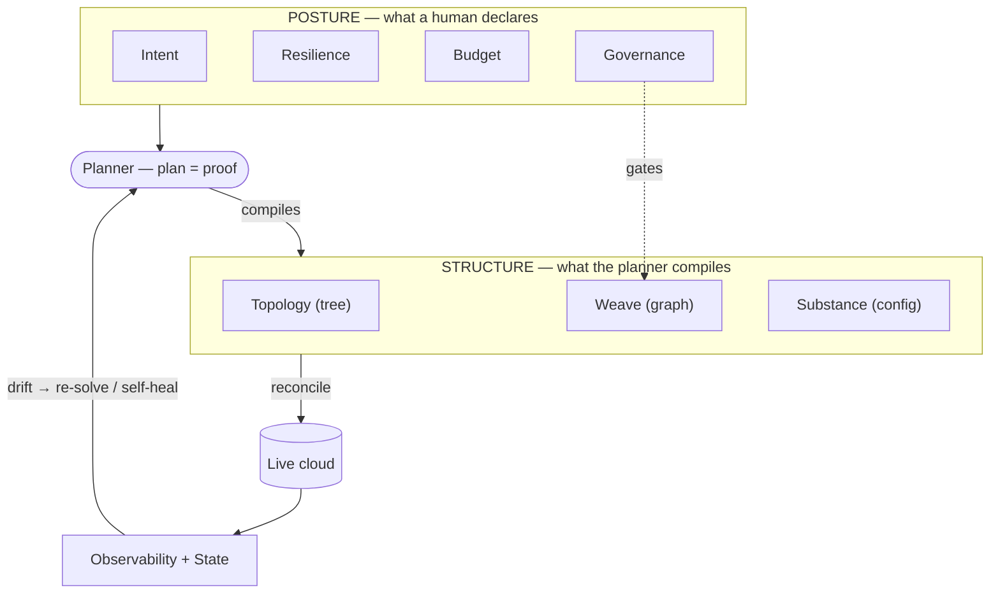
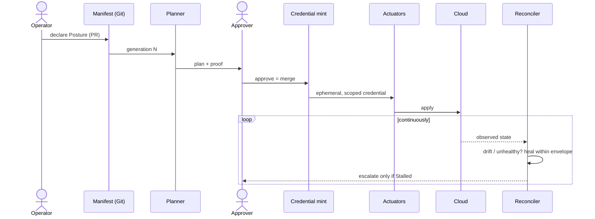
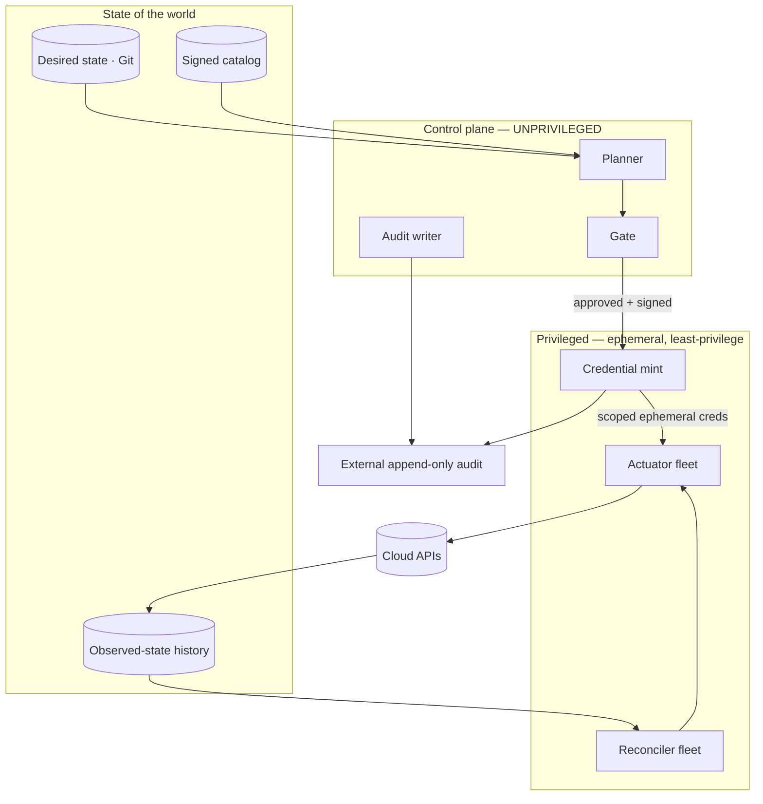
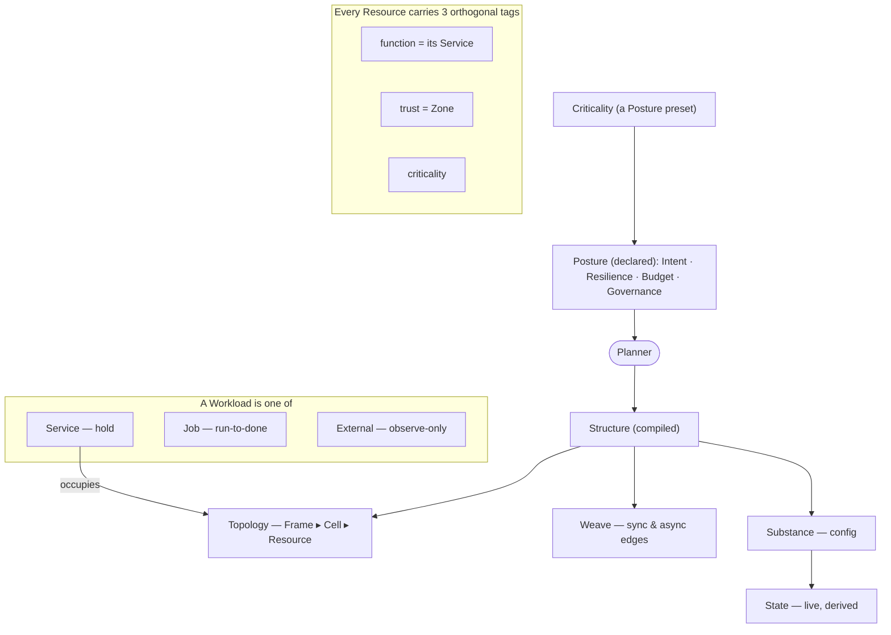
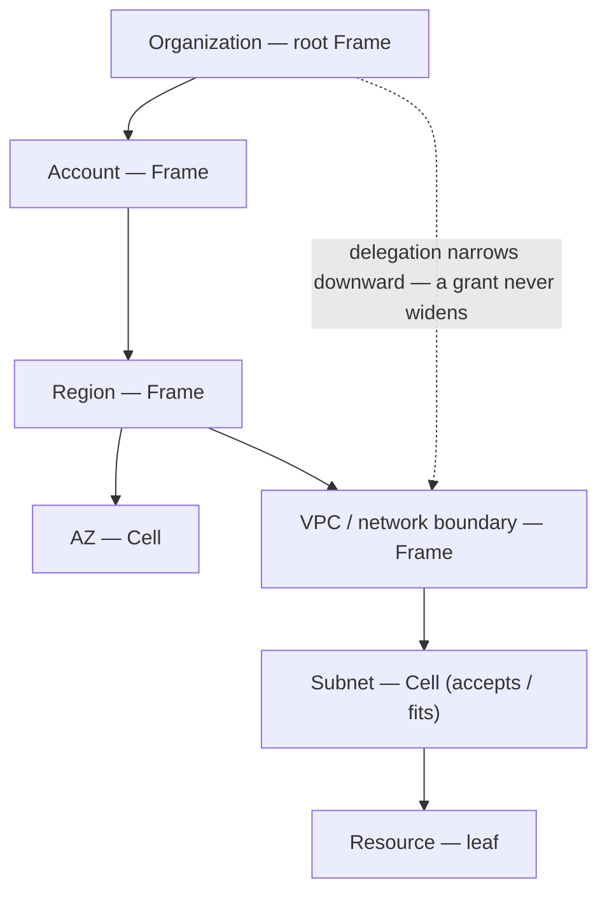
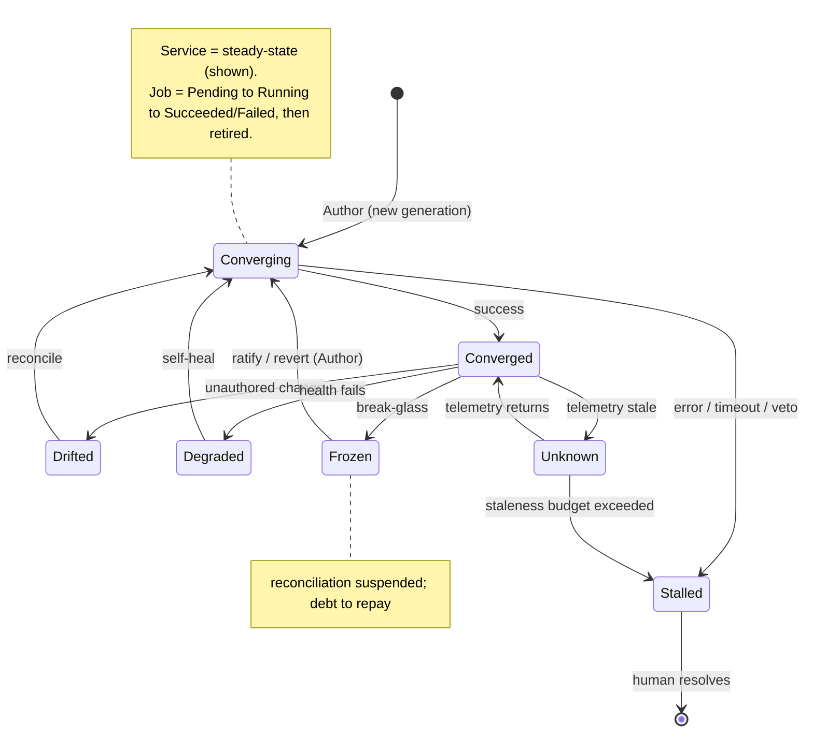
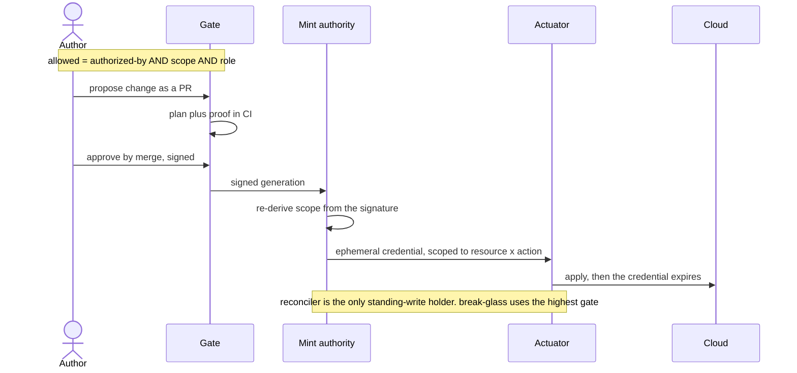
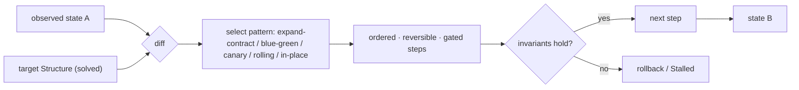
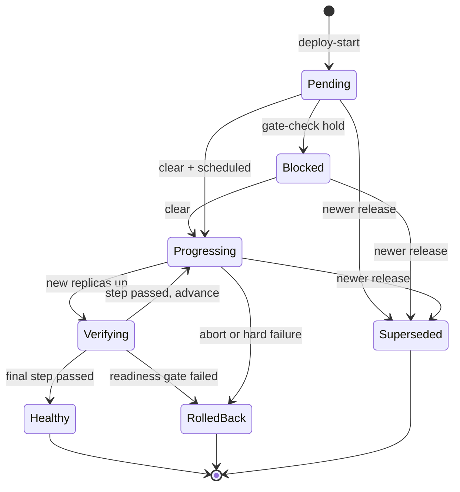
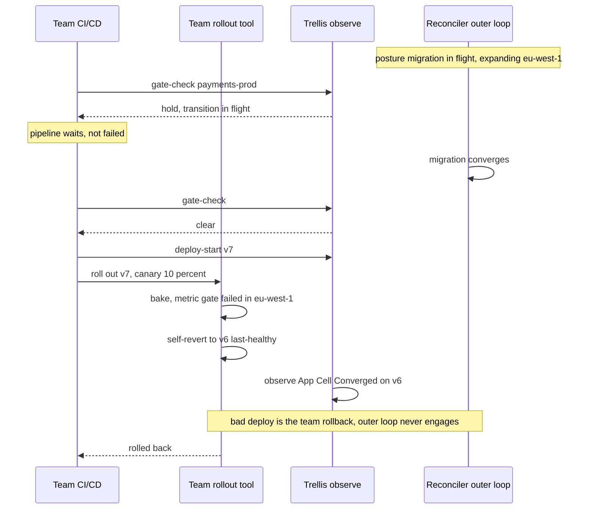

# Trellis — Design Specification

**Trellis** is a self-hosted platform for authoring, provisioning, and continuously managing
cloud infrastructure. You point it at a cloud organization (AWS in v1), declare *what you want*
as a **Posture**, and a deterministic **planner** compiles that posture into a concrete
**Structure** — a containment tree, a connectivity graph, resource specifications, and policy
bindings. The planner emits a **plan that is a proof**: every action it proposes traces to either
the stated objective or a named constraint, with the derivation shown. A human approves the plan;
then a **reconciler** keeps the live cloud equal to that Structure indefinitely. Self-healing is
simply this reconcile loop running continuously. The operating model in one breath:
**Posture → planner → Structure → reconcile loop**, manifest-driven, with *no magic* — every
action is explainable by the plan that authorized it.

Trellis is **self-hosted**. Its control plane runs in a customer-owned management account, and
the **trust root never leaves the customer**: the customer always retains the provider root and
can revoke Trellis's foothold unilaterally. A tool with org-wide privilege must not externalize
its root of trust. (The name extends a structural metaphor: a trellis trains living growth within
a shape — Governance shapes the structure, teams grow freely along it, and self-healing keeps it
in form.)

### How to read this — the proven core, the bet, and the map

Trellis is two systems welded together. **The proven core** — a desired-state **reconcile loop**, a
**manifest single-source-of-truth with merge-as-gate**, and **least-privilege execution** — is a
coherent assembly of patterns already proven in practice (controller-based reconcilers, GitOps,
short-lived scoped credentials); most of this spec is that core. **The bet** is the single novel,
research-risk piece: the **Posture→Structure compiler** that lets you declare *what* instead of *how*.
Build the core first; treat the compiler's reach (the objective solver) as the thing to prove, and ship
its practical form — opinionated blueprints + constraint validation + bounded leaf tuning (§5).

**The grammar is an ontology, not a runtime.** Frame/Cell/Resource, the recursion, "one grammar
everywhere" — these *organize and explain* the system; they are **not** an engine that executes. The
executable reality is a fleet of concrete controllers, a solver, and cloud IAM. Build concrete
controllers for the **fixed, known** cloud levels — do **not** build a generic recursive interpreter.
The grammar's job is comprehension across a large system; do not mistake the map for the machine.

---

## Primer — the system as a story

### The shape of the idea

Trellis is its own metaphor. You build a **trellis** — a structure with a deliberate shape. You declare
what **garden** you want. You **train living things** up the structure; you set **rules** about what may
grow where; and then you **tend it continuously** — pulling weeds, replacing what died, never letting
growth escape the shape you set. A prized rose gets more care than the annual herbs. That is the whole
system: a shape you govern, life that grows within it, and a gardener that never stops tending.
Everything below is that, made precise.

### One picture



### A year in the life of the payments service

**Declare.** A team wants a payments service. They don't write infrastructure — they declare a
**Posture** (§2): its **Intent** (a public payments API), its **Criticality** (C0 — which presets
aggressive resilience, tight governance, generous budget), and a few bounds (active-active across two
regions, ≤ $8k/mo). That is the *what*, never the *how*.

**Plan.** The **planner** (§5) compiles that posture into a concrete **Structure** (§3) — a **Topology**
of accounts/regions/subnets, a **Weave** of connections, and **Substance** (the resource specs). It
selects a vetted **blueprint** or solves for one, and returns a **plan that is a proof**: every resource
traces to the objective or a named constraint ("two regions because RTO ≤ 15m; this instance mix because
it is the cheapest that meets it").

**Approve.** A human reads the proof and **merges** the change (§11) — that merge *is* the gate, and the
approval **mints a credential scoped to exactly that change** (§7), handed to an **actuator** that applies
it and then expires. The team never touched a console; nothing ran with standing god-rights.

**Tend.** From here the **reconciler** (§9) holds reality equal to the declared Structure. A node dies at
3 a.m.; its **State** (§4) flips to Degraded and it is **self-healed** within the envelope the human
already approved — no page. Someone hand-edits a rule; that is **Drift**, and it is corrected. The loop
never stops:



**Change.** A new release does not redefine the database in place — it rolls out as a **transition**
(§10): a *path*, not just a target, in reversible gated steps, so invariants hold at every step.

**Survive.** A bad config slips past review and starts an outage; the reconciler is "correctly" enforcing
a harmful state, so an on-call engineer **breaks glass** (§7) — a time-boxed, dual-controlled override
that stops the bleed and records a debt to repay once the fire is out.

**Account.** Spend creeps. A **cost View** (§13) shows the drift along the ownership tree; a budget-breach
throttles provisioning before the invoice surprises anyone.

**Evolve.** A year on, the team is acquired. Its whole slice — ownership, credentials, repos —
**transfers as a gated transition** (§16). The platform upgrades *itself* the same way. Here is the
machinery that did all of it:



Two things to carry into the detail: most of this machinery is **proven patterns assembled with unusual
rigor** — the one genuine bet is the planner (§5); and the grammar that names it all (Frame, Cell, the
recursion) is **a map for understanding, not an engine to build literally** — build concrete controllers
for the fixed cloud levels (see the overview's "How to read this").

---

## The lineage — Function · Form · Substance · Finish

Trellis descends from a four-axis design grammar: **Function · Form · Substance · Finish.** Three
transferred directly; the fourth had to change, and naming that change is what keeps the model honest.

| Origin axis | In Trellis | What happened |
|---|---|---|
| **Function** — what's the point? | **Intent** (§2) | kept; **Criticality** is its magnitude facet |
| **Form** — how is it composed? | **Topology** (§3) — Frame ▸ Cell ▸ Resource | kept; the containment backbone |
| **Substance** — what fills it? | **Substance** (config, §3) **+ State** (§4) | kept, and *split*: the live condition became its own axis |
| **Finish** — how is it experienced? | **Experience** — Views, proof legibility, the console | transformed (below) |

The first three describe *what a thing is*, and transfer to any artifact. **Finish describes how a thing
is *experienced* — and that is exactly where a presentation engine and a control plane diverge.** A deck
exists to be *seen*, so Finish is co-equal there; infrastructure exists to *run*, so its sensory surface
nearly vanishes. The co-equal seat Finish vacates is taken by the axis a static artifact never needed:
**State / the reconcile loop — how the system behaves over time.** Trellis trades **Finish ↔ Behavior**;
that trade is the signature of the domain shift.

But Finish is not gone — it is **Experience**, the *operator's* sensory surface, and it is first-class:
the **legibility of the proof**, the clarity of the **Views** (§13), the feel of the console, and the
simulator. This is not cosmetic: *a plan that is a proof fails the moment a human cannot read it.*
Operator Experience is therefore a named axis whose quality is a **correctness property**, not a polish
afterthought — the antidote to "a proof nobody can read is magic by another name."

---

## 1. Glossary

Every Trellis term, defined once and standalone. How they relate:



**Posture** — what a human declares: the desired intent and constraints for an environment,
expressed as four orthogonal axes (Intent, Resilience, Budget, Governance — §2).

**Structure** — what the planner compiles a Posture into. Not declared, not an axis: the
planner's *output*. It has three facets: Topology, Weave, Substance (§3).

**Topology** — a Structure facet: the **containment tree** (org → account → region → AZ → network
boundary → resource). Realized as Frames, Cells, and Resources.

**Weave** — a Structure facet: the **connectivity graph** drawn over the Topology tree — DNS, load
balancing, peering, transit gateways, service mesh, cross-region replication. It crosses
containment boundaries by design, so it is a separate facet, not part of the tree. Weave carries
**typed edges**: *sync* (request/response — route + port) and *async* (pub/sub — producer → topic,
consumer-group → topic). (Named for the woven-support metaphor; deliberately *not* "fabric," which
collides with "network fabric.")

**Substance** — a Structure facet: the resource definitions (config/spec). The live condition of a
resource is a separate concept — see State.

**Frame** — a partitioning boundary in the Topology tree that contains and subdivides: an Account,
a Region, a network boundary. A Frame is the same type whether it is the org root or deeply nested;
this self-similarity is what makes delegation (§8) recursive.

**Cell** — a typed placement slot inside a Frame, carrying a containment contract: it `accepts`
certain kinds of thing. A *public* Cell accepts load balancers and NAT; a *private* Cell accepts
databases. A subnet or AZ is a Cell. (Note the term-of-art collision: "cell-based architecture" in
industry means the fine-isolation end of the `isolation` knob — §6 — which is a different use of
the word.)

**Resource** — a concrete cloud resource (compute instance, managed database, function) bound to
its image/config. A Resource `fits` only certain Cells.

**`accepts` / `fits`** — the containment contract. A Cell declares which kinds it `accepts`; a
Resource (or a delegated child Frame) must `fit` the contract or be rejected with a proof. This one
contract is reused as the guardrail for placement, delegation, credential scoping, and action
admission throughout the system.

**Workload** — the umbrella for a unit of running software Trellis manages. Its **lifecycle class**
is one of:
- **Service** — long-running, steady-state, *reconcile-and-hold* (desired = "N healthy replicas
  exist"). A monolith is one coarse-grained Service. A web/app/data "layer" is a Service.
- **Job** — finite, *run-to-completion* (batch / ETL / ML training; cron = recurring). Desired =
  "terminal success by deadline"; completion is success, not drift.
- **External** — a third-party SaaS (e.g. a payments API, an observability vendor) Trellis
  *consumes but does not provision*. A node in the dependency/Weave graph that Trellis governs the
  integration to but never reconciles; its State is observed-only.

**Service** — a bounded-context workload unit that **owns its own data**. It is the general,
Intent-typed building block of a Workload; the common "web/app/data" decomposition is a *blueprint*,
not a kernel concept. A Service occupies a Cell, binds its own Substance, and carries its own
posture (which may override the environment default).

**Component (battery)** — a reusable capability with sane defaults, filed under a capability bucket:
cert manager, secrets store, DNS, CI/CD, load balancing, data protection, and so on. Distinct from a
**Service** (a workload unit): a Component is infrastructure plumbing the platform provides; a
Service is software a team runs.

**Criticality** — the "how much does it matter" magnitude of Intent (C0 = mission-critical →
C3 = best-effort), realized as a **posture preset**: one dial that expands into a coordinated bundle
across Resilience / Budget / Governance / Observability. Not an orthogonal axis — its job is to move
the other axes together. Criticality is a catalog of *named* presets (e.g. `regulated-prod`,
`internal-tool`), so an org defines its own without changing vocabulary.

**Zone** — *not* a first-class noun. "Trust zone" is a **Governance-derived trust attribute stamped
on a Cell** (§6), realized as a local microsegment, never a shared horizontal band.

**`isolation`** — a per-Service knob governing placement granularity, running on a spectrum from
coarse colocation (`colocate`) to fine per-Service isolation (`isolate-per-service`). Defaulted by
Criticality, overridable, and *authored, not solved* (§6).

**bulkhead** — *not* a coined noun: it is simply a value of the `isolation` knob (a fine-isolation
boundary that contains failure).

**State** — the live lifecycle condition of a resource, *derived* from its desired and observed
projections plus health: `state = f(desired, observed, health)` (§4). Lifted out of Substance into
its own concept.

**Generation** — a version stamp on desired state, produced by the plan that authored it (realized
as a commit SHA, §11). Generations distinguish authored progress from unauthored drift.

**Action** — a first-class, catalogued verb over the noun lattice (Frame/Cell/Resource), each with a
manifest declaring its effect, class, required privilege, and `authorized-by` contract (§7).

**plan / proof** — the planner's output. The plan is the set of actions to realize a Structure; the
proof is its derivation (which constraints bound, how much slack each had, which alternatives were
dominated and why). The plan *is* a proof, and approving the plan *is* the credential that authorizes
its execution.

**blueprint** — a pre-vetted, pre-solved Structure (or Structure fragment) in the signed catalog,
parameterized by posture. The planner *selects* a blueprint when one fits and *solves* for a novel
Structure when none does; novel Structures are reviewed offline and frozen into the catalog (§5).

**control plane** — the unprivileged part of Trellis that *thinks*: planner, desired-state model,
gate, audit. It reads, reasons, and proves; it holds no write credentials.

**actuator** — a least-privilege agent that *acts*: it holds the minimal credential for its cell of
the privilege grid and executes approved changes. Actuators are partitioned by action class, Frame
scale, and capability.

**reconciler** — the autonomous machine actor that converges live cloud toward desired state
continuously. It is the *only* holder of standing write credentials, bounded to its managed
resources and the change kinds the posture permits.

**gate** — the human approval point before apply: a human approves a plan (its exact signed bytes), at
a **rigor that scales with blast radius** (Invariant 18) — high-blast-radius plans require per-plan
approval and an independent second; a reversible, in-catalog change below a posture-set floor may run
under a standing, human-authored auto-merge policy. Prior approval never carries forward to a different
plan.

**View** — a read-only projection/aggregation of State + Substance + cost + audit along the Frame
tree, filtered for an audience (cost, security, health, compliance, incident, exec). Derived, never
authoritative (§14).

---

## 2. Posture & Criticality

### The four Posture axes

A human declares a Posture as four **orthogonal, independently-swappable** axes, each owned by a
distinct audience:

| Axis | The question | Owned by |
|---|---|---|
| **Intent** | what is this environment *for*? | requesting team |
| **Resilience** | how must it survive and change? (active-active / passive / standby; blue-green / canary; RPO/RTO; chaos tolerance) | SRE / ops |
| **Budget** | what may it cost? | owner / finance |
| **Governance** | what is *allowed*? (service whitelist, permissions, compliance regime, data residency) | security / compliance |

**Governance is always a hard constraint** — never traded away. **Data residency** is one such hard
constraint: a placement/data-flow rule ("EU PII stays in `eu-*`") the planner enforces on Topology,
Weave, *and* backups (a cross-region backup must not violate it).

The operator declares **which posture input is the objective and which are bounds** (§5). Resilience
and Budget are therefore not competing axes — they are inputs that get *assigned a role* (objective
or bound). Governance is always a hard pre-filter, never an objective term.

### Criticality — the magnitude facet of Intent

Criticality (C0 → C3) is a **posture preset**: one dial that expands into a coordinated bundle across
the other axes. It is a *catalog of named presets*, not a fixed enum. When the planner resolves a
Criticality, it:

1. assigns the objective-vs-hard-constraint roles by default (high Criticality → resilience hard and
   aggressive, cost is slack; low Criticality → cost is the objective, resilience best-effort);
2. sets target aggressiveness (availability / RPO / RTO numbers);
3. selects the blueprint (macro) and sizing headroom (micro);
4. sets the default `isolation` granularity (§6) — high Criticality → fine isolation;
5. sets gate rigor and break-glass scope (§7);
6. orders budget priority under contention;
7. sets observability depth (telemetry intensity, SLO-burn tracking).

**Precedence is explicit.** An explicit operator `optimize:` declaration **overrides** the Criticality
preset, which overrides the system default. Criticality *defaults* the objective/constraint roles; an
explicit declaration wins.

### Posture cascades per Service

Posture is declared at the environment level as a default and **overridden per Service**. The planner
resolves effective posture per Service (override > inherit) and reports it per Service in the proof.

---

## 3. Structure & its facets

The containment tree (the Topology facet; Weave and Substance overlay it) — fixed, known cloud levels:



Structure is the planner's output, not a declared axis. Its three facets are likewise outputs:

| Facet | Realized as |
|---|---|
| **Topology** | the containment **tree**: org → account → region → AZ → network boundary → resource |
| **Weave** | the overlay **graph**: DNS, LB, peering, transit gateways, mesh, cross-region replication |
| **Substance** | resource definitions (config/spec); the live **State** dimension is its own concept (§4) |

### The Topology nouns

| Noun | Role | Cloud example |
|---|---|---|
| **Frame** | a partitioning boundary that contains and subdivides | Account, Region, network boundary |
| **Cell** | a typed placement slot with an `accepts` contract | a subnet/AZ — public Cell accepts LBs/NAT; private Cell accepts DBs |
| **Resource** | a concrete leaf bound to its image/config; `fits` only certain Cells | compute instance, managed DB, function |

**Topology is the tree; Weave is the graph drawn over it.** This resolves "cloud isn't a tree":
connectivity edges (an LB fronting two regions, global DNS, cross-region replication) cross
containment boundaries, so they are a separate facet.

The Frame/Cell recursion is **accurate but fixed.** Cloud containment genuinely nests, but the levels
are a *known, finite* set (org → account → region → AZ → network boundary → subnet → resource). Build
them as concrete, named levels; the uniform "a Cell may hold any Frame" recursion is ontology for
clarity, **not** a license to build arbitrary-depth nesting the domain never uses. `Cell` as a noun
distinct from the concrete subnet/AZ earns its keep only as the provider-neutral seam (§15) — in a
single-provider v1 it is a thin alias, not a runtime indirection.

### Weave vs Governance — distinct, with a directed gate

Weave (a Structure facet) and Governance (a Posture axis) stay distinct: different owners
(network/platform vs security/compliance), different change cadence (re-route traffic vs tighten
policy), different enforcement (routes/DNS/LB vs IAM/SCP/admission), different planner role (decision
variable vs hard constraint). Conflating them collapses the defense-in-depth the platform exists to
provide.

- **Weave authors reachability intent** — *capability*: what CAN connect ("ALB → app tier:443";
  "us-east ↔ eu-west replication").
- **Governance authors authorization intent** — *authority*: what MAY connect ("app role may read
  payments DB"; "PCI ⇒ encryption in transit").
- The planner **compiles both** into the concrete security-group / IAM / route set.
- **Governance gates Weave**: a proposed Weave edge must pass `accepts`/`fits` admission, or the plan
  fails *with a proof* ("denied — service not in whitelist").

The seam (a security group is both a reachability and an authorization statement) is a shared-artifact
problem — the planner compiles one artifact from two intents — not a reason to conflate the concepts.

---

## 4. The State model

The derived state machine (the rules that define each transition follow below):



**State** is the live condition of a resource. `desired` and `observed` are *not* states — they are
two **projections** of one resource (spec/status; setpoint/measured value). The lifecycle state is
**derived**:

```
state = f(desired, observed, health)
```

a pure, recomputable function — never stored as ground truth. (One scoped exception: a *retained
observed-state history* is kept for compliance evidence — §15.) That is "no magic" applied to state:
every state is explainable by showing its inputs.

- **Desired** (spec) — authored; **version-stamped** by the plan generation that produced it.
- **Observed** (status) — measured from telemetry; **timestamped** with freshness/confidence.

### State is a product of three orthogonal sub-dimensions

| Sub-dimension | Values |
|---|---|
| **Sync** (observed vs desired) | InSync · Progressing · Drifted · Unknown |
| **Health** (liveness of observed) | Healthy · Degraded · Unknown |
| **Control** (reconciler stance) | Reconciling · Settled · Stalled · Frozen |

The named states are the salient cells of that product:

| Named state | Combination | Meaning |
|---|---|---|
| **Converged** | InSync · Healthy · Settled | matches spec and alive — the goal |
| **Converging** | Progressing · — · Reconciling | *authored* gap-closing (a deploy) |
| **Drifted** | Drifted · — · Reconciling | *unauthored* divergence — reconciler corrects |
| **Degraded** | InSync · Degraded · Reconciling | correct but unhealthy → self-heal |
| **Stalled** | behind · — · Stalled | can't converge (error / timeout / blocked / Governance veto) — needs a human |
| **Frozen** | — · — · Frozen | reconciliation suspended (break-glass — §7) — debt outstanding |
| **Unknown** | Unknown · Unknown · — | observation stale/missing — *cannot assert* |

### Two lifecycle modes

The product above describes **steady-state** (a Service: converge-and-hold). A **Job** has a different
shape: its State is a **terminal progression** — Pending → Running → Succeeded / Failed. The reconciler
converges to *terminal success by deadline*, then **retires** the Job; a completed Job vanishing is
success, not Drift. **Stateful clusters** (e.g. message brokers, databases, search) are steady-state
with a **quorum/partition-aware roll-up** (1-of-3 down = Degraded-serving; 2-of-3 = unavailable).

### Two non-obvious rules

- **Progressing vs Drifted is decided by provenance, not gap size.** `observed ≠ desired` is ambiguous
  (a healthy deploy or an out-of-band change), so desired state is **versioned (generations)**:
  "converging toward generation N" is good; "diverged from N with nothing pending" is drift.
- **Unknown is fail-safe and first-class.** Stale telemetry → Unknown, never assumed-Converged. The
  reconciler **holds on Unknown — it never acts on stale data** — but holding is a *liveness* tradeoff,
  not pure safety. Binary fresh/Unknown is replaced by **confidence-decay + a per-Criticality staleness
  budget + a liveness backstop**: after a threshold T the system escalates to a human rather than
  freezing silently — crucial when the *observability plane itself* is the degraded thing (otherwise
  the reconciler would freeze exactly when a failover is needed). A dashboard never shows green while
  blind.

### Roll-up follows the Frame tree; Resilience parameterizes it

A Resource has a state; a Cell/Frame state is a **roll-up of its children** up the tree. The roll-up
**severity function is parameterized by Resilience**: active-active reads "one region down" as
Degraded-but-serving; active-passive reads the same fact as a failover trigger. Posture defines what
"healthy" *means*, not just the topology.

### Drift policy

Auto-remediation of Drift is a **per-scope policy — `enforce | warn | ignore`** — defaulting to
`enforce`, set by Governance/posture. An operator can mark a resource observe-only (e.g. hand-managed
during a migration) without the reconciler stomping it.

---

## 5. The planner

The planner is an **explainable objective solver**. Every provisioning action traces to either the
objective or a named constraint. The planner emits the *derivation*: which constraints were binding,
how much slack each had, which alternatives were dominated and why ("RTO 15m is the binding constraint
forcing warm standby"; "raise budget $500 and active-active becomes feasible").

### The objective program

```
minimize   cost(structure)                         # when Budget is the objective
subject to availability(structure) ≥ SLO           ┐
           rpo(structure) ≤ target                  ├ Resilience  (hard)
           rto(structure) ≤ target                  ┘
           services(structure) ⊆ whitelist          ┐ Governance  (hard — never relaxed)
           compliance(structure) ⊨ regime            ┘
           intent requirements satisfied               Intent
           resources(structure) ≤ provider quotas       Quota  (hard — else the plan passes review then
                                                                 fails at apply; the planner requests
                                                                 increases + tracks headroom)
decision vars: region set, AZ spread, instance mix, replica count,
               replication links, deployment-strategy realization
```

The operator may flip the objective (`maximize-resilience subject to cost ≤ budget`). Resilience and
Budget are inputs assigned a role (objective | bound); Governance is always a hard pre-filter.

### Blueprint selection vs solving

The planner can either **select a pre-vetted blueprint** from the signed catalog (a blueprint is a
pre-solved answer to a standard objective, parameterized by posture) **or solve for a novel Structure**
when no blueprint fits. The guardrail that makes solving safe is Governance (whitelist + compliance) and
the `accepts`/`fits` containment contract. Novel Structures are **reviewed offline and frozen into the
catalog** — they are never realized blind. "No magic" *is* this review discipline.

### Depth: shallow across Frames, deep within Cells

A plan has two scales. The **macro topology shape** (which Frames; how regions/AZs/network boundaries
are carved) is discrete, small, and comes from blueprint *selection* — never from global optimization.
The **micro fill of each Cell** (instance types/sizes, replica counts, placement mix) is the only place
optimization lives, confined to **bounded, independent leaf sub-problems**. You never optimize the
blueprint catalog; you select a blueprint and optimize what fills its Cells.

The rung ladder describes increasing solver sophistication:

| Rung | Planner does | "Solve" = | Limit |
|---|---|---|---|
| **0 — fixed template** | posture → one named blueprint | lookup | no flex |
| **1 — parameterized template** | blueprint + posture-bound knobs | instantiate + validate | shape fixed |
| **2 — rule-based composition** | rules select & compose blueprints | decision procedure | no optimization |
| **3 — constraint satisfaction** | search for *any* legal structure | feasibility | no preference among legal |
| **4 — constrained optimization** | among legal, minimize cost / max resilience | the objective program | combinatorial — global search is intractable |

**v1 caps at rung 2** (select + compose + parameterize), with **heuristic/lookup-table leaf sizing** —
no real optimizer. Determinism and the proof are mandatory from v1. *True bounded leaf optimization*
(rung-4 confined to a single leaf, deterministic) is v2. Global topology optimization (rung-4 across the
whole structure) is intractable and **out of scope** — it is the graveyard the catalog-not-search
discipline exists to avoid.

### Two time-scales

- **Catalog-time (offline, human-reviewed):** higher-rung solving may generate a novel topology
  blueprint from goals; its output is reviewed and frozen into the catalog. A solved novel Structure,
  once vetted, *becomes* a cached blueprint.
- **Request-time (online, deterministic, fast):** consumes the catalog — rungs 0–2 select/compose/
  parameterize, plus bounded leaf tuning. No global search on the hot path.

### Authored, not solved: placement and Criticality propagation

Two decisions are deliberately **authored-and-validated, not solver-optimized**, because solving them
would reintroduce global, intractable optimization:

- **Cross-Service placement** (the `isolation` choice — §6) is *declared* (or Criticality-defaulted),
  never solved. Solving it is facility-location/quadratic-assignment-hard.
- **Criticality propagation** (§2/§6) is *validated* statically, never optimized. It is a graph fixpoint;
  solving it is global optimization.

In both cases the planner only **checks consistency and fails loud with a proof**. Optimization stays
confined to independent per-Service leaves.

### The competence-boundary escape hatch

When no blueprint/rule/feasible solution fits, the planner **fails loudly with the binding constraint**
("no blueprint satisfies RTO < 2m at $8k/mo — RTO is binding; here's the cheapest feasible RTO, or the
budget that unlocks it") — it **never silently invents**. That loud failure *is* "no magic" at the edge
of competence.

### Determinism

A plan is a **pure function of (manifest generation + a pinned provider-state snapshot + a pinned
pricing version)**: same pinned inputs → same plan. Live provider state is eventually-consistent, so
determinism is scoped to the *snapshot*, not "the cloud right now." Hysteresis is added so a
sub-threshold cost wobble doesn't churn the plan. At rung 4 this forbids a stochastic solver.

---

## 6. Placement — ownership, trust, and isolation

### Ownership is the primary grouping (vertical, not horizontal)

A workload decomposes **by ownership / bounded context (vertical)** — a Service owns its own data,
colocated — not by horizontal function (no shared "data tier"). Genuinely shared things (a data lake,
identity, logging) are just Services owned by a *platform team*, depended on via Weave, with Criticality
propagation forcing them ≥ their most-critical consumer. Function and trust are overlays *within* the
ownership grouping.

### Trust — a Governance-derived attribute on a Cell

Trust is a **Governance-derived attribute stamped on a Cell**, not a parallel classification or a
location. It sets the Cell's trust-derived `accepts` and its inter-Cell adjacency (this is "Governance
gates Weave"). A database stays database-*trust* (isolated, no internet inbound, strict adjacency) while
living **with its app**, inside the owning Service's boundary. A shared "database zone" horizontal tier
does not exist; trust is a tag realized as a *local microsegment*, not a shared central band.

- **Resources are classified along three independent dimensions:** *function* (a Service — Intent),
  *trust* (a Governance attribute on a Cell), and *Criticality* (a posture preset — Intent magnitude).
  They usually line up in a textbook app, which is why they get conflated — but they vary independently.
- **Trust attributes recurse** (concentric trust → microsegmentation; finest grain = per-Service).
- **Inter-Cell adjacency is the concrete "Governance gates Weave" policy** — default-deny, with explicit
  allowed crossings (customer-facing → app → data, never customer-facing → data). The planner compiles
  the security-group / NACL / route set from the adjacency and **fails forbidden flows with a proof**.
- **Designer/author split:** Governance *owns* the trust vocabulary + adjacency rules org-wide; each
  ownership boundary *realizes* them locally.

### The colocate↔isolate placement posture

Placement is an explicit, provable **choice** — three forces, two of which oppose colocation for
different reasons:

| Force | Pulls toward | Driven by |
|---|---|---|
| efficiency (data gravity, latency, egress cost) | **colocate** | Budget + Weave |
| redundancy (survive a failure) | **spread copies** | Resilience |
| containment (a failure/breach doesn't propagate) | **separate boundaries** | Governance / blast-radius |

The knob is the **`isolation` value**, a granularity decision on isolation boundaries running from
coarse colocation to fine per-Service isolation. It lands as a per-Service knob (`isolation: colocate …
isolate-per-service`), **defaulted by Criticality** (C0 → fine isolation; C3 → colocate for cost),
**overridable**, and **authored, not globally optimized** — the planner validates consistency and
reports the tradeoff in the proof ("colocated — C2; cross-region replication exceeds budget"). It is no
new axis; it bundles the existing Budget / Resilience / Governance forces into one declarable choice.

### Criticality propagation

Criticality flows over two graphs in two directions:

- **Declared Criticality cascades *down* the containment tree** (environment default → per-Service
  override) — the same cascade as posture.
- **Required protection propagates *up* the dependency graph** (Weave edges): your dependencies must be
  at least as critical as you are — `effective = max(declared, max over dependents)`. The planner
  **validates this statically** (checks consistency, fails loud: "C0 web → C2 cache: violation; raise
  cache ≥ C0 or mark it off the critical path"); it does **not** optimize it. Needs the dependency graph
  as a planner input.

Propagation raises a shared dependency's **protection level** (HA / backup / change-rigor) — *not* its
isolation domain. A shared C0 dependency stays *shared*, isolated **as its own unit**, with C0
protection — never duplicated per consumer. (This separates the two meanings the dimension carries:
"more protection" up the dependency graph, and "more separation" via the `isolation` knob, are distinct.)

### Slicing Kubernetes — the boundary between two reconcilers

Kubernetes is the one substrate that is **itself a reconciler**: a closed loop with declared state in
etcd, controllers converging reality, and its own RBAC and standing write. Trellis managing it is
therefore a *reconciler managing a reconciler*, and correctness turns entirely on **where the line between
the two loops falls**:

- **Trellis owns the cluster *as a resource*** — its existence, version, node groups, networking,
  pod-identity, and the platform add-ons (CNI, CSI, DNS, autoscaler, the in-cluster GitOps agent). This is
  infrastructure authority, expressed in the normal Posture → plan → reconcile loop.
- **Kubernetes owns what runs *inside*** — Deployments, pods, autoscaling, Services. Trellis **stops at
  the cluster API and platform add-ons** and leaves workload runtime to the in-cluster loop (Argo/Flux).

The rule is that **the two loops never address the same object** — violating it is the classic "two
reconcilers fighting," each undoing the other; a defect, not a tuning choice.

**Slice at the cluster, not the namespace.** A cluster's control plane, etcd, and upgrade cycle are a
shared fate for everything in it, so a namespace-per-tenant re-creates the very shared single point of
failure the isolation grain exists to remove — a cluster upgrade, etcd failure, or bad operator rollout
takes all namespaces down at once. The **cluster is the unit of containment**; namespace + network-policy
isolation is the weaker grain, chosen deliberately for density under low Criticality, never for
blast-radius containment. The one honest seam: a Kubernetes upgrade removes APIs and can break
*workloads*, not just infrastructure, so the cluster-upgrade transition (§10) must carry a deprecated-API
compat gate — the point where "infra only" legitimately reaches into workload space. (Keep data off the
cluster — managed stores, not databases-on-k8s — so cluster churn never threatens State.)

---

## 7. Authorization, execution, and the trusted computing base

Approval mints the credential; the planner never holds write rights:



### The governing law

Every action is exactly one of four **classes**, and the class *is* the authority and gate:

| Class | Mutates | Who | Gate | Why / When |
|---|---|---|---|---|
| **Author** | *desired state* (the manifest) | humans only | **always** — plan + proof + approval (per-plan, or a standing auto-merge policy below the blast-radius floor — Inv 18) | intent/policy/budget change; on-demand |
| **Converge** | *reality* toward desired state | the platform / reconciler | pre-authorized — human approved the **envelope**, not each act | drift, health, schedule, load; continuous / event |
| **Observe** | nothing | anyone in scope | none (read-only) | telemetry; continuous / on-demand |
| **Break-glass** | reality, *outside* the gate | elevated human | emergency only — time-boxed, dual-control, max-logged | outage / incident; rare |

> **The one law: desired state changes only through *Author*; everything else *Converges* toward it.**
> Self-healing acts autonomously *because* a human already approved the envelope it acts within — it
> never invents desired state.

### The actors

| Actor | Scale | May Author | Other role |
|---|---|---|---|
| **Admin** | org / root Frame | org guardrails, delegation, governance baseline | — |
| **Operator / Platform eng** | account / region | environment manifests, blueprints, capabilities | — |
| **Team / Developer** | network boundary / nested Frame | app config *within the delegated envelope* | — |
| **Security** | cross-cutting | tightens Governance constraints | Observe everywhere |
| **Auditor** | cross-cutting | — | reads the *independent, externally-anchored* record (§15); split from Security |
| **FinOps / owner** | per Frame | budget + tags | reads cost Views; acts on budget-breach |
| **Incident responder** | per blast-radius | — | drives the incident surface (§13); may invoke break-glass |
| **External / contractor** | scoped + TTL'd | — | guest identity, single Frame, max-audited, expiring |
| **Exec** | portfolio | — | reads portfolio Views |
| **Reconciler** (machine) | wherever applied | never | the autonomous Converge actor |
| **Approver** (human) | per scope | — | owns the gate (approve / reject plans) |

The `accepts`/`fits` delegation contract (§8) bounds *both* what a team may Author and what the
reconciler may Converge.

### Actions are first-class — authorized by contract

An Action is a **catalog entry with a manifest**, like a Component — not ad-hoc code. Each declares its
effect, class, required privilege, and its **`authorized-by` contract** (the `accepts`/`fits` of the
verb layer):

```yaml
action: failover
class: converge
effect: promote standby region to active
requires:                     # the privilege profile (the privilege ladder, below)
  privilege: standing-write
  capability: [traffic, dns]
  scope: region
authorized-by:                # the contract — who / when may invoke
  roles: [reconciler, operator]
  conditions: [region.health == degraded]   # the why/when, as a guard
  gate: auto                  # auto | human-approval | dual-control
emits: audit-record
```

Authorization is a declarative **three-way intersection, statically checkable** — provable without
running anything:

```
allowed  =  action.authorized-by   ∩   scope.accepts-actions   ∩   actor.role
```

- the **action** declares which roles/conditions/gate it permits;
- the **scope/Frame** (delegation envelope) declares which action-kinds it `accepts` (a team's network
  boundary accepts `deploy, scale-in-bounds, observe`, not `create-peering, failover`);
- the **actor's role** declares which it `fits`.

Gate rigor is a *field on the action*, not scattered logic. Break-glass is simply an action whose
contract says `gate: dual-control`, with a `ttl` and elevated privilege. `actor.role` must bind to an
authenticated, MFA'd identity, and role assignment is itself a gated Author action.

### The execution engine — one control plane, many actuators

Not all privileges are the same, which forbids a single all-powerful engine (it would hold the union of
every privilege; one compromise = total org takeover) and forbids fully independent engines (they would
drift). The resolution:

- **One control plane — unprivileged.** Planner, desired-state model, gate, audit. It reads, reasons,
  and proves; it holds **no write credentials**. Authoring mutates the manifest (data), never the cloud
  directly. (The control plane *thinks*; the actuators *act*.)
- **Many actuators — each least-privilege**, partitioned along three seams:
  1. **Action class** — Observe/Plan need *read*; Apply/Converge need *write*; Break-glass needs
     *elevated*.
  2. **Frame scale** — a team actuator holds creds for one network boundary; the org actuator's
     account-creating creds are rare and heavily gated.
  3. **Capability / bucket** — the DNS actuator gets DNS only; secrets gets the secrets store only. A
     poisoned DNS actuator can't touch IAM.

### The privilege ladder

```
  break-glass / org-admin       — vaulted, dual-control, time-boxed
  standing write                — reconciler ONLY, scoped to managed set + posture-permitted changes
  ephemeral plan-scoped write   — minted by approval, expires after apply
  read / plan / observe         — broad, low-risk
  author                        — NO cloud creds (control-plane data only)
```

**The approved plan *is* the capability.** Approval mints an ephemeral credential scoped to *exactly the
diff in that plan* — the actuator does what the proof says and nothing else, then the cred expires.
Standing god-mode write exists nowhere except the reconciler, bounded to its managed resources and the
change kinds the posture permits (replace an unhealthy instance: yes; create new VPC peering: no — that
needs Author + Approve). Plan-proof, gate, and privilege grant are the same object.

Privilege **narrows down the Frame tree**: an org-actuator mints account-actuators, which mint
boundary-actuators, and **a child grant can never exceed its parent's** — `accepts`/`fits` applied to
credentials.

### Break-glass — the sanctioned divergence

The escape hatch from the gate, for crises where the gate *can't* run: the control plane is down, an
already-approved desired-state is *itself* the outage, the bleed is faster than Author→Plan→Approve, or
a gate dependency is unavailable. It is the **most**-controlled action, not the least:

- **pre-authorized, never ad-hoc** — invoke a *defined* break-glass action (`gate: dual-control`, a
  `ttl`, elevated privilege), not improvised god-mode;
- **dual-control** — two humans open the glass; above the boundary scope, the **second approver must be
  outside the requesting Frame** (so "team lead + second" within one team can't defeat dual-control);
- **JIT, time-boxed credential** — minted by the ceremony for the TTL, held by no one standing; the
  glass re-seals on expiry;
- **scoped to the Frame** — never one global god-switch; it comes in distinct scopes, each opening a
  strictly bounded blast radius:

| Scope | Opened by (two-person) | Blast radius | TTL |
|---|---|---|---|
| **Network boundary / team** | team lead + second | one boundary's resources | shortest (≤ 30m) |
| **Account / region** | operator + second | one account or region | bounded (≤ 1h) |
| **Org** | admin + second | cross-account / org-wide — *only when the org itself is the incident* | shortest-lived, hardest gate |

- **maximally logged + loud** — non-repudiable audit; opening it pages everyone; heightened monitoring
  while the glass is open; a per-actor break-glass budget caps abuse.

**It does not change desired state — it changes reality, temporarily, and owes a debt.** On TTL expiry
the reconciler does **not** auto-revert (that would re-open the very bleed). It **freezes reconciliation
on the touched resources** (the Frozen state, §4) and raises a mandatory **ratify-or-revert** task: the
operator closes the divergence through the normal **Author** gate — ratify (the emergency change becomes
new desired state) or explicitly revert. The Frozen debt carries an **escalating deadline** so it can't
become a permanent un-healed hole.

> Break-glass buys *time*, not *permission*. The governing law still holds — desired state changes only
> through Author; only "reality converges to desired state" is suspended, and only until the debt is paid.

#### The trigger — *when* to open the glass

Break-glass is the **one transition the state model never derives** (§4): every other edge is a pure
`f(desired, observed, health)`; `Converged → Frozen` is a *human judgment*. An undecided trigger is an
untrainable, un-drillable, un-auditable decision, so the trigger is itself part of the spec. Six
**sensations** make an operator reach for the glass — but **only three should open it**; the rest have a
cheaper correct response, and confusing them is how the emergency exit becomes the front door:

| Sensation | Condition | Correct response |
|---|---|---|
| "Every fix I make reverts" | out-of-band fix read as Drift, enforce-stomped | **scope-freeze / observe-only** (§4 drift policy) — *not* glass, unless it can't wait |
| "Approval is slower than the bleed" | gate latency > incident tolerance | first try the Inv 18 fast-path; glass only if it truly can't run — *this is the most-abused trigger* |
| "The deploy *is* the outage" | approved-but-bad generation converging | **glass** (halt convergence) — Inv 11 auto-rollback should already be acting |
| "It's holding and won't move" | Stalled, or Frozen-on-Unknown when failover is needed (§4) | **liveness escalation** (§13), *not* a bypass |
| "I can't even propose a change" | gate / CI / mint authority unreachable | **glass** — the gate literally cannot run; this is break-glass's reason to exist |
| "There's no manifest for *this*" | fix not expressible as desired state (forensic / containment one-off) | **glass** — outside the envelope by nature |

**Break-glass *rate* is a first-class gate-health signal** (routed via §13, not just budget-capped, §7
above): a frequently-opened glass diagnoses a *miscalibrated gate*, not a heroic operator — the fix is to
make normal Authoring fast (Inv 18), keeping the emergency path rare. (Inversion red-team of the trigger:
[`trellis-breakglass-redteam.md`](trellis-breakglass-redteam.md).)

### The duality with observability

Actions are the writes; the observability plane is the log of them. Every action emits one audit record:
`actor · verb · target · trigger · plan-proof · outcome` — the who/why/when captured at the moment of
action.

### The trusted computing base — making the model *inherently* secure

The model's safety **concentrates onto five parts**: the **planner**, the **proof**, the **gate**, the
**catalog**, and the **reconciler**. Every "it's a proof / statically checkable" claim trusts a checker
inside the blast radius of what it checks. The same maker-checker / parity-gate / external-audit
discipline applied to managed infrastructure **must be turned on the core**. These are invariants, not
options:

- **The planner authors credential bounds but is unprivileged.** A compromised planner could emit a plan
  whose human-readable proof reads benign while the minted scope is attacker-chosen (a confused deputy —
  the human approves prose, the mint trusts a machine field). **Therefore:** a separate minimal **mint
  authority re-derives the scope from the signed manifest generation** (it never consumes a scope the
  planner asserts); **the plan artifact is signed and approval binds to the signature** (the human
  approves the exact bytes); and **reproducible plan builds** (a re-run reproduces the same signed
  artifact). Full **dual-planner parity** for the *build* (two independent implementations agreeing before
  mint) is optional later hardening, not a v1 requirement — it roughly doubles build cost for marginal gain
  over reproducible-build + signing. **Per-plan parity is separate and not optional: above a
  computed-blast-radius threshold a second independent planner must reproduce the realized diff
  (Invariant 17).**
- **The gate trusts CI; merge = apply-authorization.** Defense-in-depth demands repo controls *and* the
  gate: signed commits, branch protection, required external reviewers, an **attested builder** for the
  plan check, the reconciler verifying a **signature on the generation** (not "it's on main"). Surface the
  **realized resource diff** (IAM/SG/route delta), not just the manifest diff; **scale gate rigor to
  computed blast radius** (Invariant 18).
- **The reconciler holds the only standing god-write and is steerable by attacker-induced drift**
  (out-of-band fixes read as drift and get stomped). **Therefore:** partition it into a fleet by Frame
  scale + capability; bound change-kinds at the **credential** layer (not a planner rule); **sign
  generation stamps**; rate-limit + anomaly-alert on remediation volume; human-confirm before
  **destructive** convergence; provide an out-of-band **kill-switch it cannot disable**.
- **The central catalog is a supply-chain bomb** — blueprints/presets/patterns are trusted by every plan.
  **Therefore:** sign + version entries; consumers pin versions; a catalog change is a highest-rigor
  (admin + security dual-control) gated Author action that re-plans dependents.
- **Audit must be independent.** A compromised control plane can't be trusted to honestly verify changes
  to itself. **Therefore:** the external append-only audit covers **all** privileged actions (written by
  the mint/gate, §16), not just genesis; self-environment changes need a **higher** gate (sealed root,
  never the ordinary merge); meta-DR restores to a **signed, externally-attested known-good generation**;
  an integrity watcher lives **outside** the self-environment.
- **Workload supply-chain** (distinct from the control-plane TCB): the artifacts a *workload* runs —
  machine image / container image / package — are trusted implicitly. **Therefore:** require signed images
  + provenance (SBOM, CVE gate) admitted by Governance — the catalog-signing discipline extended to what
  Resources execute.
- **Static authorization governs *infrastructure authority*, not *workload behavior*.** Approved app code
  can still abuse a legitimately granted edge. Runtime controls (egress filtering, workload-identity
  scoping, anomaly detection) are required and out-of-model.

The TCB parts (planner, proof, gate, catalog, reconciler) **must be independently verified / externally
audited** — this is a non-negotiable invariant (§17).

---

## 8. Delegation

The three personas are the **same grammar at different Frame scales** — a Frame is the same type whether
root or nested:

| Persona | Points at | Operates on |
|---|---|---|
| **Admin** | an **Organization** | the **root Frame** — carves OUs / accounts |
| **Operator / DevOps** | an **account / region** | a **mid Frame** |
| **Team** | a **network boundary** | a **nested Frame** (one Cell of the parent, recursed into) |

The guardrail that makes delegation safe is the `accepts`/`fits` contract: a division's Frame declares
what its Cells `accept` (which services, which budget ceiling, which compliance regime); a team's
resource must `fit` it or be rejected. Quota and blast-radius enforcement are literal at the boundary; a
policy violation surfaces as a flag in the console, never burned into a deployed resource.

**The Governance contract composes by monotonic tightening.** The org sets non-negotiable **floors**
(central); delegated parents may **tighten, never loosen** within their subtree; the gate enforces the
composition. Both central policy and per-Frame delegation are true at once — they compose, they don't
compete.

---

## 9. The reconcile loop and reconciler safety

```
solve → PLAN (+ proof) → human approves → apply → reconcile → (drift / manifest change) → re-solve
```

- The **human-approves-the-plan** step is the platform's one gate — at a **rigor that scales with blast
  radius** (Invariant 18). Prior approval never carries forward.
- **Self-healing** is the reconciler enforcing "live cloud equals desired Structure" *continuously*
  instead of once. Every remediation is explained: "replacing instance i-abc — failed health; Resilience
  requires availability ≥ 99.95%."
- The reconciler converges to the declared **lifecycle intent** (Service: hold; Job: run-to-completion).

### Reconciler safety — temporal governance + self-protection

The reconciler has standing write and acts continuously, so *when* and *how hard* it may act must be
governed, or autonomy is an outage amplifier.

- **Temporal governance (change windows).** A **change-freeze** is a Governance/posture constraint on
  *Converge*: a window (holiday/earnings freeze; a per-Service maintenance window) in which the reconciler
  may **not** apply non-emergency changes. Drift during a freeze is *recorded and held*, not
  auto-remediated. Break-glass explicitly overrides a freeze and says so in its proof. Freeze scope
  follows the Frame tree.
- **Self-protection (circuit breakers).** The reconciler bounds its own action: **rate-limit**
  remediations per scope; **flap detection** (healed N times in T → stop, escalate, don't retry into a
  crash-loop); **blast-radius breaker** (a remediation touching > X% of a scope halts and pages). A
  remediation that keeps failing trips to **Stalled** (§4), never infinite retry. Criticality-scaled
  (C0 = tighter breakers).

---

## 10. Transition planning and data protection

A plan is a *path*, not just a target — the path is computed from the gap and must hold invariants at
every step:



Everything to here produces a **target** (the desired Structure). But a *live* system can't always jump
to a valid target: two perfectly valid states may have no safe instantaneous transition (you can't
redefine a live database's network boundary — you stand up the new, replicate, cut over, retire the old).

> A target only has to be **valid at the end**. A path has to keep the system's invariants — availability,
> data integrity, the Criticality's SLOs — **true at every intermediate step.** A transition can be unsafe
> even when both endpoints are flawless.

So "the plan" splits into two artifacts from one derivation:

1. **Solve the target** (§5 — the objective solver): *what should exist.*
2. **Solve the path** (the **transition planner**): diff `observed → target` and sequence a safe
   migration that preserves invariants *during* the change, not just at the end.

### Build the path from canonical patterns — not a path-solver

A general "search all orderings" solver is intractable. Apply the catalog-not-search discipline — select
from a catalog of **migration patterns**, never global search:

| Pattern | Use | Cost / safety |
|---|---|---|
| **Expand-contract** (parallel change) | replace anything others depend on | safe, general |
| **Blue-green** | swap a whole environment | safe, expensive |
| **Canary / progressive** | validate before full ramp | safe, slow |
| **Rolling** | replace N-at-a-time | medium |
| **In-place (stop-the-world)** | low-Criticality, tolerable downtime | cheap, unsafe-by-design |

The planner classifies each change, **selects a Criticality-appropriate pattern per change**,
dependency-orders them, and emits the path with a proof. Criticality sets the strategy (C0 → zero-downtime
expand-contract/blue-green; C3 → in-place).

### The path is a sequence of gated, reversible Actions

- **Each step is a first-class Action (§7)** — its own `authorized-by` contract, proof, audit record.
- **Rollback is first-class:** every step carries its inverse (or a checkpoint); the plan ships its undo.
- **The proof extends to transition safety** — "this ordering preserves invariant X at every phase;
  here's each step's rollback point; here's the one place a maintenance window is required, and why."
- **The path is recomputed from `observed`, not stored as a script** — idempotent, resumable, self-healing
  by construction. To avoid strategy-thrash mid-flight, the chosen pattern is **pinned** in an explicit,
  versioned **transition intent** — a short-lived second desired-state layer that retires when the
  transition completes. A re-planned path that **materially diverges** from the approved one **requires
  re-approval**; the gate pins to the approved *pattern + bounds*, not a frozen step list.
- **Each step runs within its credential's lease (Invariant 16).** Writes use the plan-scoped, time-boxed
  credential (§7, Invariant 4); a step **never starts unless its worst-case duration fits the credential's
  remaining lifetime plus a buffer** — otherwise re-mint a fresh credential, wait for one, or refuse and
  flag. Combined with idempotent, reversible steps, a credential that expires mid-flight can only leave a
  *resumable* state, never a half-applied one; unavoidably long provider operations are
  initiate-then-poll under a refreshed lease.
- **Approval is Criticality-defaulted:** whole-path for routine/low-Criticality; **phase gates for C0 and
  any stateful migration** (approve, validate the phase landed, proceed).

### Effects on the rest of the model

- **Loop:** `solve target → plan transition → approve the path → apply step-by-step → reconcile`.
- **State model:** becomes the **gate between steps** — observe + confirm invariants/health before
  proceeding; a failed step → rollback → Stalled/Frozen + human. "Converging" is per-step.
- **The gate:** the human approves a *sequence* (or phases), not a single target.
- **Break-glass:** gains "halt/abort an in-flight transition and stabilize."

### Stateful data — the hard core

Stateless resources transition trivially (rebuild). **Stateful ones (DBs, queues, caches) are the deep
end** — the RPO/integrity invariant binds the path itself. The mechanism is the **Data Protection
Component (battery)**: backup realizes RPO; archive realizes retention/compliance; cadence and retention
are posture-derived per Criticality. Two payoffs:

- **Point-in-time restore is the data-plane rollback** — the restore point before a risky step *is* its
  undo. Backup-restore is to *data* what inverse-actions are to *structure*.
- **Two stateful-migration patterns, Criticality-picked:**

  | Stateful pattern | When | Cost / loss |
  |---|---|---|
  | **Backup → restore → cutover** | C2–3, downtime-tolerant, cold | cheap; window + RPO-window data loss |
  | **Replicate → verify → atomic cutover** | C0–1, live, zero-loss | safe; expensive, complex |

  Restore is point-in-time-*past* (loses the delta since the restore point) and doesn't choreograph
  cutover or transform schema/engine — so live high-Criticality migration needs replicate-cutover, with
  backup as the *net*, not the mechanism.

**Backup ≠ HA** — different threat models: replication protects against *infrastructure failure* (but
faithfully replicates a corruption or destructive command); backup/PITR protects against *corruption /
deletion / logical error*. C0 provisions **both**.

---

## 11. Manifest lifecycle and promotion

### The operator-facing manifest

```yaml
environment: payments-prod          # Intent
dock: aws-org/ou/payments           # WHERE it attaches — the Frame scale (§8)

optimize: minimize-cost             # which posture input is the objective
posture:
  resilience: active-active         # Resilience  ─┐ planner compiles to
  regions: [us-east-1, eu-west-1]   #              │  Topology + Weave
  rpo: 5m ; rto: 15m                #              ┘
  budget: 8000/mo                   # Budget       → bound (since cost is the objective)
  compliance: [pci-dss, soc2]       # Governance   → hard constraint

governance:                         # Governance overlay (permission graph)
  services: [ec2, rds, alb, acm]    #   whitelist
  permissions: least-privilege

capabilities:                       # Components from buckets ("batteries")
  certs: acm ; secrets: secrets-manager
  dns: route53 ; cicd: codepipeline ; traffic: alb
```

### Structure follows ownership — federated repos, central contract

> **Governance dictates the *contract* (what's allowed); teams *contour* — they self-determine how they
> slice their apps into Services — within it.**

Desired state is **federated by ownership, not a monorepo.** A monorepo would collapse one access
boundary over all desired state, contradicting the per-Frame least-privilege held everywhere. The
structure is **layered by Frame scale**:

- **Platform / governance layer** — centrally owned (admin/security): the Governance contract, the
  Criticality/trust catalogs, blueprints, org guardrails.
- **Team units** — federated, team-owned: each owns its Services, slices its apps as it likes, runs its
  own cadence — bounded only by the contract.

**Governance is enforced at the admission gate, not by repo topology** — the contract check at plan time
(`accepts`/`fits`, the §7 three-way `authorized-by` intersection, Criticality propagation, inter-Cell
adjacency), applied uniformly to whatever any team submits, *wherever it lives*. Policy is centralized;
mechanism and structure are distributed. (Defense-in-depth still requires repo controls *as well as* the
gate — §7.)

### Git is the source of truth; the gate is the merge

| Concept | GitOps realization |
|---|---|
| Desired state (the manifest) | the Git repo |
| **Generation** (drift-vs-progress provenance) | a commit SHA |
| **Author** action — the only way to change desired state | a commit / PR |
| **The plan is a proof** | the planner runs in CI on the PR, posts the plan+proof as the check |
| **The human gate** (approve), rigor-scaled (Inv 18) | PR review + **merge**; below the blast-radius floor, a standing human-authored auto-merge policy |
| Reconciler converges to desired | reconciler **pulls** the merged manifest |

*Propose (PR) → planner posts plan+proof → human reviews → merge = approve → reconciler applies.* Below a posture-set blast-radius floor the "human reviews" step is a standing, human-authored auto-merge policy evaluated fresh per plan (Invariant 18); above it, per-plan review, with an independent second at high blast radius. Two
caveats: the reconciler **pulls** (not CI-push), and **secrets never live in Git** — the manifest
*references* a secret (in the secrets-store battery, Governance-controlled); the value is never committed.

### Promotion: advance an immutable, validated version

> **Promotion = advancing an immutable, validated version reference through an ordered pipeline of
> environments.** The base desired state is **environment-blind**; each environment instantiates it with
> its own **posture overrides** (the §2 cascade — dev = C3, prod = C0). You promote a known-good artifact
> (vN), so **what you validated in staging is bit-for-bit what reaches prod.**

One key split: **the artifact is promoted, but the *path* is re-planned per environment** — prod gets a
fresh transition plan+proof against *prod's* observed state, because prod ≠ staging. Promotion state is
visible (dev@v5, staging@v4, prod@v3), and an environment hand-modified off its version shows as
**Drifted**.

### Delegation and loop closure

Commit authority follows the §8 Frame scales (CODEOWNERS-style); the `accepts`/`fits` envelope bounds
what a team's commit may declare. **Break-glass ratify = a commit** (the emergency change repaid into
Git); **rollback of intent = a revert commit**, and the reconciler plans the reverse transition (with the
§10 stateful caveats for schema-affecting reverts).

### Single-team authoring: one manifest, environments as values

The federation above is the *org-scale* shape — desired state splits along **ownership boundaries**. For
a single team owning one app there is one owner, hence **one manifest**, and dev/staging/prod live inside
it. The split is never along environments:

> **Separate manifests track ownership boundaries, never environments.** Split a manifest only when a
> different principal must hold write access to a slice (security owning Governance away from a team; two
> teams owning two apps). Within one owner's manifest, all of its environments live inline.

Environments are **values along the Criticality cascade (§2)**, not files — the same environment-blind
structure projected at three points on the dial. dev *is* prod at a lower Criticality. Authoring one file
per environment splits on the wrong axis (the environments share an owner and an intent); the
per-environment *Structure* is **compiled, never authored** — exactly as the per-region resources are
compiled from a `regions:` list (§3), not hand-written.

```yaml
# trellis.yaml — one team, one app, the whole promotion story
environment: payments              # Intent (the app, environment-blind)
dock: gitlab/payments              # WHERE it attaches — the Frame scale (§8)
inherits: org/payments-floor       # sealed Governance + budget envelope — narrow-only (Inv 6)

services: [payments-api, internal-dashboard]
governance: { services: [compute, managed-relational-db] }   # a NARROWING of the inherited floor — never a widening
capabilities: { secrets: secrets-manager, dns: route53, traffic: alb }
optimize: minimize-cost            # the objective (§5); the inherited budget is then the bound

pipeline: [dev, staging, prod]     # ordered promotion path (§11 promotion)
environments:                      # each is a posture overlay (§2 cascade) on the shared base
  dev:     { criticality: C3, resilience: single,        regions: [us-east-1] }
  staging: { criticality: C2, resilience: single,        regions: [us-east-1] }
  prod:    { criticality: C0, resilience: active-active, regions: [us-east-1, eu-west-1], budget: 6000/mo }
                                   # budget ≤ the inherited envelope; the planner rejects any excess
```

Everything above `environments:` is stated once; each environment is a few-line overlay. But *not*
everything in the file is the team's to set: the **Governance floor and budget envelope are inherited and
sealed** (`inherits:`). By Invariant 6 (monotonic tightening) the manifest may only **narrow** them — drop
a permitted kind, set a budget *below* the envelope — never widen, and the planner enforces the
composition at plan time, failing an attempted widening as loud as any governance denial. *One file to
read, not one file that owns everything* — the federation resolution holds; a single owner simply reads
its sealed floor inline rather than across repos.

Independent gating and promotion do **not** come from file separation — they come from the
**per-environment plan**: the planner compiles one plan+proof per environment, the gate fires on the
change to *that environment's* compiled Structure, so editing the `dev:` overlay diffs only dev's plan and
prod's gate sees nothing. And the promotion version each environment sits at (`dev@v5, staging@v4,
prod@v3`) is **authored pipeline intent** — a pointer the delivery loop advances and *stores in its own
ledger* — *distinct* from the **running version** the reconciler derives from reality (§4). Conflating
them loses the difference between *intentionally held at v3*, *promotion to v4 failed*, and *rolled back*;
the pointer is stored, not inferred (Invariant 28).

### The platform↔app seam — consuming provisioned infrastructure

Trellis provisions and owns the **substrate** (the Cells and their Weave, §3); it does **not** deploy
application code. Two loops run at two cadences: the **reconcile loop** (slow, gated — converges the
platform, §9) and the team's **app-delivery pipeline** (fast, ungated — ships releases into the App Cell).
The seam between them is a published **outputs contract**, not shared state.

> An app release is **not** a desired-state change to the Structure. Routing it through the Author gate
> (§7) would both intolerably slow delivery and read as mass drift to the reconciler — tripping the
> blast-radius breaker (§9). The release pipeline is not an Author; it operates *inside* the App Cell,
> within the action kinds the Cell `accepts` (deploy/scale/observe, §7).

The boundary is the **Cell (§3, §6).** Trellis owns the *shape* of the App Cell — replica count, size,
multi-AZ, the Edge Cell in front and the Data Cell behind. The team owns *what runs inside* it — the
release artifact, rollout strategy, app config. The App-Cell spec deliberately excludes the release
version: **changing the running artifact is not drift.** The contract has three facets.

**(a) Coordinates — the export.** For each environment, Trellis publishes the addressable handles a
pipeline targets, derived from the converged Structure (an output, never authored):

```
trellis env coordinates payments-prod →
  app_target:  <App-Cell deploy handle>      # where the release is shipped
  edge_host:   <stable Edge-Cell hostname>   # the front door; regional fan-out owned by Trellis
  data_ref:    <Data-Cell connection ref>    # a handle, never a credential value (§18)
  generation:  <converged commit SHA>        # provenance the pipeline can assert against
```

Coordinates are recomputed from observed Structure, so they are **never stale and never committed** (the
same derive-don't-store discipline as State, §4). The release artifact is environment-portable precisely
because environment-specifics arrive through injected refs, not a rebuild — *what validated in staging is
bit-for-bit what reaches prod* (§11 promotion). The pipeline is **blind to regions**: it targets the
App-Cell handle and Trellis owns the fan-out across the environment's regions (§3 Weave), so one deploy
step serves a single-region dev and a two-region prod unchanged.

**(b) Workload identity — bound to the Cell.** The running app resolves `data_ref` (and other capability
refs, §18) at runtime via its **own** scoped identity, which Trellis provisions and binds to the App Cell.
The pipeline deploys the release *into* that identity; it never handles the credential. This is the
workload side of *identity, not standing secrets* (§12): the control plane holds no standing app secrets,
the app holds no long-lived keys, and the secret value is dereferenced just-in-time from the
Governance-controlled secrets battery (§18).

**(c) The deploy handshake — notify, honor, observe.** The team's pipeline tells Trellis when a deploy
starts and finishes; Trellis **honors** the window and **observes** the App Cell's health. It may ask
whether the environment is clear first:

```
trellis env gate-check   payments-prod                  → { clear | hold, reason }
trellis env deploy-start payments-prod/payments-api v3  # "I'm deploying"
trellis env deploy-done  payments-prod/payments-api     # "...done" (or Trellis sees it settle)
```

`hold` means a posture transition (§10) or change-freeze (§9) is in flight. Trellis **honors** a deploy by
suppressing conflicting infra changes for the window and by **attributing App-Cell health wobble to the
deploy** — so a rolling release is not mistaken for an infra fault and self-healed against (§ aware, not
passive). The window is **leased** (Invariant 16): if a deploy never reports done, the lease expires,
reconciliation resumes, and Trellis raises — so "deploying forever" cannot freeze self-heal.

Crucially, Trellis does **not** run the rollout and does **not** sit in the write path. What bounds *what
the pipeline may write* is the **scoped credential** from the trust handshake (below) — the pipeline may
change the workload **inside its own App Cell and nothing else** (Invariant 4). Trellis grants scope,
honors the window, and observes; the team drives the release.

> **The seam, in one line:** Trellis compiles intent into a provisioned Structure and *publishes its
> coordinates*; the team's pipeline promotes an immutable release through the environment pipeline (§11),
> reading each environment's coordinates and resolving secrets through a Cell-bound identity — gated only
> by the temporal handshake.

### The deploy bridge — CI/CD-agnostic, trust-handshaked

Trellis **never reads the team's git and never runs the team's canary.** The two worlds touch only through
a thin, authenticated API with two moments: **declare a posture** (onboarding, gated) and **notify a
deploy** (every release, ungated). Everything else — the repo, the pipeline, the rollout tooling — is the
team's.

**CI/CD-agnostic.** The bridge is a plain authenticated API plus a token format every major CI already
issues — **OIDC**. GitLab CI, GitHub Actions, Bitbucket Pipelines, Jenkins/Tekton with OIDC all work
unchanged; Trellis pins no vendor and ships no plugin into the team's pipeline.

**The trust handshake (the load-bearing part).** A team's CI job presents a **short-lived OIDC token** its
provider mints for that job; Trellis verifies it against the provider's JWKS — issuer, `aud = trellis`,
expiry — and maps its claims (`project: acme/payments`, `ref: main`, `environment: prod`) to an
authorization: *may this caller deploy/notify for this (Service, environment)?* On success Trellis returns
a **short-lived, least-privilege credential** scoped to that **App Cell only**. No shared secrets, no
long-lived keys — *identity, not standing secrets* (§12), now reaching across the org boundary to the
team's CI.

**Maker-checker establishes the binding.** Which CI identity may deploy which Service is **not**
self-asserted by the caller — it is part of the **posture, approved by a checker** (separation of duties,
Invariant 14):

```
maker   (team)              proposes the posture + the deploy binding:
                              deploy_identity: oidc://gitlab.com/acme/payments @ ref:main
checker (security/platform) reviews and approves  ← the gate
                            → Trellis records the binding; only then can that identity deploy
```

So a team cannot bind an arbitrary identity to a Service, and a token stolen from repo *X* cannot deploy
Service *Y* — the claim must match a checker-approved binding. **Posture is gated; deploys are not:** the
gate is on *who may deploy what*, set once via maker-checker; each deploy then runs within that scope,
ungated.

**A deploy, end to end (any CI/CD):**

1. Team CI builds an immutable artifact → digest.
2. CI presents its **OIDC token** → Trellis verifies + authorizes (the handshake) → short-lived scoped
   deploy credential for that App Cell.
3. CI calls **`deploy-start`** → Trellis honors the window and begins observing.
4. CI runs **its own** canary (Argo Rollouts / Flagger / Spinnaker / scripts) with that credential, against
   **its own** health gate — Trellis is not in this loop.
5. Trellis **observes** the App Cell's health, attributing wobble to the deploy (no self-heal fight), and
   **corroborates** the team's reported status with its own view.
6. CI calls **`deploy-done`** (healthy or rolled-back); Trellis settles its map. A lease backstops a deploy
   that never reports.

**Holes closed (the trust red-team):**

| Hole | Closed by |
|---|---|
| spoofed "I'm deploying" | OIDC verify + claim→(Service, env) authz; an unbound or forged identity is rejected |
| deploy to a Service you don't own | the scoped credential reaches only your App Cell (Invariant 4) |
| team self-grants deploy rights | the deploy binding is **checker-approved** (maker-checker, Invariant 14), never self-asserted |
| "honor" abused to freeze self-heal | the window is **leased and bounded** (Invariant 16) — it expires and reconciliation resumes |
| token theft / replay | tokens are short-lived, `aud`-bound to Trellis, verified per call |
| the team's canary lies "healthy" | Trellis's **independent** App-Cell observation corroborates (Invariant 15) — infra-visible degradation still raises |

**Honest residual.** Trellis observes *infra-visible* health, not the team's app-level SLOs; a release that
is "up but subtly wrong" is caught only by the team's own canary (the Invariant 28 residual). Trellis
guarantees the *boundary and the map*, not the team's taste in health checks.

### Aware, not passive — why the platform observes the rollout

The platform publishes coordinates and then **watches** the rollout — it does not provision and walk away.
Observation here is **load-bearing for the platform's own job**, not curiosity; a passive provisioner
cannot meet the guarantees of the rest of this spec:

- **Self-heal needs the live version.** "Keep N healthy replicas of the right thing" requires knowing what
  the right thing *is*: a replacement or scale-up must come up on the **current** artifact (the runtime
  holds it, but the reconciler must observe it), or it resurrects a blank/stale instance.
- **The two loops must not collide.** Provisioning and delivery run concurrently; without awareness an
  expand-contract transition (§10) can tear down capacity under a live rollout, or a rollout can land on
  half-built infra. Awareness is what powers the temporal handshake (facet c) that serializes them.
- **An app bug is not an infra fault.** A crashlooping release makes the App Cell *look* Degraded; a blind
  reconciler would self-heal, fight the bad release, trip its breakers, and page the *platform* for the
  *team's* bug. Knowing a rollout is in flight (the rollout state machine below) is exactly what lets the
  reconciler stay out — the inner/outer separation **depends** on awareness.
- **Admission is governed at the observed seam.** Invariant 27's admission control — the change-freeze, the
  Criticality-permitted strategy, the scoped identity — holds only because the release transits the adapter
  the platform watches; a platform blind to releases is an ungoverned write path into governed prod.
- **The control plane is the honest map.** Releases are the most frequent, most outage-prone changes; a
  platform blind to them has a hole in its State (§4) and audit (§14) exactly where incidents begin.

The boundary stays **observe-and-govern, never trigger**: the platform is aware so it can do *its own* work
and admit the write — not to own the deploy. Passive provisioning is IaC; a control plane that cannot see
what is running is IaC with extra steps.

### The App Cell's release interface — what `app_target` is

`app_target` is **not** a raw provider handle (an ECS service ARN, a Kubernetes namespace). Surfacing one
would couple every team's pipeline to a provider and a runtime, breaking provider-neutrality (§15) — the
same reason a `Kind` names what a resource is *for*, never a provider type (§3). It is a **stable, opaque
deploy target** the team's rollout tool writes to: Trellis publishes it (a coordinate, facet a), the
**team's tool performs the rollout** against it, and Trellis **observes**.

```
trellis env coordinates  payments-prod/payments-api  → app_target, edge_host, data_ref
trellis env deploy-start payments-prod/payments-api v3   # notify; the team's tool then rolls v3 out
trellis env status       payments-prod/payments-api  → { progressing | healthy | rolled-back }  (observed)
```

The currency is an **immutable, content-addressed artifact** (an OCI image digest; for a non-container
runtime, an equivalent content ref) — the same artifact promoted bit-for-bit across environments (§11
promotion). Because `app_target` is opaque, swapping the substrate (Fargate → EKS, or AWS → another
provider) changes what it *resolves to*, not the team's pipeline.

**Two nested loops.** Trellis's reconcile loop (§9) converges the App Cell's *shape* — N replicas of size
S, multi-AZ, isolation — toward the posture. *Inside* that shape, the **team's rollout tool** advances the
*running version* toward the team's latest artifact. Trellis owns the outer loop (capacity, gated); the
team owns the inner (which version, ungated) and runs it; Trellis observes. Moving the running artifact is
the inner loop, and is **not drift** on the outer.

**The cascade reaches delivery.** Both the *substrate isolation* and the *permitted rollout strategies*
are Criticality-derived (§2), not free:

| | C0 | C3 |
|---|---|---|
| substrate isolation | dedicated runtime (isolate-per-service, §6) | shared runtime, namespace-isolated (colocate) |
| rollout strategy | canary / blue-green **required** | rolling permitted |

A C0 environment may not ship a big-bang rolling replace, and a C3 internal tool is not made to pay for
blue-green — the same dial that sizes the Cell bounds how releases enter it. Trellis enforces the bound at
**handshake time** — the credential it mints (§ the deploy bridge) — not by running the rollout.

**Health is team-defined, at a different altitude than infra health.** The team's tool gates its canary on
a **readiness contract the team declares** (a probe / health endpoint) — application liveness, which only
the team can define. This is distinct from the §4 infra Health the reconciler derives over the Cell: the
team's probe says *is this version serving correctly*; Trellis's Health says *is the Cell alive and sized*.
A failed readiness check **rolls back the inner loop** (the team's release) without touching the outer (the
Cell shape); Trellis observes the rollback, it does not perform it.

**Two rollbacks, two owners.** A bad *release* (the artifact is broken) is the team's to revert — re-deploy
the prior digest, fast and ungated. A bad *Cell shape* (the posture was wrong) is an infra rollback — a
gated posture change, reconciled (§11 loop closure). The two stay separable: a deploy rolls back in seconds
without a plan, and a posture mistake never masquerades as a deploy problem.

> **v1 realization (non-normative).** On AWS (§19), the App-Cell substrate is a container runtime
> (Fargate/ECS or EKS) chosen as a capability; `app_target` resolves to the deploy target (an ECS service /
> EKS namespace) the team's tool writes to, and the artifact is an ECR image digest. This is merely how it
> is met today.

### The release contract — authored in the team's pipeline

How a Service rolls out — strategy, canary steps, bake window, and the health check that decides
go/no-go — lives **in the team's own CI/CD**, not in `trellis.yaml`. It is exactly the config their rollout
tool already uses (an Argo `Rollout`, a Flagger `Canary`, a Spinnaker pipeline, or plain scripts); Trellis
neither stores nor evaluates it:

```yaml
# in the team's repo — e.g. an Argo Rollouts spec. Trellis never reads this.
strategy: canary
steps: [10, 50, 100]
bake: 5m
healthy_when: [ "GET /healthz == 200", "error_rate < 1%", "p99 < 300ms" ]
```

- **The team owns the verdict.** Their canary evaluates `healthy_when` and decides promote-or-rollback — the
  *is-it-good* judgment is app knowledge (the Invariant 28 residual), so it stays where the app is.
- **`trellis.yaml` carries only what governance bounds** — never the rollout mechanics: the *permitted*
  strategies per Criticality (C0 → canary / blue-green) and the **deploy binding** (which CI identity may
  ship this Service, § the deploy bridge). The team picks within the bound; Trellis enforces the bound at
  **handshake time**, by what credential it will mint — not by running the rollout.
- **Trellis observes, it does not execute.** It learns of the rollout from the deploy notification and its
  own App-Cell observation — never by reading the team's pipeline config or git. The rollout states
  (Progressing → Healthy / RolledBack, below) are what Trellis **observes**, not what it drives.
- **Migrations are still not here.** A schema/data change is a separate, reversible, gated expand-contract
  step (Invariant 29), run by the team but coordinated through the same handshake.

### Multiple Services in one environment — addressing, isolation, promotion

An environment owns one or more **Services** (§6); the Service — not the environment — is the unit that is
sized, isolated, and **deployed**. Each Service carries its own Criticality and compiles to its own
Edge/App/Data cells per region (`payments-api-app-us-east-1`, `internal-dashboard-app-us-east-1`, …), so a
single environment routinely mixes criticalities: a C0 `payments-api` beside a C3 `internal-dashboard`.

**Criticality is a function of (Service × environment), via the §2 cascade.** The environment overlay
sets a default; a Service overrides it *within* an environment. This is what lets dev run everything cheap
while prod runs the revenue path hot and the internal tool cold — the overlay is still a few lines, now
able to carry per-Service overrides:

```yaml
environments:
  dev:
    criticality: C3                            # default — every Service cheap in dev
    regions: [us-east-1]
  prod:
    criticality: C0                            # default — prod is serious
    regions: [us-east-1, eu-west-1]
    resilience: active-active
    budget: 8000/mo                            # shared across all Services (§5 bound)
    services:
      internal-dashboard: { criticality: C3 }  # override down: internal tool stays cold in prod
```

Neither Service nor environment alone fixes Criticality. The shared budget is environment-level; the
planner allocates it across each Service's floor (§5), and per-Service isolation follows each Service's
Criticality (C0 → dedicated substrate, C3 → colocated, §6) — the same dial that governs the release
substrate (above). So within one prod environment, `payments-api` lands on isolated, multi-AZ,
active-active capacity while `internal-dashboard` colocates on shared, single-region capacity.

**The seam is keyed by (environment, Service).** Coordinates and releases address a Service, because the
App Cell is per-Service:

```
trellis env coordinates  payments-prod/payments-api  → app_target, edge_host, data_ref, generation
trellis env deploy-start payments-prod/payments-api v7   # notify; the team's tool then rolls it out
```

**Services promote independently.** They are different apps with different cadences — that is *why* they
are separate Services. The `pipeline: [dev, staging, prod]` path is shared, but each Service walks it on
its own (`payments-api@prod=v7, internal-dashboard@prod=v3`); there is no environment-wide lockstep. A
release targets one Service; the others are untouched. (Posture changes, by contrast, re-plan the whole
environment — its Services share one budget and one Structure, §5.)

**Service discovery rides the same export, gated by Weave.** A Service's coordinates include the
`edge_host` of each *peer Service it is authorized to reach* — the inter-Cell adjacency Governance permits
(§7). `payments-api` learns `internal-dashboard`'s address only if the contract allows that edge; an
unpermitted pair simply does not appear, so reachability is governed at plan time (§3 Weave), not patched
into the network afterward.

### The release rollout — a derived, terminal state machine

A release is the **inner loop** (above): the App Cell's *running version* advancing toward the team's
latest artifact. **The team's rollout tool drives these transitions; Trellis observes them** (§ the deploy
bridge) — it is the workload-altitude analogue of §4's **Job mode**, a finite **terminal progression**, not
converge-and-hold, and like every State in Trellis it is **derived, not stored** (§4): recomputed from what
is observed, never written down as ground truth. (In the simulator one process plays both roles — it drives
*and* observes — but the states are the same.)

```
rolloutState = derive(target, observed, control)
  target   = { artifact digest, strategy, readiness contract }     # what the team submitted
  observed = { version split across replicas, readiness, canary metrics }
  control  = { gate-check: clear | hold, abort, supersede }         # the inner loop's control facet
```

The states — the salient cells of that progression:

| State | Kind | Meaning |
|---|---|---|
| **Pending** | transient | accepted; not yet started (queued, or awaiting gate-check) |
| **Blocked** | hold | gate-check returned `hold` — a posture transition (§10) or change-freeze (§9) is in flight; **waiting, not failed** |
| **Progressing** | transient | the new version is being introduced per strategy (canary step / blue-green warm / rolling) |
| **Verifying** | transient | the bake: readiness contract + canary metric gate evaluated against the new version |
| **Healthy** | terminal ✓ | new version at 100%, prior retired — the rollout succeeded |
| **RolledBack** | terminal | a gate failed or an abort fired; restored to the prior version |
| **Superseded** | terminal | a newer release arrived mid-flight; this one is abandoned (**latest-wins**) |



**The canary is the Progressing↔Verifying cycle.** Each step raises the new version's share, then bakes; a
passed bake advances to the next step, the final bake promotes to Healthy, and a failed bake at *any* step
exits to RolledBack. Rolling and blue-green are the degenerate one-step cases (the release interface above
sets which strategies a Criticality permits).

**A failed rollout self-reverts — it never reaches the outer loop.** RolledBack restores the last-healthy
version, so the App Cell returns to **Converged** (§4) on the *prior* artifact. The outer reconciler
therefore never observes sustained Degraded, and its self-heal / flap breaker (§9) does not engage: a bad
deploy is the team's RolledBack, not the platform's Stalled. This is the boundary that lets the fast inner
loop fail safely *below* the slow gated outer loop — the verification gate must conclude within its bake
budget precisely so failure is contained there.

**Success hands the version to the steady state.** On Healthy, the running-version pointer becomes vN (the
team's tool holds the running version; Trellis authors capacity, not version — above), and the Service
returns to converge-and-hold on vN: subsequent self-heals and scale-ups bring up vN, not the old artifact.
`trellis env status` reports the **observed** state; `{ progressing | healthy | rolled-back }` is its
three-way summary.

### Worked example — promoting one Service through dev → staging → prod

Everything above, as a single trace. The Service is `payments-api` (C0 in prod, C3 in dev); its sibling
`internal-dashboard` rides along untouched, to show promotion is per-Service.

**Act 1 — author the substrate (gated, infrequent).** The team commits `trellis.yaml`. CI runs the
planner, which compiles **one plan+proof per environment** (§5) — dev at C3, staging at C2, prod at C0
with `internal-dashboard` overridden down. Review + merge = approve (§7); the reconciler pulls and
provisions each environment's Structure (§9). Coordinates now resolve:

```
trellis coordinates payments-dev/payments-api  → app_target=…dev,  edge_host=…dev,  data_ref=…dev
trellis coordinates payments-prod/payments-api → app_target=…prod, edge_host=…prod, data_ref=…prod
```

**Act 2 — build once (ungated).** A push to `src/` builds an image; the pipeline captures the immutable
digest `sha256:abc` — this is **v7**, promoted unchanged the rest of the way (§11 promotion).

**Act 3 — dev and staging (the fast loop).** dev is C3, so the team's tool rolls; Trellis observes:

```
team CI: deploy-start payments-dev/payments-api v7 → team rolls out → Trellis observes
  Pending → Progressing → Healthy                                    payments-api@dev = v7
(staging, same)                                                      payments-api@staging = v7
```

**Act 4 — prod, held by the handshake.** prod is C0, so the team's tool must canary. But a posture
migration is in flight on prod (an earlier commit raised it to active-active; the reconciler is mid
expand-contract bringing up `eu-west-1`, §10). The team's `gate-check` returns **hold**, so its pipeline
**waits** rather than deploying into half-built infra:

```
team CI: gate-check payments-prod → hold (transition in flight)  → pipeline waits
```

When the reconciler finishes the migration, `gate-check` clears and the team proceeds — the **sole**
coupling between the two loops, doing its one job.

**Act 5 — a failed bake, contained below the outer loop.** The team's canary opens at 10%; its bake
evaluates the new version — and the error rate spikes in `eu-west-1`, the region staging (single-region C2)
never exercised. The team's metric gate fails, and its tool self-reverts (Trellis observing):

```
  Blocked → Progressing (10%) → Verifying → RolledBack
  self-revert to v6 (last-healthy) → App Cell Converged on v6
```

The reconciler **never engages**: the App Cell returns to Converged on the prior artifact, so there is no
sustained Degraded, no self-heal, no flap breaker, no page to platform on-call. The bad deploy is the
team's `RolledBack`, owned in their pipeline — not the platform's `Stalled`.



**Act 6 — fix forward.** The team ships **v8** (`sha256:def`) with the region-specific fix; their canary
passes every step to Healthy. The running version advances to v8 and the Service returns to
converge-and-hold (§4) on v8 — subsequent self-heals and scale-ups bring up v8.

| | dev | staging | prod |
|---|---|---|---|
| start | v6 | v6 | v6 |
| after Act 3 | **v7** | **v7** | v6 |
| after Act 5 (rollback) | v7 | v7 | v6 *(held safe)* |
| after Act 6 | v7 | v7 | **v8** |

`internal-dashboard` sat at its own version throughout: Services promote on their own cadence, never in
environment lockstep.

---

## 12. Bootstrap and root of trust

The whole model assumes credentials already exist; the platform can't provision its own initial authority
(circular).

> The root of trust is **necessarily external** to the system it bootstraps. There is exactly one moment
> outside the gated machine — the bootstrap ceremony — and the whole chain of derived, scoped, ephemeral
> authority hangs from it. Bootstrap has the same shape as break-glass: deliberate, dual-controlled,
> maximally-logged, time-boxed, using the most elevated credential, then **sealed**.

1. **External, minimal, sealed root.** The seed is the provider's own root (the management-account root
   user) + a human IdP. It does the minimum — establish the org, create the delegated-administrator
   identity foundation — then **seals itself** (root MFA in a safe, no access keys, never used again;
   re-opening is a break-glass-scope event).
2. **Bootstrap is the loop's first iteration — privilege is *earned* visibly:** `read-only discovery →
   plan (proof of what it would set up) → human approves → scoped write`. The platform shows the map and
   the bootstrap plan *before* it is granted anything that writes.
3. **Identity, not standing secrets.** The control plane authenticates via workload identity (instance
   roles / OIDC federation); actuators mint ephemeral creds via the provider's STS, scoped to the approved
   plan. No long-lived keys at the core; permission boundaries cap even the top org-actuator (it can't
   escalate itself or remove its own guardrails).
4. **Protect the root like break-glass, log it externally.** Dual-control to use it; the bootstrap audit
   is **immutable and external** — the platform can't be trusted to honestly log its own genesis, so that
   record lives in an append-only store outside it.
5. **The platform manages itself as a Criticality-0 environment** — its own control plane is just another
   environment, **C0** by definition, described by a manifest in external SCM. That yields **meta-DR**: if
   the control plane is destroyed it is *re-bootstrappable* from the external seed + the manifest repo
   (restored to a signed, externally-attested known-good generation — §7). Only the very first stand-up is
   manual.

### Near-stateless — no consensus store of its own

The control plane keeps **no quorum/consensus datastore of its own.** Desired state lives in external Git
(generations are commit SHAs), the privileged-action record lives in the external append-only audit, and
live State is **derived, not stored** (`state = f(desired, observed, health)`, §4) — recomputed from the
provider on demand. The only standing stateful bit is a **trivial lock for reconciler leader-election**;
secrets are *referenced*, never held (§18). This is a security property, not just efficiency: there is no
snowflake consensus state to split-brain, corrupt, or lose — which is exactly what lets meta-DR be a
**re-bootstrap** from the external seed + manifest repo + audit, not a database restore.

### Deployment: self-hosted first

The control plane runs in a **customer-owned management account**, and the **trust root never leaves the
customer** — chosen for sovereignty. The customer always retains the root and can revoke the platform's
foothold unilaterally. A vendor-hosted control plane (customer grants a scoped, revocable cross-account
role) is a possible *later* option, not the v1 posture.

---

## 13. FinOps, Views, and incident management

### Views — the read/aggregation layer

A **View** is a read-only projection/aggregation of State + Substance + cost + audit **along the Frame
tree**, filtered for an audience: cost, security-posture, health/SLO, compliance, incident, exec
portfolio. Derived, never authoritative. It is *not* a re-skin — it is a projection, and it is the
read-side of the **Experience** axis (see *The lineage*) — Finish's role for an operator. **Boundary (to
prevent sprawl):** Views does **not** own a query language or general dashboarding — it computes
projections/rollups along the tree and emits to existing observability/BI tools for rendering and ad-hoc
query. The *kind* is fenced (a projection layer, not a query engine); *which* views exist stays open.

### FinOps — cost as a first-class loop signal

Budget is a *planner input*, but without a cost loop the system is open on its most-watched dimension.
Close it:

- **Allocation rides the Frame/Service tree** — each Resource's spend attributes to its owning Service →
  Frame → org. A minimal **tag** model carries cross-cutting dims (cost-center, environment) and tags
  **External** spend. Mandatory-tag enforcement is a Governance rule.
- **Cost is an observed signal** (a cost View) → **cost drift** (actual billed vs planned) is detected
  like any drift; a **budget-breach** triggers alert/throttle, or — by posture — blocks further
  provisioning.
- **Forecast / commitment** (reservations, savings plans, headroom) is a planner input at catalog-time.

### Incident management — the middle between self-heal and break-glass

Self-heal is autonomous; break-glass is emergency-human. The vast middle — a **Stalled** resource that
"needs a human" — needs a home:

- **Alert routing.** A signal (Stalled, SLO-burn, budget-breach, freeze-violation) routes by **Frame tree
  + Criticality** to an **on-call** owner (the owning Service's team; escalates up the tree). Declared
  posture, not ad-hoc.
- **Incident surface = an incident View:** the blast-radius rollup of Stalled/Degraded/Frozen joined to
  the time-correlated **action audit log** (actions and observability are duals, joined here).
- **Shows the reconciler's reasoning *before* an override.** When an operator is about to break glass (§7),
  the surface presents *why the loop is acting as it is* — the generation it's converging toward, the
  proof, why a resource is being reverted — so the decision is made on evidence, not panic. The most
  dangerous trigger ("every fix reverts" / "the deploy is the outage") is the one indistinguishable from
  *the loop being right and the operator wrong*; surfacing the loop's belief is the guardrail against
  breaking glass on a misread and disabling the thing that was healing the incident.
- **Runbooks** are catalog entries bound to a failure class; break-glass is invocable *from* the incident
  surface, scoped to the blast radius. Each runbook binds a failure class to its correct response, so the
  six break-glass sensations (§7) route to glass *or* to the cheaper fix (scope-freeze / observe-only /
  liveness escalation) by recognition, not improvisation.

---

## 14. Compliance and audit

Governance enforces compliance at *plan time* (§5) and §7 logs *actions*. An auditor needs evidence of
**state over time** ("prove this DB was encrypted-in-transit and access-restricted *continuously*") —
which the action log can't show during the long stretches when nothing changes.

- **Retained observed-state history.** State is derived and recomputable, but for evidence the platform
  **stores a retained observed-state history** (a time-series of the `observed` projection + derived
  compliance status), kept per Governance regime. "Never stored as ground truth" holds for *desired* state
  and for *deriving current* state; evidence needs a *retained observed history* — a deliberate, scoped
  exception, written to the **external append-only store** (§7/§12), not the mutable plane.
- **Evidence = a compliance View:** controls → resources → continuous status over the period, exported as
  an attestation package.
- **Auditor is split from Security:** the Auditor reads the independent, externally-anchored record;
  Security authors constraints.

---

## 15. Provider strategy

Full simultaneous multi-cloud is expensive and rarely materializes — it leaks via the
lowest-common-denominator trap anyway. The strategy is **abstract with a contract**:

> The vocabulary, Topology, and Structure stay **provider-neutral**, expressed against a **capability
> contract**. Exactly **one provider is executed at a time** (the primary, implemented richly); other
> providers are **mapped** against the contract but **built only when the time comes**. This is
> provider-risk mitigation, *not* active multi-cloud. (A second provider, once built, is just another
> execution path of the same desired state, brought to parity by the same agreement discipline that keeps
> the reconciler honest.)

### The contract is capability-intent, not resource-type

This avoids the lowest-common-denominator trap:

- ❌ "an `aws_db_instance`" (leaky, AWS-shaped)
- ✅ "a managed relational store, cross-region replication, RPO ≤ 5m" — AWS binds RDS, GCP binds Cloud SQL,
  Azure binds Azure SQL.

The primary is implemented **richly** (full capabilities), not the intersection. **Escape hatches** are
allowed: a Service may use a provider-specific feature with no mapping elsewhere — which makes
**portability a measurable property** (pure-contract vs provider-locked per Service). The platform
**reports lock-in exposure**. (Multi-cloud is therefore *deferred and measured*, not erased.)

### Level-name crosswalk

The Frame/Cell/Resource grammar is provider-neutral by design; only the *named levels* are AWS today. The
contract abstracts them. **This is deferred generality:** in a single-provider v1 the neutral layer is
abstraction tax paid against a second provider that may never come. Keep the crosswalk *documented but
unbuilt*, and don't let the neutral-Cell indirection complicate the AWS implementation.

| Neutral concept (contract) | AWS | GCP | Azure |
|---|---|---|---|
| tenancy root | Organization | Organization | Mgmt Group |
| isolation / billing boundary | Account | Project | Subscription |
| geographic failure domain | Region | Region | Region |
| local failure domain | AZ | Zone | AZ |
| network boundary | VPC | VPC | VNet |

Implement the AWS column; the rest is the documented crosswalk, built on demand. Adding a provider is
**additive** (a new adapter against the existing contract, brought to parity), never a rewrite —
portability costs *contract discipline now*, not N implementations.

---

## 16. Self-upgrade and org-change

Both apply the transition machinery (§10) **reflexively** — to a part of the system that is normally the
*operator* of change, not its subject: self-upgrade to the platform itself (the C0 self-environment),
org-change to the ownership structure itself. They share one invariant — **a reflexive change requires the
highest gate** (you are changing the thing that governs change) — and one hazard (circularity: the thing
securing the change sits in its own blast radius). Their *mechanisms* differ and are kept distinct below.

### Self-upgrade — replacing the loop while it runs

Bootstrap covers genesis, not evolving the running control plane/actuators. You can't always use the loop
to replace the loop.

- Trellis manages itself as a **C0 environment** (§12), so a Trellis upgrade is a **transition** (§10) on
  that environment: blue-green/canary the control plane, with **version-skew tolerance** between control
  plane and actuators, **manifest-grammar backward-compat**, and a **desired-state-store schema migration**
  as a gated, reversible transition.
- The upgrade gate is the **highest** (sealed-root / dual-control) — never the ordinary merge path —
  because a bad self-upgrade is the one change that can disable the thing that would heal it.
- Recovery from a bricked upgrade = the §12 meta-DR path (re-bootstrap from the signed external seed + a
  known-good prior generation).

### Org-change — the structure is not static

Delegation, credentials, repos, and break-glass scopes hang off a *static* Frame tree anchored in one
sealed root. Orgs mutate. Treat each change as a **first-class, gated, proof-carrying transition** (§10):

- **Ownership transfer** — re-parent a Service/Frame subtree: atomically re-points delegation (§8),
  credential scoping (§7), repo ownership (§11), and Criticality propagation. A transition with a proof,
  not a manual scramble.
- **Team split/merge** — re-partition `accepts`/`fits` envelopes and on-call routing (§13) along the new
  ownership lines.
- **M&A / multi-root** — bootstrap assumed *one* sealed root; M&A produces two. The model **federates two
  roots** (or migrates one under the other) as an explicit, gated trust-merge — the one deliberate
  relaxation of the single-root assumption.

### Control-plane partitioning — the enforcer is not exempt

A single control plane governing the whole org holds standing write across all of it — making it the
**largest shared single point of failure**, and a bad self-upgrade to it a company-wide outage at the
meta-level. **The control plane cannot be exempt from the containment rule it enforces.** So anything that
holds standing write is **partitioned to the containment boundary**: each isolation domain (the
containment grain of §6 — Criticality-driven, not fixed) runs its **own control-plane instance** — its own planner, gate,
reconciler fleet (§18), desired-state store, and bootstrap (§12) — on its own upgrade cadence. Upgrading
or losing one domain's control plane **cannot touch** another's. This is the §18 reconciler-fleet
partition taken to the isolation boundary; the C0-self-environment and meta-DR properties (§12) hold per
instance.

What stays shared is constrained to surfaces that **cannot exert standing god-write**:

- the **signed, versioned catalog** (§18) — pulled and version-pinned, promoted per domain on its own
  schedule (§11), so a bad publish auto-deploys nowhere;
- the **org root + Governance floor / guardrails** (Invariant 6, monotonic tightening) — the single-root
  reality;
- the **external append-only audit store** (§12, §14).

Each is read-mostly, signed, versioned, and pulled — never a synchronous-fate dependency. That is the
smallest shared blast radius compatible with central governance: **slice everything with standing write
down to the boundary; share only what is signed, versioned, and pulled.**

---

## 17. Invariants

The non-negotiable rules a builder must preserve. A violation is a defect, not a tradeoff. Invariants
1–10 fix the model; **11–19 are the inversion-hardened set** — each forecloses a specific way the
platform could cause the very catastrophe it exists to prevent (the inversion stress test, §21).
**20–26 are the manifest-substrate hardening set** — each closes a seam between the five jobs the word
"Git" does in this spec (store, generation, gate, promotion/rollback, meta-DR source); the raw findings
are in the Git red-team bundle (§21). **27–30 extend the set to the app-delivery seam (§11).**

1. **Determinism.** A plan is a pure function of *(manifest generation + a pinned provider-state snapshot +
   a pinned pricing version)*. Same pinned inputs → same plan. Determinism is scoped to the snapshot, not
   "the cloud right now"; hysteresis prevents sub-threshold churn. At any rung that optimizes, the solver
   is non-stochastic.
2. **The plan is a proof.** Every plan carries its derivation; the proof's *form* deepens by rung but it is
   always present.
3. **Desired state changes only through Author.** Every other action class converges *toward* desired
   state; none invents it.
4. **Least-privilege with ephemeral, plan-scoped credentials.** Approval mints a credential scoped to the
   approved diff's **resource-set × action-set** — the tightest IAM can express, *not* literally "exactly
   this state transition"; the residual gap is closed by a re-validate-against-observed check immediately
   before apply. Re-derived by an independent mint authority from the signed generation; expires after
   apply. The **reconciler is the only standing-write holder**, bounded to its managed set and the
   change-kinds posture permits.
5. **Governance/compliance is always hard.** Never an objective term; always a hard pre-filter on the
   feasible region. Data residency is one such hard constraint.
6. **The Governance contract composes by monotonic tightening.** Org floors are non-negotiable; delegated
   parents may tighten, never loosen, within their subtree; the gate enforces the composition.
7. **Fail-safe on Unknown, with a liveness backstop.** Stale telemetry → Unknown, never assumed-Converged;
   the reconciler never acts on stale data — but it escalates to a human after a per-Criticality staleness
   budget rather than freezing silently forever.
8. **Reconcile to the declared lifecycle intent.** Service = hold; Job = run-to-completion (a finished Job
   is success, not drift); External = observe-only.
9. **The trusted computing base is independently verified.** The planner, proof, gate, catalog, and
   reconciler must be externally audited and independently verified (reproducible builds; full
   dual-implementation parity is optional hardening *for the build*, but per-plan parity is **required
   above a blast-radius threshold** — Invariant 17); the audit of all privileged actions is written
   to an append-only store outside the system, and self-environment changes pass a higher gate than the
   ordinary merge.
10. **The enforcer is not exempt.** Anything holding standing write is partitioned to the containment
    boundary it serves — **including the control plane itself** (whose reconciler fleet is the
    standing-write holder), which runs one instance per isolation domain on its own upgrade cadence (§16). The only cross-domain shared surfaces are signed-and-pulled
    (the catalog), the org root / Governance floor, and the external audit; none may be a standing
    god-write service.
11. **Convergence is progressive and reversible — never a fleet-wide write.** The reconciler rolls any
    change across its managed set **incrementally** (canary → waves), **health-gated**, with **automatic
    rollback to the last known-good generation** on regression and a **blast-radius breaker** that halts
    the wave. An *approved* change is still not permitted to reach an entire blast radius simultaneously —
    a mistake that passes the gate must not become a company-wide outage.
12. **No floating fate; shared surfaces are fail-static.** Every cross-boundary or pinned reference
    resolves to an **immutable, signed version** — never a floating tag (`latest`) — and pins are
    **transitive** (a pinned artifact pins its own dependencies). A consumer of any shared surface
    (catalog, Governance floor, audit) keeps operating from **last-known-good when the source is
    unreachable**; shared surfaces are pull-and-cache, **never a synchronous-fate dependency**, and no
    shared service sits on a division's critical write path.
13. **Recovery is out-of-band.** Every recovery dependency — the external seed, a known-good prior
    generation, the kill-switch, and the audit — must be **reachable and operable with the control plane
    (and the system under recovery) fully down**; recovery never transits the failed system. Root and
    signing authority are **M-of-N** (no single human, no single key); the kill-switch cannot be disabled
    by the system it stops.
14. **Separation of duties; the gate floor cannot be self-loosened.** The **approver is never the
    author**; above a blast-radius threshold the second approver is **outside the owning team**. The
    merge-gate's protection posture (signed commits, branch protection, attested builder) is a
    **governed, non-loosenable floor**, not a per-repo option — and **loosening the org Governance floor
    is itself a reflexive, highest-gate, dual-controlled, externally-audited change** (§16), never a
    single root action.
15. **The checker sits outside the blast radius.** Trellis **observes itself** — planner, gate,
    reconciler, and the observe path — on an **independent channel**, so a broken or lying telemetry path
    is itself visible. Observed signals are **authenticated**; unauthenticated or anomalous telemetry is
    treated as **Unknown, never trusted** (Invariant 7), and a destructive converge requires
    **corroborating** signals, not one source. **No component is the sole verifier of its own
    correctness.**
16. **Bounded by the lease — never start what you can't finish.** Every write runs on a **plan-scoped,
    time-boxed credential** (Invariant 4). No unit of work begins unless its **worst-case completion fits
    the credential's remaining lifetime plus a safety buffer**; otherwise the actuator **re-mints a fresh
    credential first**, **waits until one is available**, or **refuses and flags** (doing nothing) — never
    start-and-hope. As the backstop for what estimation gets wrong (expiry, crash, slow provider
    operations), each apply step is **idempotent and individually reversible**, so an interrupted apply
    **resumes or rolls back to a defined state**, never a half-applied one; unavoidably long provider
    operations are **initiate-then-poll under a refreshed lease**, the operation itself idempotent.
17. **Independent corroboration above a blast-radius threshold.** A plan whose **computed blast radius**
    crosses a posture-set threshold is never gated on a single derivation: a **second, independently
    implemented planner** must reproduce the **same realized diff** (the resource × IAM × route delta),
    and the proof must carry **named real-world checks** — provider-quota feasibility, data residency,
    dependency-criticality, and a re-validate-against-observed — not internal consistency alone.
    Divergence **fails loud** and escalates to a human; it never auto-resolves. This applies Invariant 15
    (the checker outside the blast radius) to the planner itself — it **shrinks, but does not eliminate**,
    the Posture→Structure compiler bet (two implementations can still share a blind spot, or the blueprint
    itself can be wrong).
18. **Gate rigor scales to blast radius; the proof must be legible.** Human attention is a rationed
    resource, spent where blast radius warrants — never uniformly, which is how alarm fatigue and
    rubber-stamping defeat any gate. Gate rigor is a **function of the plan's computed blast radius**:
    below a posture-set floor a change that is reversible, in-catalog, and low-Criticality may run under a
    **standing, human-authored auto-merge policy** (a governed rule evaluated fresh per plan — still
    authored, proof-carrying, audited, and bounded by Invariants 11–12 — not a prior approval carried
    forward); above the ceilings rigor **escalates** — an independent second approver (Invariant 14),
    dual-control, phase gates (§10). And a **proof must be readable at its tier** — a one-line headline
    with honest drill-down; a proof no human can read **fails the gate**, because an unreadable proof is
    magic by another name. This forecloses the *structural* path to social defeat by design, not
    exhortation.
19. **The control plane is cheap by construction, and its cost is a first-class signal.** Slicing only
    survives if running many control planes costs about the same as running one — so each per-division
    instance is **near-stateless and scale-to-zero when idle**, holds **no standing consensus store**
    (§12), and surfaces its **own cost as an observed FinOps signal** (a cost View, §13), governed like
    any other. This forecloses the economic pull to **re-centralize** — collapsing the sliced control
    planes back into one god-write SPOF to save money — by keeping the sliced model cheaper than the SPOF
    it replaces and making the temptation **visible, not silent**. Cost pressure is a watched signal,
    never an excuse to rebuild the single point of failure.
20. **The proof binds the merged generation, not the proposal.** The plan+proof is computed and
    **re-validated against the post-merge tree** that actually becomes the generation — never only
    against the proposed PR head. Merges keep the gated tree and the realized tree identical
    (up-to-date-before-merge / linear history); concurrent or non-commutative changes are **re-planned and
    re-gated**, never silently combined. The reconciler converges only to a generation that carries a proof
    *for that exact tree*. (Forecloses the merge-vs-proof TOCTOU: "merge = approve" must not let a tree no
    human proved become the desired state.)
21. **Approval is attested in-band; the reconciler verifies gate-passage, not just authorship.** The
    reconciler pulls **Git objects**, not the forge's PR/review state — so a signed commit proves the
    *author*, never that *the gate was passed*. A generation is trusted only on a **cryptographic
    attestation binding its SHA to a completed gate** (approval + passing proof of Invariant 20),
    verifiable **without** trusting forge configuration. "merge = approval" is forge mechanism; the
    in-band attestation is what the convergence loop actually checks.
22. **The gate guards itself — its configuration is declared and reconciled.** The merge gate's protection
    posture — branch protection, required checks, commit authority (CODEOWNERS), signed-commit
    enforcement, no-force-push, history retention — is **itself declared desired state and reconciled**,
    not hand-configured outside the loop. Drift on the gate's own config is **high-Criticality** and fails
    loud. The non-loosenable floor (Invariant 14) is *enforced by the loop*, not merely asserted; the
    protector is not exempt from being protected.
23. **Generations are immutable, retained, and collision-resistant.** A gated generation SHA is
    **immutable** and **retained for as long as it is a reachable known-good or meta-DR target** — never
    orphaned by force-push, history rewrite, or GC (the meta-DR target of §12 must still exist). The object
    format is **collision-resistant** (SHA-256) and objects are **signed**. Because secrets are *referenced,
    never committed* (§11, §18), a leak is a **rotate-the-secret + audit** event — **never** a
    history-rewrite, which would break this immutability.
24. **A federated generation is a coordinated vector, not a single SHA.** When desired state is per-domain
    (Invariant 12), Git provides **no cross-repo atomicity** — so a cross-domain change is an **ordered,
    jointly-proved set** of per-repo generations, with cross-domain references pinning immutable per-repo
    SHAs (Invariant 12 transitivity) and **rollback reverting the set, not one repo**. The inter-domain
    inconsistency window is a **planned, reversible transition** (§10) — bounded and gated, never assumed
    instantaneous.
25. **The manifest substrate is never on the liveness or recovery-blocking path.** The reconciler **pins a
    specific generation per cycle** and advances deliberately — it never tracks a moving ref (a branch HEAD
    is a floating reference, forbidden by Invariant 12). An **emergency action** (break-glass, rollback)
    **never blocks on the manifest store being healthy** — it acts out-of-band and is *repaid* into Git when
    reachable (§11). For meta-DR the manifest store **and its host** are **out-of-band** (Invariant 13):
    reachable and operable with the recovered system fully down, and **never co-located inside the blast
    radius being recovered**.
26. **Promotion is ordered, and overrides are proved.** Promotion advances an immutable, validated version
    reference through an **enforced environment order** (dev → staging → prod); skipping a stage is not
    possible without passing the gate. The "bit-for-bit what you validated reaches prod" guarantee covers
    the **base artifact only** — per-environment **posture overrides are desired state**, diffed and proved
    at *each* hop; an override change may not ride a version bump unproved.
27. **The fast loop is approval-ungated, never admission-ungoverned.** App delivery skips the human gate
    for cadence (§11), but every deploy is **authenticated and scoped**: the team's CI presents a verified
    OIDC identity (§11 the deploy bridge) that must match a **checker-approved binding**, and receives a
    short-lived credential scoped to its **own App Cell only** (Invariant 4) — an unbound or stolen identity
    is rejected, and it can touch nothing else. Trellis does not run the rollout; it governs **admission**
    (who may deploy what, set once via maker-checker) and **honors a leased window** (Invariant 16), never
    the mechanics. Speed is bought by skipping *approval* — never by skipping *authentication, scope, or the
    map*.
28. **Promotion is authored intent; green below the target Criticality is not proof.** The version an
    environment is promoted to is **stored pipeline intent** (a pointer the delivery loop advances), never
    inferred from the running version (the derived §4 State) — so *held*, *failed*, and *rolled-back* stay
    distinguishable. And above a Criticality threshold a promotion gate must **name what the prior stage
    could not validate** — the prod-only resilience behaviors (active-active, cross-region,
    quorum-under-partition) a lower-Criticality stage structurally lacks — so staging-green never
    auto-implies prod-safe. The residual is honest: those behaviors are fully exercised only in prod; the
    discipline is progressive canary (Invariant 11) plus named unknowns, not a safety claim.
29. **Data changes are expand-contract and decoupled from the code release.** A schema or data migration
    rides its **own reversible, backward-compatible** step under the §10 data-protection caveats — the
    running code tolerates both schema versions across the rollout — never a destructive in-place change
    inside a canary. Because data is only *partially* reversible (PITR / backup, not undo), a migration is
    gated by Data Protection, not waved through on the fast loop: the artifact promotes bit-for-bit while
    the schema advances on its own gated cadence.
30. **The catalog is the extension point; widening is routine, not heroic.** A new capability kind is
    added to the **signed catalog** (§18) on its own gated-but-ordinary cadence and self-served from it
    within the Governance floor — never an ad-hoc per-team whitelist widening (which Invariant 6 forbids
    anyway). Catalog velocity is a **watched signal** (like cost, Invariant 19): if every new dependency
    waits on the platform team, teams route around the platform into shadow infra — re-centralizing
    friction the way Invariant 19 guards against re-centralizing cost. The residual is honest: curating the
    catalog is ongoing platform work, owned and measured.

---

## 18. Architecture / subsystems

The buildable components, their responsibilities, boundaries, and trust relationships.

- **Control plane (unprivileged).** Houses the **planner** (compiles Posture → Structure, emits the
  signed plan+proof; rungs 0–2 in v1), the **gate** (binds human approval to the signed plan), and the
  **audit emitter**. Holds *no* write credentials. Authenticates via workload identity. Independently
  verified / parity-checked (Invariants 9, 17). The platform's own control plane is itself a C0 environment it
  manages. Keeps **no consensus store of its own** — live State is derived (§4), the only standing
  stateful bit a leader-election lock — and is **partitioned to the containment boundary** (one instance
  per isolation domain; §16, Invariant 10).
- **Mint authority (minimal, isolated).** Re-derives credential scope from the *signed manifest generation*
  — never consumes a scope the planner asserts — and mints the ephemeral, plan-scoped credential. The
  confused-deputy firewall between "what the proof says" and "what the actuator can do."
- **Reconciler fleet.** Partitioned by Frame scale + capability (like the actuators). The only holder of
  standing write, bounded to its managed set + posture-permitted change-kinds at the *credential* layer.
  Pulls the merged manifest; converges live cloud; enforces drift policy, change-freezes, and circuit
  breakers (rate-limit, flap detection, blast-radius breaker). Subject to an out-of-band kill-switch it
  cannot disable.
- **Actuator fleet + credential mint.** Least-privilege agents partitioned by action class × Frame scale ×
  capability/bucket. Each holds the minimal credential for its grid cell; org-actuators mint
  account-actuators mint boundary-actuators, child grant ≤ parent grant.
- **Desired-state store (Git).** Federated by ownership; layered by Frame scale (central governance layer +
  team units). Generations are commit SHAs. Secrets are *referenced*, never committed. Repo controls
  (signed commits, branch protection, external reviewers, attested builder) backstop the gate.
- **Observed-state history store.** A retained time-series of the `observed` projection + derived
  compliance status, per Governance regime, for evidence. Written to the external append-only store.
- **Signed catalog.** Blueprints, Criticality/trust presets, migration patterns, runbooks, Component
  (battery) definitions, Action definitions. Every entry signed + versioned; consumers pin versions; a
  change is a highest-rigor (admin + security dual-control) gated Author action that re-plans dependents.
- **Manifest repos + CI gate.** The planner runs in CI on each PR and posts the plan+proof (including the
  realized resource diff — IAM/SG/route delta) as the check; merge = approval; the reconciler pulls. Gate
  rigor scales to computed blast radius (Invariant 18).
- **Views subsystem.** Read-only projections/aggregations along the Frame tree (cost, security, health,
  compliance, incident, exec). Derived, never authoritative; powers FinOps, incident, and compliance
  surfaces.
- **External append-only audit store.** Lives *outside* the control plane. Records bootstrap genesis *and*
  all runtime privileged actions, written by the mint/gate. Source of truth for the Auditor and for
  meta-DR known-good generations. An integrity watcher lives outside the self-environment.
- **Secrets + data protection.** A secrets-store Component (manifest references, never values in Git,
  Governance-controlled) and a Data Protection Component (posture-derived backup cadence + retention; PITR
  as data-plane rollback). Workload supply-chain controls (signed images + SBOM + CVE gate) admitted by
  Governance.

The **capability buckets** that organize Components stay roughly twelve: Compute · Networking · Storage ·
Data · Identity · Secrets · Certs · DNS · Delivery (CI/CD) · Traffic (LB) · Observability · Governance.

---

## 19. Scope — v1 in / out

**In (v1):**
- Planner at **rungs 0–2** (select + compose + parameterize) with heuristic/lookup-table leaf sizing.
  Determinism and the proof are mandatory.
- **Authored (not solved) placement** (`isolation`) and **validated (not optimized) Criticality
  propagation**.
- A single executed provider (**AWS**), implemented richly; other providers mapped against the contract
  but not built.
- Self-hosted control plane in a customer-owned management account; trust root retained by the customer.
- The full reconcile loop, GitOps gate, authorization model + credential mint, transition planning, Data
  Protection, FinOps/Views, incident management, compliance evidence, self-upgrade, org-change.

**Out (v1 / out of scope):**
- **Global topology optimization** (rung-4 across the whole Structure) — intractable; the catalog-not-
  search discipline replaces it. (Bounded *per-leaf* rung-4 optimization is v2.)
- **Solver-optimized placement or Criticality propagation** — authored-and-validated only.
- **Solver/AI-assisted blueprint generation on the request path** — novel-blueprint generation is an
  offline, human-reviewed catalog-time capability only.
- **Active multi-cloud** (simultaneous, provider-erasing) — only one provider executed at a time.
- **Edge computing** — thousands of intermittently-connected sites invert the org → account → region →
  AZ → boundary containment tree and need a disconnected / eventually-consistent reconciler, a different
  core model.
- **Runtime workload-behavior controls** (egress filtering, anomaly detection) — required but out-of-model
  (the platform governs infrastructure authority, not workload behavior).
- A **vendor-hosted SaaS control plane** — a possible later option, not the v1 posture.

---

## 20. Build sequence

A suggested construction order with dependencies.

1. **Core reconcile spine.** Desired-state store (Git) + a single reconciler + actuators converging
   against a *fixed, hand-written manifest* (no planner yet). Establishes the State model
   (`state = f(desired, observed, health)`), generations, and drift detection.
2. **Rung-0/1 planner.** Posture → blueprint select/parameterize → plan+proof; deterministic against
   pinned inputs. Then rung-2 composition.
3. **Gate + GitOps.** Planner in CI posts plan+proof; merge = approval; reconciler pulls. Add the realized
   resource diff to the check.
4. **Authorization + credential mint + TCB hardening.** The four action classes; the `authorized-by`
   three-way intersection; the independent mint authority (scope re-derived from the signed generation);
   plan signing + approval-to-signature binding; reconciler fleet partitioning + kill-switch; catalog
   signing; the external append-only audit; reproducible plan builds (build-time dual-planner parity
   optional, later; per-plan parity above the blast-radius threshold is Invariant 17).
5. **Transition planning.** Two-stage solve (target, then path); migration-pattern catalog; reversible
   gated steps; transition intent pinning; Data Protection (backup/PITR, stateful patterns).
6. **FinOps / Views / incident.** The Views subsystem; cost allocation + cost-drift loop; alert routing +
   incident surface + runbooks; reconciler safety (change-freeze + circuit breakers).
7. **Self-upgrade + org-change.** Transitions applied to the self-environment (highest gate) and to
   structure itself (ownership transfer, team split/merge, M&A multi-root).

Bootstrap (§12) is a prerequisite ceremony for any live deployment but is built alongside step 4 (it
shares the break-glass/sealed-root machinery). Compliance evidence (§14) rides on the observed-state
history store and the Views subsystem (steps 1 and 6).

---

## 21. Open decisions

No structural decisions remain open. Recorded for provenance:

- **The product's home** — Trellis ships as a portable documentation bundle, carried into its own
  **dedicated new repository** where the build begins; it does not live inside any sibling codebase.

Other resolutions:

- **Self-upgrade and org-change** — kept as two distinct mechanisms under one section (§16), named as the
  shared *reflexive transition* pattern with a shared highest-gate invariant, but **not** promoted to a
  standalone concept (their mechanisms differ; two dissimilar instances don't justify a category).
- **Views scope-creep** — fenced in §13: Views is a projection layer, **not** a query engine or
  dashboarding tool; the *kind* is bounded, *which* views exist stays open.
- **Control-plane partitioning, the Kubernetes boundary, and the no-consensus-store property** — folded in
  from the operating-model and architecture decision pages: §16 + Invariant 10 (partition the control
  plane to the containment boundary), §6 (slice Kubernetes at the cluster, not the namespace), and
  §12 / §18 (the control plane keeps no consensus store of its own). Promotions from applied decisions to
  normative spec.
- **Inversion stress test** — applying Munger's inversion ("how would we *guarantee* the catastrophe?")
  surfaced six real gaps, folded in as **Invariants 11–16**: progressive/reversible convergence (no
  fleet-wide write), no-floating-fate / fail-static shared surfaces, out-of-band recovery with M-of-N
  custody, separation-of-duties on a non-loosenable gate floor, self-observability with attested
  signals (the checker outside the blast radius), and **leased applies** (never begin a write you can't
  finish within its credential's lifetime — re-mint, wait, or refuse — with an idempotent/resumable
  backstop). The raw kill-path enumeration is retained off-site in the red-team bundle.
- **Compiler-bet residual promoted (second pass)** — the inversion's honest residual K22 (the
  Posture→Structure compiler emitting a subtly-wrong-but-proof-passing Structure) was hardened into
  **Invariant 17**: independent corroboration (dual-planner parity on the realized diff + named real-world
  proof checks) is **required above a blast-radius threshold**. It *shrinks* the compiler bet rather than
  eliminating it — an honest mitigation, not a solved claim.
- **Social-defeat and economic residuals promoted (third pass)** — the inversion's last two honest
  residuals were hardened: gate **social defeat** (alarm fatigue / rubber-stamping / unreadable proofs)
  into **Invariant 18** (rigor scales to blast radius; the proof must be legible), and **economic
  re-centralization** into **Invariant 19** (the control plane is cheap by construction and its cost is a
  first-class signal). Both foreclose the failure by design while naming the discipline that remains.
- **Git-substrate red-team (fourth pass)** — a focused stress-test of the **five jobs the word "Git" does**
  (store, generation, gate, promotion/rollback, meta-DR source) surfaced ten findings in the *seams between
  the roles*, folded in as **Invariants 20–26**: the proof must bind the **merged** generation, not the
  proposal (20); the reconciler must verify **gate-passage by in-band attestation**, since "approval" is a
  forge fact it cannot read in Git (21); the **gate's own configuration is reconciled**, not hand-held
  outside the loop (22); generations are **immutable, retained, collision-resistant** (23); a **federated
  generation is a coordinated vector**, Git having no cross-repo atomicity (24); the manifest substrate is
  **never on the liveness or recovery-blocking path** (25); and promotion is **ordered and override-proved**
  (26). The raw scored findings are retained off-site in the red-team bundle.
- **App-delivery seam inversion (fifth pass)** — inverting the §11 seam ("how would the *ungated*
  delivery path become the hole that defeats the whole governance model?") surfaced five kill-paths,
  folded in as **Invariants 27–30** plus two in-text corrections. The **bypass** (deploy around the
  handshake) → Invariant 27 (admission-governed even when approval-ungated); **promotion provenance**
  (derived-vs-stored, and staging-green ≠ prod-safe) → Invariant 28; **schema/data migration on the fast
  path** → Invariant 29 (expand-contract, Data-Protection-gated); the **tiny-catalog bottleneck** →
  Invariant 30 (the catalog is the routine extension point, velocity a watched signal). Two findings were
  **defects, not residuals**, and were corrected in place: the single-manifest example showed Governance
  and budget as team-authored — corrected to **inherited and sealed under Invariant 6** — and `gate-check`
  was written as an advisory pipeline step — corrected to **adapter-enforced admission**. The honest
  residuals (prod-only behaviors validate only in prod; data is only partially reversible; catalog
  curation is ongoing work) are **named in the invariants, not solved**. (Two earlier seam hazards — the
  image-version ownership and a bad deploy tripping the platform's flap breaker — were already closed in
  the §11 rollout state machine: the runtime holds the version while Trellis authors capacity, and a
  failed rollout self-reverts *below* the outer loop.)

---

## 22. Provenance

This specification is derived from a recorded design brainstorm and an eight-reviewer red-team critique
(retained separately). Nothing in this document depends on access to either.
